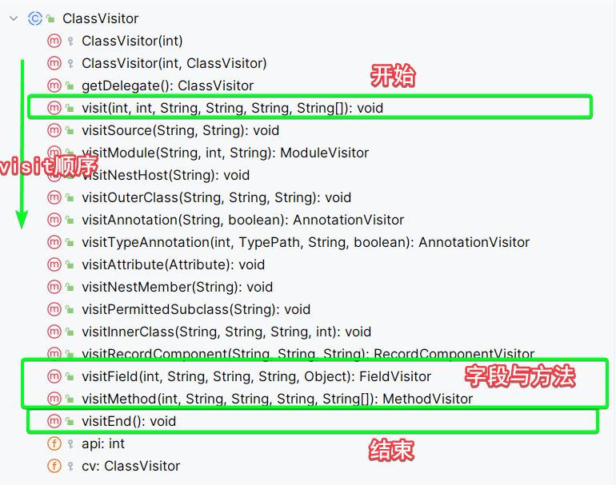

## 基础概念
asm是一个可以用来修改java字节码的库, 他可以读取一个文件, 字节, 类名作为参数, 然后读取对应的字节码, 在读取字节码的时候, 会触发对应的字节码的时候, 就会触发一定的事件, 类似于生命周期

asm有两个主要的库
1. asm-core: 他提供了最基本的修改字节码的功能, 会在在读取字节码的时候, 会触发对应的字节码的时候, 就会触发一定的事件, 类似于生命周期 
 
   但是asm-core这个包提供的功能过于的琐碎, 使用起来比较复杂, 所以asm也提供了asm-tree包
2. asm-tree: 这个包是在asm-core之上构建的, 提供了一种结构化的, 基于树的字节码表示方法. core中是以visitor模式作为主心骨，对于拆分的较细，tree则是以Node为组织方式，更加面向对象。

asm整体设计基于visitor模式，就是扫描(visit)字节码的过程中，不同的阶段和不同的操作都会调用一些hook函数，类似react生命周期函数，这些函数默认是空操作，我们可以利用这些hook，执行一些逻辑，最终完成我们想要的效果。
## 导入依赖
~~~xml
<!-- 注意common这个包中已经间接引入了core和tree包 -->
<dependency>
	<groupId>org.ow2.asm</groupId>
	<artifactId>asm-commons</artifactId>
	<version>9.7</version>
</dependency>
~~~

## asm-core
ClassReader是读取字节码的类，使用这个类读取了字节码才能进行后续操作，他可以接收类名也可以接收byte[]作为参数。

一般而言，通过ClassReader读取一个类的字节码，然后需要用一个ClassVisitor来遍历字节码。下图是visit的顺序，这些visit函数都是在遍历过程中的hook钩子函数，比如刚开始遍历的时候就会触发钩子函数visit(int,int,String,String,String,String[])，这里的参数就是类的一些信息
