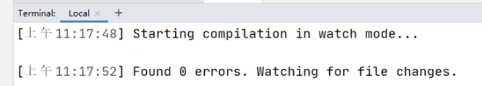
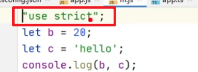
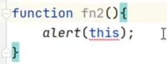
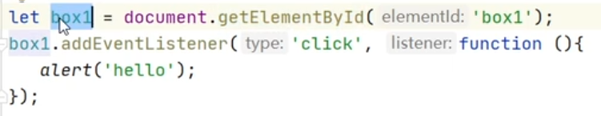
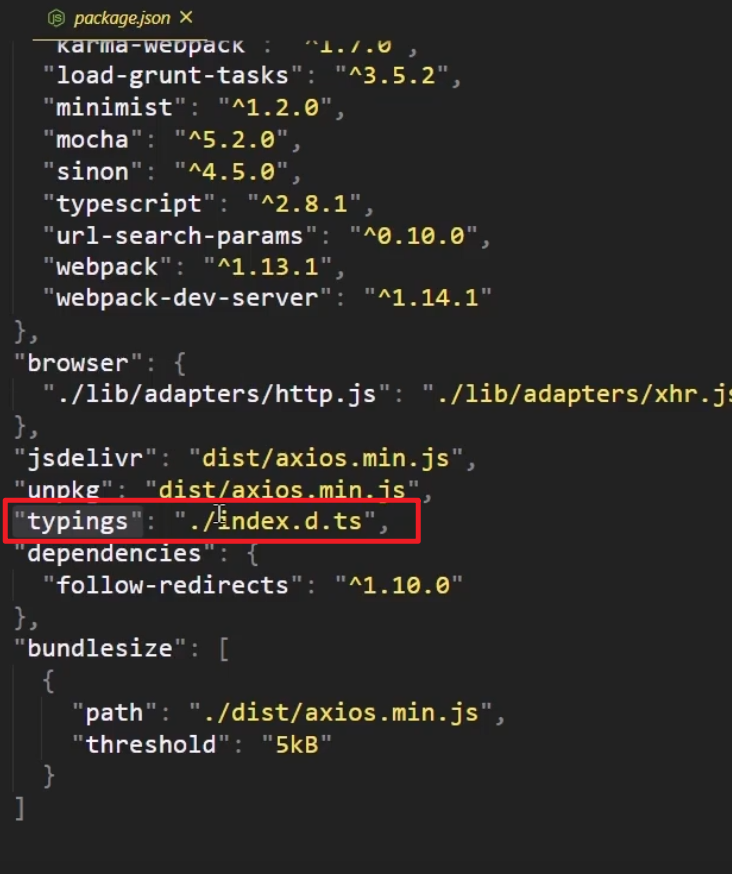
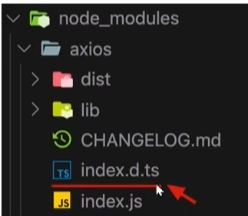

#### TypeScript简介

1. TypeScript是JavaScript的超集。在 js中能用的在ts中都能用
2. ts对js中添加了类型, 所以在执行ts的时候需要先编译成指定版本的js

#### TypeScript 开发环境搭建


2. 安装Node.js

3. 使用npm全局安装typescript
   - 进入命令行
   - 输入：npm i -g typescript
   - 输入: tsc --version 来确认ts编译器的版本
   
4. 创建一个ts文件

5. 使用tsc对ts文件进行编译并执行
   - 进入命令行
   - 进入ts文件所在目录
   - 执行命令：tsc xxx.ts 将ts编译成js
   - 执行js代码

#### ts-node的使用

ts-node可以直接运行ts代码(也是编译成js然后给node执行)

`npm install -g ts-node`安装

`ts-node hello.ts` 执行ts

#### 类型

- 类型声明

  - 指定类型后，当为变量赋值时，TS编译器会自动检查值是否符合类型声明，符合则赋值，否则报错

    ```typescript
    let a: string;
    let b: boolean = true;
    function sum(a: number, b: number): number {return a+b} 
    ```

- 自动类型判断

  - TS拥有自动的类型判断机制

  - 当对变量的声明和赋值是同时进行的，可以省略类型, TS编译器会自动判断变量的类型

    ```ts
    let b = "hello" // 自动推断为string
    ```

    

- 类型：

  |   类型   |          例子           |                描述                |
  | :------: | :---------------------: | :--------------------------------: |
  |  number  |       1, -33, 2.5       |              任意数字              |
  |  string  |    'hi', "hi", `hi`     |             任意字符串             |
  | boolean  |       true、false       |         布尔值true或false          |
  |  字面量  |         其本身          |    限制变量的值就是该字面量的值    |
  |   any    |            *            |              任意类型              |
  | unknown  |            *            |           类型安全的any            |
  |   void   |    空值（undefined）    |       没有值（或undefined）        |
  |  never   |         没有值          |            不能是任何值            |
  |  object  |     {name:'孙悟空'}     |            任意的JS对象            |
  |  array   |         [1,2,3]         |             任意JS数组             |
  |  tuple   |          [4,5]          |   元素，TS新增类型，固定长度数组   |
  |   enum   |       enum{A, B}        |         枚举，TS中新增类型         |
  | 联合类型 |    string \| number     | 表示既可以是string, 又可以是number |
  |  symbol  | let s:symbol = Symbol() |                                    |

- number

  - ```typescript
    let decimal: number = 6;
    let hex: number = 0xf00d;
    let binary: number = 0b1010;
    let octal: number = 0o744;
    let big: bigint = 100n;
    ```

- boolean

  - ```typescript
    let isDone: boolean = false;
    ```

- string

  - ```typescript
    let color: string = "blue";
    color = 'red';
    
    let fullName: string = `Bob Bobbington`;
    let age: number = 37;
    let sentence: string = `Hello, my name is ${fullName}.
    
    I'll be ${age + 1} years old next month.`;
    ```

- 字面量

  - 也可以使用字面量去指定变量的类型，通过字面量可以**确定变量的取值范围**

  - ```typescript
    let a: 1; // a只能是1
    let color: 'red' | 'blue' | 'black' = "red";
    let num: 1 | 2 | 3 | 4 | 5 = 1;
    
    // 自动类型推断, 设置str的类型为"hello world"
    // const str: "hello world" = "hello world"
    const str = "hello world"
    ```

- any任意类型

  - ```typescript
    let d: any = 4;
    d = 'hello';
    d = true;
    
    let c; // c的类型为any
    
    // any可以赋值给任何类型, 不报错
    let c1:any = 1;
    let s:string = c1; // 不保存
    ```

- unknown 类型安全的任意类型

  - ```typescript
    let notSure: unknown = 4;
    notSure = 'hello';
    
    // unknown不能复制给其他类型的值, 如果需要赋值需要添加条件
    let a: unknown = "hello"
    let s: string;
    s = a // 报错
    if (typeof a === "string") {
        s = a; // 不报错
    }
    s = a as string; // 不报错
    s = <string> a; // 不报错
    ```

- void: 常常用在函数返回值, 表示函数没有返回值, 但是可以返回null和undefined

  - ```typescript
    let unusable: void = undefined;
    
    function fn(): void {
        // return "hello" // 不行
        return null; // 可以
        return undefined; // 可以
    }
    ```

- never: 常常用在函数返回值, 表示没有返回值, 即使null和undefined也不行

  - ```typescript
    // 常常用在一个报错的函数中
    function error(message: string): never {
      if(message === "xxx"){
          throw new Error(message);
      }
    }
    ```

- object

  - ```typescript
    // object的类型定义使用分号隔开, 对象定义使用逗号隔开
    
    let obj: object = {}; //现在obj只能是一个对象, 但是js中的对象是在是太复杂了, 所以没啥用
    
    // 有用的是要限制对象中有什么属性
    let obj: {name: string}  // 限制了obj只有一个name:string属性, 多了也不行, 少了也不行
    obj = {name: "aaa"}
    obj = {name: "aaa", age: 12} // 报错, 多了一个
    obj = {} // 报错
    
    // 加上问号, 表示属性可选
    let obj: {name: string; age?: number}  // 限制了obj有一个name:string属性, 同时有一个可选的age属性
    obj = {name: "aaa"} // 不报错
    obj = {name: "aaa", age: 12}  // 不报错
    
    // 限制了obj有一个name属性, 同时有多个key为string, value为any的其他属性
    let obj: {name: string; [propName: string]: any}
    obj = {name: "aaa", age: 12, sex: "nan"} // 不报错
    
    // 如果类型的属性写在多行, 可以不加分号
    // 函数可以使用定义的形式, 也可以使用箭头函数的形式
    let obj1: {
      name: string
      sayHi(name: string): void
      sayHi2: (name: string) => void
      [propName: string]: any
    };
    ```

- array

  - ```typescript
    let list: number[] = [1, 2, 3]; // 数组, 元素只能是number
    let list: Array<number> = [1, 2, 3]; // 与上面相同
    ```

- tuple

  - ```typescript
    let x: [string, number];
    x = ["hello", 10]; 
    ```

- 联合类型

  - ~~~js
    let x: string | number = "hello"; // 表示x可以是string类型或者number类型
    function haha(message: string): string | number {
      return "1";
    }
    
    let arr:(number | string)[] = ["a", 1, "b", "2"] // 数组, 元素可以是数字和字符串
    let arr: number | string[] // 数字和字符串数组
    ~~~
  
- enum

  - ```typescript
    // 枚举成员是有值的, 默认从0开始
    enum Color {
      Red, // 0
      Green, // 1
      Blue, // 2
    }
    enum Color {
      Red = 1, // 1
      Green,  // 2
      Blue, // 3
    }
    enum Color {
      Red = 1,
      Green = 2,
      Blue = 4,
    }
    ```
  - ```ts
  // 枚举的值还可以是字符串, 一旦设定枚举的值是字符串, 那么所有成员都必须要有初始值
    enum Direction {
        UP = "UP",
        DOWN = "DOWN",
        LEFT = "LEFT",
        RIGHT = "RIGHT"
    }
    ```
  
- 函数类型

  ```ts
  // 定义和赋值分开
  let d: (a:number, b: number) => number;
  d = function(n1: number, n2: number): number {
      return n1 + n2;
  }
  // 定义和赋值一起
  let d: (a:string, b: number) => number = function(n1: number, n2: number): number {
      return n1 + n2;
  }
  // 如果定义和赋值一起, 变量的类型可以省略, 上面的可以简写为如下
  let add = (n1: number, n2:number):number => {
      return a +b
  }
  ```
  
  
  
- 类型别名

  -   ~~~ts
  // 这里只是别名, 并不会和go一样创建一个新的类型
    type myType = 1 | 2 | 3;
  let a: myTpye = 1;
    
    type myArr = (string, number)[]
    let arr: myArr = [1, "b"]
    ~~~
  
- 类型断言

  - 有些情况下，变量的类型对于我们来说是很明确，但是TS编译器却并不清楚，此时，可以通过类型断言来告诉编译器变量的类型，断言有两种形式：

    - 第一种

      - ```typescript
        let someValue: unknown = "this is a string";
        let strLength: number = (someValue as string).length;
        ```

    - 第二种

      - ```typescript
        let someValue: unknown = "this is a string";
        let strLength: number = (<string>someValue).length;
        ```

        

#### 函数的可选参数

```ts
// 函数有一个必选参数, n个可选的任意类型的参数
// 可选参数只能出现在参数列表的最后
function getHTTP(url: string, queryString?:any[]){}
```

#### 默认参数

```js
// 默认参数是js中的, 在ts中也能用
function add(n1:number = 1, n2:number = 2) {}
```


#### tsconfig.json编译选项

- 自动编译文件

  - 编译文件时，使用 -w 指令后，TS编译器会自动监视文件的变化，并在文件发生变化时对文件进行重新编译。**但是只能监视一个文件**

  - 示例：

    - ```powershell
      tsc xxx.ts -w
      ```
      

  

- 自动编译/监视整个项目

  - 先在项目根目录下创建一个ts的配置文件 tsconfig.json, 当然也可以通过`tsc --init`来创建
  - tsconfig.json是一个JSON文件，添加配置文件后，只需只需 tsc 命令即可完成对整个项目的编译, 内容如下

    ~~~json
    {}
    ~~~

    上面即使是一个空的文件也能使用

    **使用`tsc`编译整个项目**

    **使用`tsc -w`编译并监视整个项目**

  - 配置选项：

    - include

      - 定义希望被编译文件所在的目录

      - 默认值：["\*\*/\*"]

      - 示例：

        - ```json
          "include":["src/**/*", "tests/**/*"]
          ```

        - 上述示例中，所有src目录和tests目录下的文件都会被编译

    - exclude

      - 定义需要排除在外的目录

      - 默认值：["node_modules", "bower_components", "jspm_packages"]

      - 示例：

        - ```json
          "exclude": ["./src/hello/**/*"]
          ```

        - 上述示例中，src下hello目录下的文件都不会被编译

    - extends

      - 定义当前文件继承其他配置文件中的配置

      - 示例：

        - ```json
          "extends": "./configs/base"
          ```

        - 上述示例中，当前配置文件中会自动包含config目录下base.json中的所有配置信息, 可以**避免重复配置**

    - files

      - 指定需要编译文件的列表, 与include类似，只有需要编译的文件少时才会用到

      - 示例：

        - ```json
          "files": [
              "core.ts",
              "sys.ts",
              "types.ts",
              "scanner.ts",
              "parser.ts",
              "utilities.ts",
              "binder.ts",
              "checker.ts",
              "tsc.ts"
            ]
          ```

        - 列表中的文件都会被TS编译器所编译

      - compilerOptions

        - 编译选项是配置文件中非常重要也比较复杂的配置选项

        - 在compilerOptions中包含多个子选项，用来完成对编译的配置

          - 项目选项

            - target

              - 设置ts代码编译的目标版本

              - 可选值：

                - 'es3'(默认), 'es5', 'es6', 'es2015', 'es2016', 'es2017', 'es2018', 'es2019', 'es2020', 'esnext'

              - 示例：

                - ```json
                  "compilerOptions": {
                      "target": "ES6"
                  }
                  ```

                - 如上设置，我们所编写的ts代码将会被编译为ES6版本的js代码

            - lib

              - 指定代码运行时所包含的库（宿主环境）(一般情况下不用修改)

              - 可选值：

                - ES5、ES6/ES2015、ES7/ES2016、ES2017、ES2018、ES2019、ES2020、ESNext、DOM、WebWorker、ScriptHost ......

              - 示例：

                - ```json
                  "compilerOptions": {
                      "target": "ES6",
                      "lib": ["ES6", "DOM"],
                      "outDir": "dist",
                      "outFile": "dist/aa.js"
                  }
                  ```

            - module

              - 设置编译后代码使用的模块化系统(导入导出)

              - 可选值：

                - 'none', 'commonjs', 'amd', 'system', 'umd', 'es6', 'es2015'(es2015和es6是一样的), 'es2020', 'esnext'

              - 示例：

                - ```typescript
                  "compilerOptions": {
                      "module": "CommonJS"
                  }
                  ```

            - outDir

              - 编译后文件的所在目录

              - 默认情况下，编译后的js文件会和ts文件位于相同的目录，设置outDir后可以改变编译后文件的位置

              - 示例：

                - ```json
                  "compilerOptions": {
                      "outDir": "./dist"
                  }
                  ```

                - 设置后编译后的js文件将会生成到dist目录

            - outFile(了解, 后续使用打包工具)

              - 将生成后的js文件合并为一个js文件

              - 默认会将所有的编写在全局作用域中的代码合并为一个js文件，如果module制定了None、System或AMD则会将模块一起合并到文件之中

              - 示例：

                - ```json
                  "compilerOptions": {
                      "outFile": "dist/app.js"
                  }
                  ```

            - rootDir

              - 指定代码的根目录，默认情况下编译后文件的目录结构会以最长的公共目录为根目录，通过rootDir可以手动指定根目录

              - 示例：

                - ```json
                  "compilerOptions": {
                      "rootDir": "./src"
                  }
                  ```

            - allowJs

              - 是否对目录下的 js文件编译, 默认为false, 如果为true那么就会将js文件也放到outDir目录下

            - checkJs

              - 检查目录下的js文件语法是否符合规范, 默认是false

              - 示例：

                - ```json
                  "compilerOptions": {
                      "allowJs": true,
                      "checkJs": true
                  }
                  ```

            - removeComments

              - 编译后是否删除注释
              - 默认值：false

            - noEmit

              - 只进行编译, 不生成编译后的js文件, 用于语法检查
              - 默认值：false

            - noEmitOnError

              - 有错误的情况下编译失败

                即如果ts中有不符合ts语法的, 但是在js中能执行的(不同类型的赋值), 默认也会编译过去

              - 默认值：false

            - sourceMap

              - 是否生成sourceMap
              - 默认值：false

              

          - 严格检查

            - strict
              
              - 启用所有的严格检查，默认值为true，设置后相当于开启了所有的严格检查, 是下面几个属性的总开关
            - alwaysStrict
              
              - 编译后的js文件是否使用严格模式, 默认为false
              
              - 当在js中使用了import后, 编译的js文件自动使用严格模式
              
              - 严格模式, 即在js文件开头添加"use strict";
              
                
            - noImplicitAny
              
              - 禁止隐式的any类型, 默认为false
              
              - 隐式类型
              
                ```ts
                let a; // a隐式为any
                function(a, b){} // a,b, 返回值隐式为any 
                ```
              
            - noImplicitThis
              
              - 禁止类型不明确的this
              
              - 当函数作为方法调用时, this指向调用对象, 当作为函数调用时, this指向window, 禁止使用这样类型不明确的this
              
                
            - strictBindCallApply
              
              - 严格检查bind、call和apply的参数列表
            - strictFunctionTypes
              
              - 严格检查函数的类型
            - strictNullChecks
              
              - 必须对可能的空值机型检查, 下面这种情况下box1可能为null, 如果设置为true, 必须检查
              
                
            - strictPropertyInitialization
              
              - 严格检查属性是否初始化
  
- 额外检查
          
  - noFallthroughCasesInSwitch
              - 检查switch语句包含正确的break
            - noImplicitReturns
              - 检查函数没有隐式的返回值
            - noUnusedLocals
              - 检查未使用的局部变量
            - noUnusedParameters
              - 检查未使用的参数
  
- 高级
          
  - allowUnreachableCode
              - 检查不可达代码
              - 可选值：
                - true，忽略不可达代码
                - false，不可达代码将引起错误
              
              

#### webpack

- 通常情况下，实际开发中我们都需要使用构建工具对代码进行打包，TS同样也可以结合构建工具一起使用，下边以webpack为例介绍一下如何结合构建工具使用TS。

- 步骤：

  1. 初始化项目

     - 进入项目根目录，执行命令 ``` npm init -y```
       - 主要作用：创建package.json文件

  2. 下载构建工具

     - ```npm i -D webpack webpack-cli webpack-dev-server typescript ts-loader clean-webpack-plugin```
       - 共安装了7个包
         - webpack
           - 构建工具webpack
         - webpack-cli
           - webpack的命令行工具
         - webpack-dev-server
           - webpack的开发服务器
         - typescript
           - ts编译器
         - ts-loader
           - ts加载器，用于在webpack中编译ts文件
         - html-webpack-plugin
           - webpack中html插件，用来自动创建html文件
         - clean-webpack-plugin
           - webpack中的清除插件，每次构建都会先清除目录

  3. 根目录下创建webpack的配置文件webpack.config.js

     - ```javascript
       const path = require("path");
       const HtmlWebpackPlugin = require("html-webpack-plugin");
       const { CleanWebpackPlugin } = require("clean-webpack-plugin");
       
       module.exports = {
           optimization:{
               minimize: false // 关闭代码压缩，可选
           },
       
           entry: "./src/index.ts",
           
           devtool: "inline-source-map",
           
           devServer: {
               contentBase: './dist'
           },
       
           output: {
               path: path.resolve(__dirname, "dist"),
               filename: "bundle.js",
               environment: {
                   arrowFunction: false // 关闭webpack的箭头函数，可选
               }
           },
       
           resolve: {
               extensions: [".ts", ".js"]
           },
           
           module: {
               rules: [
                   {
                       test: /\.ts$/,
                       use: {
                          loader: "ts-loader"     
                       },
                       exclude: /node_modules/
                   }
               ]
           },
       
           plugins: [
               new CleanWebpackPlugin(),
               new HtmlWebpackPlugin({
                   title:'TS测试'
               }),
           ]
       
       }
       ```

  4. 根目录下创建tsconfig.json，配置可以根据自己需要

     - ```json
       {
           "compilerOptions": {
               "target": "ES2015",
               "module": "ES2015",
               "strict": true
           }
       }
       ```

  5. 修改package.json添加如下配置

     - ```json
       {
         ...略...
         "scripts": {
           "test": "echo \"Error: no test specified\" && exit 1",
           "build": "webpack",
           "start": "webpack serve --open chrome.exe"
         },
         ...略...
       }
       ```

  6. 在src下创建ts文件，并在并命令行执行```npm run build```对代码进行编译，或者执行```npm start```来启动开发服务器

     

#### Babel

- 经过一系列的配置，使得TS和webpack已经结合到了一起，除了webpack，开发中还经常需要结合babel来对代码进行转换以使其可以兼容到更多的浏览器，在上述步骤的基础上，通过以下步骤再将babel引入到项目中。

  1. 安装依赖包：
     - ```npm i -D @babel/core @babel/preset-env babel-loader core-js```
     - 共安装了4个包，分别是：
       - @babel/core
         - babel的核心工具
       - @babel/preset-env
         - babel的预定义环境
       - @babel-loader
         - babel在webpack中的加载器
       - core-js
         - core-js用来使老版本的浏览器支持新版ES语法

  2. 修改webpack.config.js配置文件

     - ```javascript
       ...略...
       module: {
           rules: [
               {
                   test: /\.ts$/,
                   use: [
                       {
                           loader: "babel-loader",
                           options:{
                               presets: [
                                   [
                                       "@babel/preset-env",
                                       {
                                           "targets":{
                                               "chrome": "58",
                                               "ie": "11"
                                           },
                                           "corejs":"3",
                                           "useBuiltIns": "usage"
                                       }
                                   ]
                               ]
                           }
                       },
                       {
                           loader: "ts-loader",
       
                       }
                   ],
                   exclude: /node_modules/
               }
           ]
       }
       ...略...
       ```

     - 如此一来，使用ts编译后的文件将会再次被babel处理，使得代码可以在大部分浏览器中直接使用，可以在配置选项的targets中指定要兼容的浏览器版本。

#### tsconfig之moduleResolution详解

> 作用

moduleResolution：指定ts在处理import的时候按照 什么逻辑去查找对应的文件

> 模块解析策略

共有两种可用的模块解析策略：`Node` 和 `Classic`。
若未指定，默认值为 `Classic`。

> Classic 策略 

这种策略在以前是 TypeScript 默认的解析策略。

- 相对导入的模块是相对于导入它的文件进行解析的
  如 `/root/src/folder/A.ts` 文件里的 `import { b } from "./moduleB"` 会使用下面的查找流程
  - `/root/src/folder/moduleB.ts`
  - `/root/src/folder/moduleB.d.ts`

- 非相对模块的导入

  从包含导入文件的目录开始依次向上级目录遍历，尝试定位匹配的声明文件

  如 `/root/src/folder/A.ts` 文件里的 `import { b } from "moduleB"` 会使用下面的查找流程

  - `/root/src/folder/moduleB.ts`
  - `/root/src/folder/moduleB.d.ts`
  - `/root/src/moduleB.ts`
  - `/root/src/moduleB.d.ts`
  - `/root/moduleB.ts`
  - `/root/moduleB.d.ts`
  - `/moduleB.ts`
  - `/moduleB.d.ts`
> Node策略

- typescript相对导入

  TypeScript 是模仿 Node.js 运行时的解析策略来在编译阶段定位模块定义文件。

  - TypeScript 在 Node 解析逻辑基础上增加了 TypeScript 源文件的扩展名（.ts，.tsx 和 .d.ts ）

  - TypeScript 在 package.json 里使用字段 types 来表示类似 main 的意义 - 编译器会使用它来找到要使用的 main 定义文件
    如 /root/src/moduleA.ts 文件里的 import { b } from "./moduleB" 会使用下面的查找流程

    `/root/src/moduleB.ts`
    `/root/src/moduleB.tsx`
    `/root/src/moduleB.d.ts`
    `/root/src/moduleB/package.json (如果指定了 types 属性)`
    `/root/src/moduleB/index.ts`
    ``/root/src/moduleB/index.tsx`
    `/root/src/moduleB/index.d.ts`

- typescript非相对导入

  如 `/root/src/moduleA.ts` 文件里的 `import { b } from "moduleB"` 会使用下面的查找流程

  `/root/src/node_modules/moduleB.ts`

  `/root/src/node_modules/moduleB.tsx`

  `/root/src/node_modules/moduleB.d.ts`

  `/root/src/node_modules/moduleB/package.json (如果指定了 types 属性)`

  `/root/src/node_modules/moduleB/index.ts`

  `/root/src/node_modules/moduleB/index.tsx`

  `/root/src/node_modules/moduleB/index.d.ts`

  `/root/node_modules/moduleB.ts`

  `/root/node_modules/moduleB.tsx`

  `/root/node_modules/moduleB.d.ts`

  `/root/node_modules/moduleB/package.json (如果指定了 types 属性)`

  `/root/node_modules/moduleB/index.ts`

  `/root/node_modules/moduleB/index.tsx`

  `/root/node_modules/moduleB/index.d.ts`

  `/root/node_modules/moduleB.ts`

  `/root/node_modules/moduleB.tsx`

  `/root/node_modules/moduleB.d.ts`

  `/root/node_modules/moduleB/package.json (如果指定了 types 属性)`

  `/root/node_modules/moduleB/index.ts`

  `/root/node_modules/moduleB/index.tsx`

  `/root/node_modules/moduleB/index.d.ts`

#### ts下关于一些包的说明
1. `npm install -g typescript`
   typescript是ts的编译器
2. `npm install -g ts-node`
   ts-node能够运行我们直接运行一个ts文件, 否则的话我们就只能先通过tsc将其编译成js文件, 然后通过node去执行了
   当然也可以将ts加入到package.json的scripts中
   ```json
   "scripts": {
      "start": "ts-node ./src/index.ts"
    }
   ```
3. `npm install -D @types/node`
   因为原生的node使用的是js, 而js是没有类型的, ts在使用他们的时候并不知道js中的类型
   为了能够让ts知道js中的类型, ts中有一种.d.ts的文件, 专门用于给js补全类型
   所有的用于补全类型的包都以@types开头

   

# 第二章：面向对象

面向对象是程序中一个非常重要的思想，它被很多同学理解成了一个比较难，比较深奥的问题，其实不然。面向对象很简单，简而言之就是程序之中所有的操作都需要通过对象来完成。

- 举例来说：
  - 操作浏览器要使用window对象
  - 操作网页要使用document对象
  - 操作控制台要使用console对象

一切操作都要通过对象，也就是所谓的面向对象，那么对象到底是什么呢？这就要先说到程序是什么，计算机程序的本质就是对现实事物的抽象，抽象的反义词是具体，比如：照片是对一个具体的人的抽象，汽车模型是对具体汽车的抽象等等。程序也是对事物的抽象，在程序中我们可以表示一个人、一条狗、一把枪、一颗子弹等等所有的事物。一个事物到了程序中就变成了一个对象。

在程序中所有的对象都被分成了两个部分数据和功能，以人为例，人的姓名、性别、年龄、身高、体重等属于数据，人可以说话、走路、吃饭、睡觉这些属于人的功能。数据在对象中被成为属性，而功能就被称为方法。所以简而言之，在程序中一切皆是对象。

## 1、类（class）

要想面向对象，操作对象，首先便要拥有对象，那么下一个问题就是如何创建对象。要创建对象，必须要先定义类，所谓的类可以理解为对象的模型，程序中可以根据类创建指定类型的对象，举例来说：可以通过Person类来创建人的对象，通过Dog类创建狗的对象，通过Car类来创建汽车的对象，不同的类可以用来创建不同的对象。

- 定义类：

  - ```typescript
    class 类名 {
    	属性名: 类型;
    	
    	constructor(参数: 类型){
    		this.属性名 = 参数;
    	}
    	
    	方法名(){
    		....
    	}
    
    }
    ```

- 示例：

  - ```typescript
    class Person{
        name: string;
        age: number;
    
        constructor(name: string, age: number){
            this.name = name;
            this.age = age;
        }
    
        sayHello(){
            console.log(`大家好，我是${this.name}`);
        }
    }
    ```

- 使用类：

  - ```typescript
    const p = new Person('孙悟空', 18);
    p.sayHello();
    ```

## 2、面向对象的特点

- 封装

  - 对象实质上就是属性和方法的容器，它的主要作用就是存储属性和方法，这就是所谓的封装

  - **默认情况下，对象的属性是可以任意的修改的**，为了确保数据的安全性，在TS中可以对属性的权限进行设置

  - 只读属性（readonly）：

    - **表示只读, 用来防止在构造函数之外对属性进行赋值, 可以有默认值, 只能修饰属性**

  - TS中属性具有三种修饰符：

    - public（默认值），可以在类、子类和对象中修改
    - protected ，可以在类、子类中修改
    - private ，可以在类中修改

  - 示例：

    - public

      - ```typescript
        class Person{
            public readonly name: string = "hello"; // 写或什么都不写都是public
            public age: number;
        
            constructor(name: string, age: number){
                this.name = name; // 可以在类中修改
                this.age = age;
            }
        
            sayHello(){
                console.log(`大家好，我是${this.name}`);
            }
        }
        
        class Employee extends Person{
            constructor(name: string, age: number){
                super(name, age);
                this.name = name; //子类中可以修改
            }
        }
        
        const p = new Person('孙悟空', 18);
        p.name = '猪八戒';// 可以通过对象修改
        ```

    - protected

      - ```typescript
        class Person{
            protected name: string;
            protected age: number;
        
            constructor(name: string, age: number){
                this.name = name; // 可以修改
                this.age = age;
            }
        
            sayHello(){
                console.log(`大家好，我是${this.name}`);
            }
        }
        
        class Employee extends Person{
        
            constructor(name: string, age: number){
                super(name, age);
                this.name = name; //子类中可以修改
            }
        }
        
        const p = new Person('孙悟空', 18);
        p.name = '猪八戒';// 不能修改
        ```

    - private

      - ```typescript
        class Person{
            private name: string;
            private age: number;
        
            constructor(name: string, age: number){
                this.name = name; // 可以修改
                this.age = age;
            }
        
            sayHello(){
                console.log(`大家好，我是${this.name}`);
            }
        }
        
        class Employee extends Person{
        
            constructor(name: string, age: number){
                super(name, age);
                this.name = name; //子类中不能修改
            }
        }
        
        const p = new Person('孙悟空', 18);
        p.name = '猪八戒';// 不能修改
        ```

  - 属性存取器(getter setter)

    - 对于一些不希望被任意修改的属性，可以将其设置为private

    - 直接将其设置为private将导致无法再通过对象修改其中的属性

    - 我们可以在类中定义一组读取、设置属性的方法，这种对属性读取或设置的属性被称为属性的存取器

    - 读取属性的方法叫做setter方法，设置属性的方法叫做getter方法

    - 示例：

      - ```typescript
        class Person{
            private _name: string;
        
            constructor(name: string){
                this._name = name;
            }
        
            get name(){
                return this._name;
            }
        
            set name(name: string){
                this._name = name;
            }
        
        }
        
        const p1 = new Person('孙悟空');
        console.log(p1.name); // 通过getter读取name属性
        p1.name = '猪八戒'; // 通过setter修改name属性
        ```

  - 静态属性

    - 静态属性（方法），也称为类属性。使用静态属性无需创建实例，通过类即可直接使用

    - 静态属性（方法）使用static开头

    - 示例：

      - ```typescript
        class Tools{
            static PI = 3.1415926;
            
            static sum(num1: number, num2: number){
                return num1 + num2
            }
        }
        
        console.log(Tools.PI);
        console.log(Tools.sum(123, 456));
        ```

  - this

    - 在类中，使用this表示当前对象

- 继承

  - 继承时面向对象中的又一个特性

  - 通过继承可以将其他类中的属性和方法引入到当前类中

    - 示例：

      - ```typescript
        class Animal{
            name: string;
            age: number;
        
            constructor(name: string, age: number){
                this.name = name;
                this.age = age;
            }
        }
        
        class Dog extends Animal{
        
            bark(){
                console.log(`${this.name}在汪汪叫！`);
            }
        }
        
        const dog = new Dog('旺财', 4);
        dog.bark();
        ```

  - 通过继承可以在不修改类的情况下完成对类的扩展

  - 重写

    - 发生继承时，如果子类中的方法会替换掉父类中的同名方法，这就称为方法的重写

    - 示例：

      - ```typescript
        class Animal{
            name: string;
            age: number;
        
            constructor(name: string, age: number){
                this.name = name;
                this.age = age;
            }
        
            run(){
                console.log(`父类中的run方法！`);
            }
        }
        
        class Dog extends Animal{
        
            bark(){
                console.log(`${this.name}在汪汪叫！`);
            }
        
            run(){
                console.log(`子类中的run方法，会重写父类中的run方法！`);
            }
        }
        
        const dog = new Dog('旺财', 4);
        dog.bark();
        ```

      - 在子类中可以使用super来完成对父类的引用

  - 抽象类（abstract class）

    - 抽象类是专门用来被其他类所继承的类，它只能被其他类所继承不能用来创建实例

    - ```typescript
      abstract class Animal{
          abstract run(): void;
          bark(){
              console.log('动物在叫~');
          }
      }
      
      class Dog extends Animals{
          run(){
              console.log('狗在跑~');
          }
      }
      ```

    - 使用abstract开头的方法叫做抽象方法，抽象方法没有方法体只能定义在抽象类中，继承抽象类时抽象方法必须要实现
    
    

## 3、接口（Interface）

接口的作用主要是限制结构和继承

- 限制对象结构

  - ```typescript
    interface Person{
        name: string;
        sayHello():void;
    }
    let obj:Person = {
        name: "hello",
        sayHello() {console.log("hello")}
    }
    ```
    
  
- 继承

  ```js
  class Student implements Person{
  	private name: string;
      constructor(name: string) {
          this.name = name;
  	}
      sayHello() {
          console.log('大家好，我是'+this.name);
      }
  }
  let stu = new Student("zhangsan");
  ```

- **接口在限制结构上和type别名还是一样的**

  ```ts
  type Person1 = {
    name: string;
    say():void
  }
  let a: Person1 = {
    name: "张三",
    say() { },
    // sex: "nan" // 不能再有其他属性
  }
  interface Person2  {
    name: string;
    say():void
  }
  let b: Person2 = {
    name: "张三",
    say() { },
    // sex: "nan" // 不能再有其他属性
  }
  ```

  

  

## 4、泛型（Generic）

定义一个函数或类时，有些情况下无法确定其中要使用的具体类型（返回值、参数、属性的类型不能确定），此时泛型便能够发挥作用。

- 举个例子：

  - ```typescript
    function test(arg: any): any{
    	return arg;
    }
    ```

  - 上例中，test函数有一个参数类型不确定，但是能确定的时其返回值的类型和参数的类型是相同的，由于类型不确定所以参数和返回值均使用了any，但是很明显这样做是不合适的，首先使用any会关闭TS的类型检查，其次这样设置也不能体现出参数和返回值是相同的类型

  - 使用泛型：

  - ```typescript
    function test<T>(arg: T): T{
    	return arg;
    }
    ```

  - 这里的```<T>```就是泛型，T是我们给这个类型起的名字（不一定非叫T），设置泛型后即可在函数中使用T来表示该类型。所以泛型其实很好理解，就表示某个类型。

  - 那么如何使用上边的函数呢？

    - 方式一（直接使用）：

      - ```typescript
        test(10)
        ```

      - 使用时可以直接传递参数使用，类型会由TS自动推断出来，但有时编译器无法自动推断时还需要使用下面的方式

    - 方式二（指定类型）：

      - ```typescript
        test<number>(10)
        ```

      - 也可以在函数后手动指定泛型

  - 可以同时指定多个泛型，泛型间使用逗号隔开：

    - ```typescript
      function test<T, K>(a: T, b: K): K{
          return b;
      }
      
      test<number, string>(10, "hello");
      ```

    - 使用泛型时，完全可以将泛型当成是一个普通的类去使用

  - 类中同样可以使用泛型：

    - ```typescript
      class MyClass<T>{
          prop: T;
      
          constructor(prop: T){
              this.prop = prop;
          }
      }
      ```

  - 除此之外，也可以对泛型的范围进行约束

    - ```typescript
      interface MyInter{
          length: number;
      }
      
      function test<T extends MyInter>(arg: T): number{
          return arg.length;
      }
      ```

    - 使用T extends MyInter表示泛型T必须是MyInter的子类，不一定非要使用接口类和抽象类同样适用。
    
  - 还可以为泛型指定默认的类型
  
    ~~~ts
    function test<T = number>(arg: T): T{
    	return arg;
    }
    test(10) // 在没有显示指定泛型的时候, 同时也无法通过参数来推断泛型的时候, 将会使用默认的泛型
    ~~~
  
    

#### 类型兼容性

类型兼容性即鸭子类型, 如果两个对象具有相同的结构, 那么会被认为是同一类型
```js
class Point(x:string, y:string)
class Point2D(x:string, y:string)
const p:Point = new Point2D() // 没问题
```


#### .d.ts文件的说明

我们现在所使用的的ts都是有类型的, 但是如果在ts中应用js, js是没有类型的, 所以ts会将js中的所有都设置为any类型, 使得我们在使用项目原来的js, 或者使用第三方的js包的时候, 无法知道具体的类型

所以ts就搞了一个.d.ts的文件功能, 该文件能够给已经存在的js文件中的对象设置类型, 我们能够给自己项目中原来的js添加上类型, 原来通过js发布的第三方包也能够添加上他们自己的类型, 使得ts能够利用

> 第三方类库中的.d.ts

第三方类库中的.d.ts文件又分为两种:

- 内置库的.d.ts文件, 即ts为js运行时可用的所有的标准化内置api都提供了声明文件, 比如window, document等bom, dom api都有对应的类型声明

- 第三方库中的.d.ts文件

  第三方库的.d.ts文件通过两种方式来提供类型定义文件

  - 第三方库自带的类型声明文件

    当ts在导入一个库的时候, 回去package.json中查找`typings`字段或者`types`字段, 该字段用于指定了当前模块的.d.ts文件

    

    

  - 如果第三方库中没有自带.d.ts文件, 那么加载一个模块的时候, 就会去`node_module/@types`目录下根据模块名去查找对应的.d.ts文件, 并将他们全部加载进来

    其中node_module/@types这个路径是默认规定的, 这个路径是专门保存第三方模块的.d.ts文件的

    比如在`npm install -D lodash`的时候,发现lodash这个模块没有自带.d.ts文件, 那么vscode就会提示你需要通过`npm install -D @types/lodash`来安装他的类型定义文件

    模块与类型定义文件的规律一般是前面加@types, 比如lodash和@types/lodash, react和@types/react

    ts专门提供了一个网页来查询第三方模块的类型定义文件`www.typescriptlang.org/dt`

> 为自己项目中的js文件创建.d.ts文件

比如我有一个utils.js文件, 内容如下:

~~~js
let count = 10;
const age = 12;
let songName = "痴心绝对";
let position = {
  x: 0,
  y: 0,
};

let obj = {
  x: 0,
  add: function () {
    x += 1;
  },
};

function add(x, y) {
  return x + y;
}

function changeDirection(direction) {
  console.log(direction);
}

export { age, count, songName, position, add, changeDirection, obj };

~~~

为这个js文件添加上类型, 就要在同样的目录创建一个同名的utils.d.ts文件, 内容如下

~~~ts
// declare表示为js中的一个变量/函数添加上类型
// 被添加上类型的变量/函数需要使用export导出才能够被使用
// 所以可以在declare的时候使用export
// 也可以先declare, 最后使用export{...}一起导出
/**
 * count
 */
export declare let count: number; // 声明count的类型为number

/**
 * age
 */
export declare const age: 12;
/**
 * songName
 */
export declare let songName: string; // 声明songName的类型为string

/**
 * position
 */
// 方式1
export interface Position {
  // 这个Position接口视情况导出与否都可以
  // 注意这里不是为变量添加类型,而是创建了一个新的接口
  x: number;
  y: number;
}
export declare let position: Position; // 给position添加上接口类型

// 方式2
// export declare let position: { // 使用对象类型
//   x: number,
//   y?: number // 问号表示可选
// }

/**
 * add
 */
// 方式1
export declare function add(x: number, y: number): number; //给add添加上类型
// !!!如果add函数支持重载, 那么为add添加多个类型也是可以的!!!
export declare function add(x: string, y: string): string;

// 方式2: 使用箭头函数, 注意这里的const
// export declare const add: (x: number, y: number) => number;

// 方式3: 使用type别名
// type addType = (x: number, y: number) => number; // 这里创建了一个新的类型别名
// export declare const add: addType; // 通过类型别名也可以

/**
 * changeDirection
 */
// 这里也可以使用函数定义, 箭头函数, 类型别名
export declare function changeDirection(
  direction: "up" | "down" | "left" | "right"
): void;

// 定义了一个接口, 可以视情况是否导出, 如果导出了, 那么ts就可以使用该类型
interface Peopele {
  name: string;
  age: number;
}

// 定义了一个类, 可以视情况是否导出, 如果导出了, 那么ts就可以使用该类型
declare class Student implements Peopele {
  public name: string;
  public age: number;
  say(): void;
}
~~~

上面js文件中使用的是ems的导出方式, 所以.d.ts文件也要使用ems的导出方式
如果js文件使用的是commonjs的导出方式, 那么.d.ts文件也要使用commonjs的导出方式, 语法参考如下

```ts
// https://segmentfault.com/a/1190000009247663
 declare module "abcde" { // 这里的"abcd"可以乱写类似
   export let a: number
   export function b(): number
   export let c: {
     let cd: string
   }
 }
```

如果导出的本身就是一个函数

```js
  let app = require("app")
  app()
```

 可以使用如下导出

  ```ts
declare module "app" {
   function aaa(some:number):number
    export=aaa
}
  ```


#### ts模块扩展
比如我们有一个ts模块`test1.d.ts`, 其中内容如下:
~~~ts
export interface A {
  a: string;
}
~~~

我们想在别的模块中给`test1.d.ts`中的A类型进行扩展, 添加一个属性, 那么可以创建一个`test2.d.ts`, 内容如下:
~~~
import "./test1";

declare module "./test1" {
  export interface A {
    b: string;
  }
}
~~~


#### ts typeof关键字
typeof关键字用来获取指定对象的类型
~~~ts
const a = {a: "1", b: 1}
type A = typeof a
function xxx(b: typeof a) {}
~~~
1. typeof只能出现在类型注释的位置, 即冒号后面
2. typeof只能用来获取变量和属性的类型, 不能获取函数的类型


#### ts 索引类型

当一个类型的属性无法确定时可以使用索引类型

~~~ts
type A = {
    name: string,
    // 表示A有一个必选的name属性, 和n个key为string, value为number的属性
    // key只是一个占位符, 可以改成任何名称
    [key: string]: number 
}
~~~

实际上数组就是通过索引类型来实现的

~~~ts
type Array<T> = {
    [n:number]: T
}
~~~


#### ts keyof关键字
keyof 用来获取对象或者类型的所有key的名称, 并将他们组合成联合类型

```ts
type Person = {
  name: string;
  age: number;
};
type Keys = keyof Person; // "name" | "age"
```

keyof常常和in关键字一起使用, 用来生成新的类型

~~~ts
type Partial<T> = {
    [P in keyof T]?: T[P]; // 将一个类型的所有属性变成可选类型
};
type Required<T> = {
    [P in keyof T]-?: T[P]; // 将一个类型的所有属性变成必选类型, -?表示必选
};
type Readonly<T> = {
    readonly [P in keyof T]: T[P]; // 将一个类型的所有属性变成readonly
};
type Pick<T, K extends keyof T> = { // 从T类型中个别属性组件新类型
    [P in K]: T[P];
};
interface Props { id: string, title: string, children: number}
type PickProps = Pick<Props, 'id' | 'title'> // 从Props中选择id和title组成新类型


type Record<K extends keyof any, T> = { // 指定属性为key, 类型为T的类型
    [P in K]: T;
};
type RecordObj = Record<"a" | 'b' | 'c', string[]> // 生成的类型有abc三个属性, 全部为string[]类型
~~~

#### node如何解析import和require中模块的路径
- require相对导入, 例如`require("./moduleB"); `

  1. 先按照相对路径去查找对应的js文件, 有就导入
  2. 如果发现对应路径是目录
     1. 如果目录包含package.json且其中指定了main属性, 就导入main属性指定的js文件
     2. 如果没有main属性或者没有package.json, 那么默认查找index.js
     3. 如果还没有报错

- require绝对导入, 例如`require("react")`

  1. 直接去根目录下的`node_module/react`, 按照相对导入的条件2去查找

- import相对导入

  与require相对导入类似,只是条件2会去找module属性指定的js文件,而不是main

- import绝对导入

  同样与require绝对导入只有main和module的区别


#### es6和commonjs的导入导出语法
https://juejin.cn/post/6907428111332147208
1. es6中的导入导出
   导出
   ~~~js
        export let test = "hello" // 单独导出
        export function f(){return "xxx"} // 单独导出
        let a = 1;
        let b = 2;
        export {a, b} // 一次性导出多个变量
        let d1 = 1;
        let d2 = 2;
        export default {d1, d2} // 默认导出
   ~~~
   导入
   ~~~js
        import * as m from "./m.js"

        import def from "./m.js" 
        console.log(m.f(), m.a, m.b, m.test) // import * 会将所有export的变量都被打包在一个对象中
        console.log(m.default.d1, m.default.d2) // import * 会将export default的变量被打包在default属性中

        
        console.log(def.d1, def.d2) // 直接使用import会将所有export default的变量打包

        export * from "./m.js" // 导出重定向, 从当前文件导出所有非默认导出内容
        // 导出重定向不会将变量导入到当前文件内容
   ~~~  
2. commonjs中的导入导出
   导出
   ~~~js
        // 导入一个js模块, 就是导入了他的module.export对象
        // 所以要导出变量, 只需要将他附加到module.export对象上面就好了
        // 同时export是module.export的一个引用
        // 所以将变量附加到export上也是可以的
        let a = 1;
        let b = 2;
        module.export.a = a // 使用module.export
        export.b = b // 使用export
        // export = {a, b} // 千万不能使用这种方式, 因为export只是module.export的一个引用, 修改export引用并不能修改module.export

        module.export = {a, b} // 这种属于一次性导出, 修改了module.export将会导致上面的导出无效
   ~~~
   导入
   ~~~js
    const m = require("./m.js") 
    // 将会获得在m.js中的module.export对象
    // 类似于m = module.export
   ~~~
3. 在commonjs中引入es module(一般很少这种情况)
   由于es module在加载, 解析, 执行都是异步的, 而require的过程是同步的, 所以不能通过require()来引用一个es6模块
   es6提议使用import()函数来导入一个模块, import函数会返回一个Promis, 他在es module 加载后标记完成
   ~~~js
   // 使用 then() 来进行模块导入后的操作
   import(“es6-modules.mjs”).then((module)=>{/*…*/}).catch((err)=>{/**…*/})
   // 或者使用 async 函数
   (async () => {
   await import('./es6-modules.mjs');
   })();
   ~~~
4. 在es module文件中导入commonjs模块
   在es6模块里可以很方便的使用import来引入一个CommonJS模块, 因为在es6模块里异步加载并非是必须的
   ~~~js
   import { default as cjs } from 'cjs';

   // The following import statement is "syntax sugar" (equivalent but sweeter)
   // for `{ default as cjsSugar }` in the above import statement:
   import cjsSugar from 'cjs';

   console.log(cjs);
   console.log(cjs === cjsSugar);
   ~~~

#### 两者在执行上的不同
https://juejin.cn/post/6994224541312483336


1. require就像是执行代码, 所以可以在任何地方使用, 而且是运行时加载, 
   在第一次加载该文件的时候会执行该文件, 并生成他的module.export对象, 下次任何文件再导入他的时候, 都会直接获得module.export对象
   并且require对于暴露的module.export对象进行的是**值拷贝**, 所以对于基础类型, 无法获取后续的变化
2. es6中的导入导出是静态的, import会自动提升到代码的顶层, import和export不能放在块级作用域或者条件语句中
   因为导入导出是在编译过程中就确定的, 所以更方便查找依赖, 可以使用lint工具对模块依赖进行检查, 可以对导入导出加上类型信息进行静态的类型检查

3. es6中使用import导入的变量是只读的, 不能进行修改, 可以理解为被const修饰了
   并且import导入的变量无论是否是基础变量, 他都将是引用, 否则下面的num输出将不会是2
   ~~~js
   // a.js
   export let num = 1
   export const addNumber = ()=>{
    num++
   }
   // main.js
   import {  num , addNumber } from './a'
   // num = 2 // 该语句报错, num is read-only, 可以理解 为被const修饰了
   // 但是可以通过函数修改
   addNumber() 
   console.log(num) // 2, 
   ~~~


   #### package.json中的属性
   - main:
      在使用commonjs导包规范时使用的模块入口文件
   - type:
      定义当前项目使用的是什么导包规范, 默认情况下认为js使用的是commonjs的规范, 
      如果要在js中使用es6的导包规范, 需要将type设置为module, 或者将文件的后缀名该为mjs, 则会强制使用es6规范
   - module:
      配置在使用es6规范时, 模块的入口文件
   - types:
      该属性是typescript使用的, 用于配置模块入口文件
   - browser:
      与main, type, types是一样的, 但是是在web端使用的
   - exports
      用来定义各种环境下模块的入口文件, 是main, module, browser的统一配置项, 并且当他存在时, 他的**优先级是最高的**
      ~~~json
      "exports": {
         "require": "./index.js", // commonjs
         "import": "./index.mjs", // es6
         "browser": "./index.mjs", // web
         "node": "./index.js" // node(c++扩展二进制模块)
      }
      ~~~
      上方的写法其实等同于：
      ~~~json
      "exports": {
         ".": {
            "require": "./index.js",
            "import": "./index.mjs"
         }
      }
      ~~~
      为什么要加一个层级，把 require 和 import 放在 "." 下面呢？
      因为 exports 除了支持配置包的默认导出，还支持配置包的子路径。
      比如一些第三方 UI 包需要引入对应的样式文件才能正常使用。
      ```js
      import `packageA/dist/css/index.css`;
      ```
      我们可以使用 exports 来封装文件路径：
      ```js
      "exports": {
        "./style": "./dist/css/index.css'
      },
      ```
      用户引入时只需：
      ```js
      import `packageA/style`;
      ```
      除了对导出的文件路径进行封装，**exports 还限制了使用者不可以访问未在"exports" 中定义的任何其他路径。**

      比如发布的 dist 文件里有一些内部模块 `dist/internal/module` ，被用户单独引入使用的话可能会导致主模块不可用。为了限制外部的使用，我们可以不在exports 定义这些模块的路径，这样外部引入 `packageA/dist/internal/module`模块的话就会报错。
- scripts
   指定项目的一些内置脚本命令, 这些命令可以同归npm run来执行
   ```json
   "scripts": {
      "build": "webpack"
   }
   ```
- config
   用于指定项目的一些配置, 比如设置port
   ```json
   "config": { 
      "port": "3001"
    }
   ```
   在js中可以通过process.env.npm_package_config_xxx来访问
   ~~~js
   console.log(process.env.npm_package_config_port); // 3001
   ~~~


#### npm和yarn的相关命令
1. 安装脚本
   npm install -D xxx
   yarn add --dev xxx

2. 执行package.json中的命名
   npm  xxx / npm run xxx
   yarn xx / yarn run xxx
3. 执行模块中的脚本
   npx xxx
   yarn xxx
   

#### package.json 中的module字段的含义

https://zhuanlan.zhihu.com/p/34164963
https://juejin.cn/post/6844903665594007560


1. 在原生的node项目中, 是不支持这个字段的
   这个字段是针对打包工具而言的

> 产生的原因

在node中, 通过require来导入模块的话, 因为导入模块是动态的, 所以即使模块中有些函数呀, 变量呀, 我们没有用到
但是对于打包工具还是会帮我们打包进来, 因为require是动态的, 打包工具不知道哪些是用到了, 哪些是没用到, 为了安全期间, 他会找到模块对应main字段指定的文件, 进行打包

但是如果我们通过import来导入模块的话, 因为导入是静态的, 在不需要运行代码的情况下即可分析出哪些函数, 哪些变量是用到了, 所以打包工具会优先找到模块对应的module字段指定的文件来进行打包, 这样可以进行分析, 然后没用到的函数等就不打包进来, 如果模块没有module这个字段, 那么打包工具只好找到main指定的文件, 然后将所有的代码都打包进来

在main字段中, 应该指定commonjs导入导出的文件
在module字段中, 应该指定es6导入导出的文件(认为在import的时候会去找module指定的文件也没问题, 但是只是针对有打包工具的情况下, 如果你是原生的node, 并且使用import的话, 他还说会去找main指定的文件)


大概就是这个样子, 


#### ts 定义既是对象, 又是函数的类型(可调用对象), 又可以作为构造函数

~~~ts
interface MyCallable {
  (name: string): void; // 函数签名
  prop1: string; // 属性声明
  prop2: number;
}

// 示例使用
const myObject: MyCallable = (name: string) => {
  console.log("I am callable!", name);
};

myObject.prop1 = "Hello";
myObject.prop2 = 42;

myObject(); // 调用函数
~~~

#### ts定义既是普通函数, 又是构造函数, 还可以作为对象
~~~ts

type A = {
  new(a: string): string; // 表示构造函数需要传入一个string, 并且返回一个string, 需要通过new进行调用
  (a:string): void;
  a: string;
  b: string;
}
let x: A = {
  new(a:string)
}
~~~

#### 类型缩减
```ts
type Fish = {
  swim: () => void
}

type Dog = {
  bark: () => void
}

// 进行类型缩减
function isDog(obj: Fish | Dog): obj is Dog {
  return ('bark' in obj)
}

let animal: Fish | Dog = {
  swim: () => console.log('I am Fish')
}
if(isDog(animal)){
  // 在这个范围域内, animal就是Dog类似
  animal.bark()
}else{
  // 在这个范围域内, animal就是Fish类型
  animal.swim()
}
// 这个范围域, animal还是Fish | Dog类型
```

#### 在ts中使用js, 并为js定义声明文件

在ts中, 如果要使用js, 必须为js定义声明文件, 文件后缀为.d.ts, 名称与js一样
并且js使用了什么模块化方案, d.ts文件就要使用什么类型的模块化方案, 要保持一致

> es6的模块化方式
>

这种方案只在vite的vue模板中运行成功
在原生的ts项目中老是会报错
无解, 心里憔悴

xxx.js
~~~js
export let xa = 100;
export function sayHi(msg) {
  console.log(msg);
}
~~~
xxx.d.ts
~~~d.ts
export declare let xa: number;
export declare function sayHi(msg: string): void;
~~~

在main.ts中导入文件
main.ts
~~~ts
import { xa, sayHi } from "./xxx";
console.log(xa);
sayHi("Hello, World!");
~~~
> commonjs的模块化方案

这种方案只在元素的ts项目中运行成功
在vite的vue项目中谁他妈使用commonjs呀, 超了

a.js
~~~js
let xa = 100;
function sayHi(msg) {
  console.log(msg);
}
module.exports = {xa, sayHi}
~~~
a.d.ts
~~~d.ts
declare module "a" {
  export let xa: number;
  export function sayHi(msg: string): void;
}
~~~
test.ts
~~~ts
const a = require("./a"); // 引用不需要后缀
console.log(a.xa);
a.sayHi("hello");
~~~
直接通过ts-node运行test.ts


#### 在node项目中使用本地的项目


在node项目中, 如果要使用自己定义的第三方包, 可以将其发布到npm中心
这样只要install就可以使用到了, 但是对于一些公司的内部包, 就没有办法了

还有一种办法是自建私服, 与上面类似, 只要install就可以了
但是这种办法太麻烦了

可以通过npm link的方式来使用本地的第三方包.
详情查看: https://www.jianshu.com/p/aaa7db89a5b2

简单理解就是: 假如有a, b两个项目, b项目依赖a项目

cd到a项目根目录下, 执行npm link, 会将a项目的一个快捷方式拷贝到全局模型下
cd到b项目根目录下, 执行npm link a, 会将a项目的一个快捷方式拷贝到b项目的node_modules目录下
这样通过node_modules -> 全局安装 -> a项目

就可以对a项目进行导入了

!!需要注意的是在本次实验中并没有配到import和require之间的转换问题

a项目
main.js
~~~js
let xa = 100;
function sayHi(msg) {
  console.log(msg);
}
module.exports = { xa, sayHi }; // 使用common导出
~~~
package.json
~~~js
{
  "name": "a",
  "version": "1.0.1",
  "main": "main.js",
}
~~~
b项目
main1.js
~~~js
import { xa, sayHi } from "hello"; // 使用es6导入
console.log(xa);
sayHi("hello");
~~~
package.json
~~~json
{
  "name": "b",
  "version": "1.0.1",
  "description": "",
  "type": "module", // 使用es6模块化
  }

~~~


#### 在vite的vue项目中使用本地的js项目, 并添加上类型
https://juejin.cn/post/7022884376505483294
https://zhuanlan.zhihu.com/p/349595729

在本地有`hello`项目, 内容如下
package.json
~~~json
{
  "name": "hello",
  "version": "1.0.1",
  "description": "",
  "module": "main1.js",
  "main": "main.js",
}
~~~
main.js
~~~js
let xa = 100;
function sayHi(msg) {
  console.log(msg);
}
module.exports = { sayHi, xa };
~~~
main1.js
~~~js
let xa = 100;
function sayHi(msg) {
  console.log(msg);
}
export { xa, sayHi };
~~~

现在在vite创建的vue项目中导入`hello`项目, 可以如下:
1. 在hello项目根目录下执行
   ```shell
   npm link
   ```
2. 在vue项目更新下执行:
   ```shell
   npm link hello
   ```
   就会将hello项目的快捷方式放在vue项目下的node_modules下
3. 给js项目添加上类型定义文件
   1. 在src目录或者src/types目录下创建hello.d.ts, 内容如下
    ~~~d.ts
    declare module "hello"
    ~~~
    这样的话, 就给hello创建了类型声明文件, 但是所有的类型都是any
    如果希望给项目加上具体的类型的话, 可以使用如下方法
    ~~~d.ts
    declare module "hello" {
      // export ...
    }
    ~~~
4. 在vue项目的main.ts中导入`hello`项目并使用
   ~~~ts
   import {xa, sayHi} from "hello"
   console.log(xa);
   sayHi("hello")
   ~~~
   **因为使用的是es6的导入方式, 所以vite会去hello的package.json中找module字段指定的文件进行导入
   并且在该文件中必须使用es6的导出语法才可以进行正确的导入
   对于使用commonjs导出的文件, 案例来说也可以在ts中正确导入, 但是一直显示无法导入变量, 不知道那里除了问题, 挺无语的**
   
