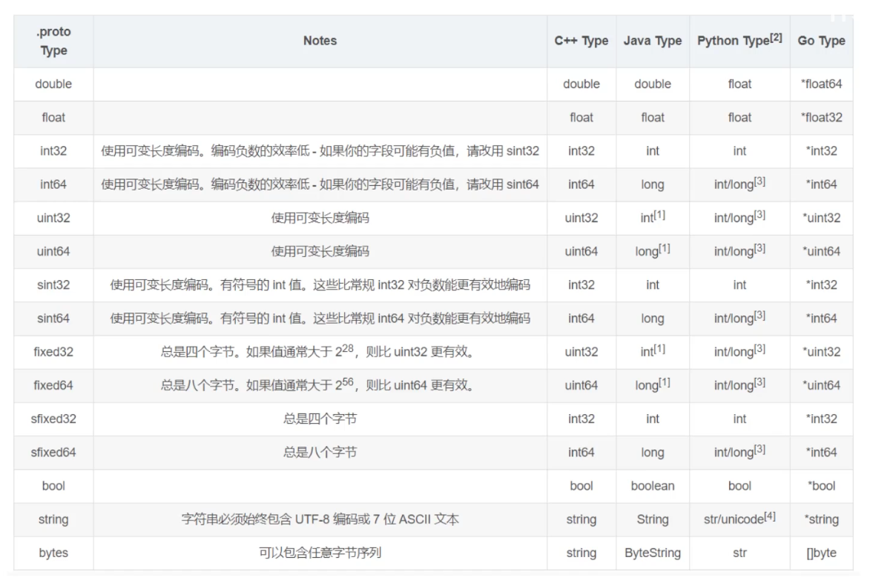
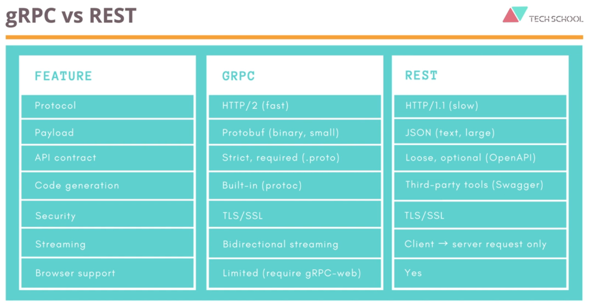

# protobuf

## 安装protobuf

(如果项目可以使用maven, gradle的话, 那么不安装也可以, 可以在编译的时候通过maven和gradle来编译proto文件, **推荐使用gradle**)

1. 下载protoc执行文件

   https://github.com/protocolbuffers/protobuf/releases/tag/v28.2

2. 解压到一个目录中

   `E:\protobuf\protoc-29.0-rc-1-win64`

3. 配置环境变量

   设置`PROTOBUF_HOME`为`E:\protobuf\protoc-29.0-rc-1-win64`

   添加path路径为`%PROTOBUF_HOME%\bin`

4. 在命令行中输入`protoc`, 如果成功即可

## protobuf  idea 插件安装

可以在idea中安装插件`Protocol Buffers`或者插件`Protobuf`

两个插件只能启用一个, 强制要求

前者是idea官方写的, 推荐

## protoc命令行

1. 编译message结构体

   ~~~bash
   # --proto_path: 指定proto文件所在的目录, 如果不指定, 那么就是当前目录, 如果有多个目录, 那么可以指定多个--proto_path选项
   # --python_out: 指定输出的python文件的位置
   # user.proto address_book.proto: 指定要编译的proto文件
   protoc --proto_path=. --python_out=. user.proto address_book.proto
   
   # 生成java代码
   protoc --proto_path=. --java_out=. user.proto address_book.proto
   
   # 生成go代码
   protoc --proto_path=. --go_out=. user.proto address_book.proto
   
   # 生成c#代码
   protoc --proto_path=. --csharp_out=. user.proto address_book.proto
   
   # 编译当前目录下所有proto文件
   find . -name "*.proto" | xargs protoc --proto_path=. --python_out=.
   ~~~

   

## protobuf语法

### 基础语法

以下是普通的protobuf文件的解析

news.proto

~~~protobuf
// 使用proto3语法
syntax = "proto3";

// 当前proto文件所在的包名, 包不需要和目录结构对应!!!
// 包名只是用来区分不同的proto文件中同名的message和service
package com.tiger.grpc;

// 如果设置为true, 那么对于每一个message, 都会生成一个同名的实体类, 和一个%message_name%OrBuilder类,
// 同时还是生成一个java_outer_classname指定的类
// 如果设置为false, 那么只会生成一个java_outer_classname指定的类, 其他的类都会放在这个类中
option java_multiple_files = true;
// java_outer_classname默认为文件名的大驼峰写法
option java_outer_classname = "NewsProto";

// 生成后的message和service的java文件所在的包
// 默认情况下使用package指定的包名
option java_package = "com.tiger.grpc.proto";

// 定义生成的go文件的包名
option go_package = "com.tiger.grpc.proto";

// 大驼峰
message NewsRequest {
  // 1表示字段的唯一编号, 唯一标识一个字段
  // 编号一旦设置, 就不应该在修改了, 否则有可能造成各个版本的客户端无法兼容
  // 编号可以设置为[1,  2^29-1], 但是不可以为[1900, 19999], 这些数字是Protobuf预留的
  // 可以在设置编号的时候, 预留一些空间, 比如10, 20, 30这样设置
  string date = 1; // 下划线写法, java中转换为小驼峰
}

message NewsResponse {
  // repeated表示这是一个有序的集合, 在编译的时候, 会根据不同的语言, 生成不同的集合类型
  // 比如在java中是List<News>, 在js中是Array<News>
  repeated News news = 1;
}

message News {
  int32 id = 1;
  // 指定title的默认值
  string title = 2 [default = "hello world"];
  string content = 3;
  
  // optional表示这是一个可选字段, 可以为空
  // 如果没有设置, 就使用默认值, 如果没有默认值, 那么就使用类型的默认值(0, false, null)
  // 如果没有显示设置值的话, 不会被序列化文件中
  // 如果没有指定optional, 那么默认就是optional的
  optional int64 createTime = 4;
}
~~~

定义了上面的文件之后, 通过protoc来进行编译, 编译后会生成一下几个类

1. 每一个proto文件会生成一个大类, 通过`java_outer_classname`来指定该类在java中的类名

2. 对于每一个message, 都会生成一个同名的实体类, 以及OrBuilder类, 比如News, 会生成一个News类和一个`NewsOrBuilder`类,  

   这些类在生成java代码的时候会根据`java_multiple_files`来判断是否放在大类中, 还是单独放置

### 所有的基础类型

### 字段的默认值

在定义字段的时候, 我们可以显示的指定字段的默认值

~~~protobuf
message News {
  int32 id = 1;
  // 指定title的默认值
  string title = 2 [default = "hello world"];
  string content = 3;
}
~~~

如果没有指定默认值, 那么就会使用类型的默认值

- string: 空字符串
- bytes: 空字节
- bool: false
- 数字类型: 0
- 其他message类型:  取决于具体语音, 在java中为null
- enum:  默认值为第一个枚举值
- repeat字段: 对应语音的空列表,  java中是ArrayList
- map: 对应语音的空map, java中是HashMap

**在序列化类的时候, 如果一个字段是默认值, 不管是显示设置还是默认使用, 都不会序列化**

**同时在反序列化的时候, 如果一个字段反序列化出来是默认值, 那么无法识别到底是显示设置的, 还是没有设置**

### import语法

在一个proto文件中可以使用`import`或者`import public`导入另一个proto文件中的内容, 然后进行使用

`import`和`import public`的区别在于:

1. a import b, b import c,  那么在a中不能使用c中的内容
2. a import b, b import public c, 那么在a中可以使用c中的内容

student.proto

~~~protobuf
syntax = "proto3";

package com.tiger.rpc;

option java_multiple_files = true;
option java_outer_classname = "StudentProto";

option java_package = "com.tiger.grpc.proto";

message Student {
  string name = 1;
  int32 age = 2;
  optional string address = 3;
}
~~~

classroom.proto

~~~protobuf
syntax = "proto3";

package com.tiger.rpc;

// 导入其他proto文件, 
import "student.proto";

option java_multiple_files = true;
option java_outer_classname = "ClassroomProto";

option java_package = "com.tiger.grpc.proto";

message Classroom {
  // 如果两个文件的package一样, 那么可以直接使用
  // 如果package不一样, 那么使用package.message来使用
  repeated Student students = 1;
}
~~~

### enum

~~~protobuf
  // 定义枚举
  enum PhoneType {
    // 枚举的第一个字段编号必须为0, 并且名称必须是UNKNOWN, UNSPECIFIED结尾
    PHONE_TYPE_UNSPECIFIED = 0;
    PHONE_TYPE_MOBILE = 1;
    PHONE_TYPE_HOME = 2;
    PHONE_TYPE_WORK = 3;
  }
  message PhoneNumber {
    // 这个枚举字段的默认值为第一个枚举值, 即PHONE_TYPE_UNSPECIFIED
    optional PhoneType type = 1;
    // 显示设置枚举值
    optional PhoneType type = 2 [default = PHONE_TYPE_HOME];
  }
~~~

还可以给枚举值设置别名

~~~protobuf
enum EnumAllowingAlias {
  option allow_alias = true; // 允许别名, 否则编译的时候会给出警告
  EAA_UNSPECIFIED = 0;
  EAA_STARTED = 1;
  EAA_RUNNING = 1; // 设置别名
  EAA_FINISHED = 2;
}
~~~

### service

在proto中还可以定义用于grpc通讯的service, 代码如下

~~~protobuf
syntax = "proto3";

option java_multiple_files = true;
option java_outer_classname = "NewsProto";

// 生成后的message和service的java文件所在的包
option java_package = "com.tiger.grpc.proto";

package com.tiger.grpc;

// 定义一个RPC服务, 对于service的定义, 每个service都会生成一个同名的类
// 一般service的命名都是以Service结尾
service NewsService {
  // rpc表示定义一个rpc方法
  // getNews表示方法名, 这个方法名可以随便写
  // NewsRequest表示参数的类型, 如果有多个参数, 使用逗号分割
  // returns表示返回
  // NewsResponse表示返回值类型, 只能有一个
  rpc getNews (NewsRequest) returns (NewsResponse);
}

message NewsRequest {
  string date = 1;
}

message News {
  int32 id = 1;
  string title = 2;
  string content = 3;
  // optional表示这是一个可选字段, 可以为空
  optional int64 createTime = 4;
}
~~~

我们定义了这个rpc服务之后, 通过protoc来编译生成代码

对于每一个service, 都会生成一个以Grpc结尾的类

比如`NewsService`, 会生成一个`NewsServiceGrpc`的类, 他内部有如下几个类

- `NewsServiceGrpc`: 用来构建一个服务器service
- `NewsServiceImplBase`:  在服务器端, 继承这个类来实现具体方法的逻辑
- `NewsServiceBlockingStub`: 在客户端, 使用这个类来向服务器发送消息到NewsService, 同步的
- `NewsServiceFutureStub`:在客户端, 使用这个类来向服务器发送消息到NewsService, 异步的, 不支持发送流式数据
- `NewsServiceStub`: 在客户端, 使用这个类来向服务器发送消息到NewsService, 异步的, 支持发送流式数据
- `NewsServiceSupplier`: grpc通讯用的描述符(元数据)

### 删除字段

当您不再需要某个字段并且所有引用都已从客户端代码中删除时，您可以从消息中删除该字段定义

但是为了防止后续不小心重用了这个字段相同的名称和编号, 可以使用如下办法

~~~protobuf
message Foo {
  // 可以将已删除的字段的名称和编号放在这里
  reserved 2, 15, 9 to 11; // 禁止使用的编号
  reserved "foo", "bar"; // 禁止使用的字段名称
}
~~~

### 嵌套message

您可以在其他消息类型中定义和使用消息类型

~~~protobuf
message SearchResponse {
  message Result {
    string url = 1;
    string title = 2;
    repeated string snippets = 3;
  }
  repeated Result results = 1;
}

// 在其他消息体中使用
message SomeOtherMessage {
  SearchResponse.Result result = 1;
}
~~~

### one of

one of表示多个字段只能设置其中一个,  一旦设置其中一个, 就会自动清除其他的值

~~~protobuf
message SampleMessage {
  // oneof中不能使用map和repeated, 如果想使用, 那么就用一个message包裹
  oneof test_oneof {
    // name和sub_message都是SampleMessage的成员
    // 可以使用case()或者whichOneOf()来判断哪个设置了值
    string name = 4;
    SubMessage sub_message = 9;
    // 因为age设置了default, 如果所有字段都没有显示设置值, 那么whichOneOf会返回age
    string age = 10 [default = "10"]; 
  }
}
~~~

### map

可以使用map来创建映射

~~~protobuf
message SampleMessage {
  // key只能是任意的整型和string
  // value可以是除map外的任意类型
  // map不能使用repeated
  // map没有顺序, 在生成text的时候, map会按照key来进行排序
  map<string, Project> projects = 3;
}
~~~

### 其他类型

#### timestamp

在protobuf的原生类型中, 并没有timestamp类型, 如果想要使用这个类型, 我们可以使用如下

~~~protobuf
import "google/protobuf/timestamp.proto"

message Laptop {
  google.protobuf.Timestamp update_at = 1;
}
~~~

#### Any

Any类型是一个特殊的类型, 可以保存任何类型的字段. 

Any实际上就是

~~~protobuf
message Any {
    string type_url = 1; // 保存数据的类型
    bytes value = 2; // 保存具体的数据
}
~~~

在序列化的时候, 会将该知道的数据和类型名称一起序列化, 在反序列化的时候通过类型名称来正确反序列化

~~~protobuf
syntax = "proto3";

import "google/protobuf/any.proto";

package example;

// 定义一些消息类型
message Person {
  string name = 1;
  int32 age = 2;
}

message Address {
  string street = 1;
  string city = 2;
  string country = 3;
}

// 使用 Any 类型的容器消息
message Container {
  string description = 1;
  google.protobuf.Any data = 2;
}
~~~

~~~python
from google.protobuf.any_pb2 import Any
from example_pb2 import Person, Address, Container

# 创建一个 Person 消息
person = Person(name="Alice", age=30)

# 将 Person 消息包装在 Any 中
person_any = Any()
person_any.Pack(person)

# 创建 Container 消息，并存储 Any 类型的数据
container = Container(description="This is a person data", data=person_any)

# 输出 Container 的内容
print(container)

# 解包 Any 类型的数据
unpacked_person = Person()
if container.data.Unpack(unpacked_person):
    print("Unpacked person:", unpacked_person)
else:
    print("Failed to unpack the person message.")
~~~

## 更新message格式

如果你想要更新message的格式, 那么有以下几个需要注意的点

1. 不要更改任何现有字段的字段编号。 “更改”字段编号相当于删除字段并添加相同类型的新字段。

   如果要对字段重新编号，请参阅[删除字段](https://protobuf.dev/programming-guides/proto3/#deleting)的说明。

2. 如果添加新字段，旧版本序列化后的消息可以由新版本的代码来反序列化

   新的字段反序列化后具有默认值

3. 在消息类型中不再使用字段编号，就可以删除字段, 参考删除字段的说明

4. 如果将int32, uint32, int64, uint64, bool中的一种类型修改为另一种类型, 那么和c++中的强制类型转换相同

5. 只要字节是有效的utf-8编码,  那么string和bytes就是兼容的

6. fixed32和sfixed32兼容,  fixed64和sfixed64兼容

## 未知的字段

如果我们使用新版本的代码去反序列化旧版本的二进制文件, 那么就可能出现未知字段的问题

~~~protobuf
// 旧版本
message News {
  int32 id = 1;
  string title = 2;
  string content = 3;
}

// 新版本
message News {
  int32 id = 1;
  string title = 2;
}
~~~

在反序列化之后的对象中还是会包含这些未知的字段

同时对一个包含未知字段的对象序列化, 那么文件中也会包含未知字段

以下操作会导致未知字段的丢失

1. 将proto序列化为json,   所以推荐在数据交换的时候使用二进制, 而不是文本
2. 迭代对象的所有字段填充另一个对象,  推荐使用CopyFrom()和MergeFrom()这两个api

## gradle中使用proto

### protobuf-gradle-plugin插件

https://github.com/google/protobuf-gradle-plugin

在gradle中, 我们可以使用protobuf-gradle-plugin来帮助我们编译proto文件, 要想在gradle中使用这个插件, 可以通过如下代码

~~~groovy
plugins {
    id 'java'
    // google的protobuf-gradle-plugin插件
    // https://github.com/google/protobuf-gradle-plugin
    // 添加了该插件之后, 他会自动识别每个sourceSet下proto目录下的proto文件
    // 从https://plugins.gradle.org/search可以搜索到这个插件的各个版本
    id "com.google.protobuf" version "0.9.4"
}
~~~

#### 自定义源文件目录

添加了这个插件之后, 默认每个sourceSet下的`proto`文件夹作为保存proto文件的目录, 即`src/main/proto`和`src/test/proto`

如果要添加别的位置, 可以如下设置

~~~groovy
sourceSets {
  main {
    // 定义main SourceSet下proto文件夹
    proto {
      // In addition to the default 'src/main/proto'
      srcDir 'src/main/protobuf'
      srcDir 'src/main/protocolbuffers'
      // In addition to the default '**/*.proto' (use with caution).
      // Using an extension other than 'proto' is NOT recommended,
      // because when proto files are published along with class files, we can
      // only tell the type of a file from its extension.
      include '**/*.protodevel'
    }
  }
  test {
    // 定义test SourceSet下proto文件夹
    proto {
      // In addition to the default 'src/test/proto'
      srcDir 'src/test/protocolbuffers'
    }
  }
}
~~~

#### 自定义使用的protoc

在默认情况下, 插件会在系统的path下查找protoc文件, 并使用该文件来编译proto文件

如果你没有将protoc添加到path下, 那么也可以直接指定protoc

~~~groovy
// 直接放在build.gradle文件中
protobuf {
  protoc {
    path = '/usr/local/bin/protoc'
  }
}
~~~

或者你可以直接使用google发布在maven仓库中的protoc

~~~groovy
protobuf {
    protoc {
        // 从maven仓库搜索protoc可以查到这个jar包, 直接将gav放在这里就好了
        artifact = 'com.google.protobuf:protoc:4.29.0-RC1'
    }
}
~~~

#### 自定义protoc使用的插件

在使用protoc的时候, 你可以搭配插件来一起使用, 不同的插件会读取不同的内容并生成不同的代码

最显著的就是使用grpc插件来对service生成代码

我们可以通过如下代码来引入插件

~~~groovy
protobuf {

  plugins {
      // 默认情况下, protobuf-gradle-plugin会在当前目录或者path目录下查找名为protoc-gen-{name}的插件
    grpc {
      // 直接指定插件所在的maven坐标
      // 从maven仓库搜索protoc-gen-grpc-java可以查到这个jar包, 直接将gav放在这里就好了
        
      // 该插件用于生成grpc代码
      artifact = 'io.grpc:protoc-gen-grpc-java:1.68.0'
        
      // or 直接指定插件的地址
      // path = 'tools/protoc-gen-grpc-java'
    }
    // Any other plugins
    ...
  }
}
~~~

上面代码只是映入插件, 并不会真正的应用

#### 自定义代码生成任务

protobuf对于每一个sourceSet(`src/main`, `src/test`), 都会自动生成一个task, 这个task用来编译proto文件, 并生成特定语言的代码到指定的目录

~~~groovy
protobuf {
    generateProtoTasks {
        // all()用来获取所有的task
        all().configureEach { task ->
        }

        // 获取main SourceSet的任务
        ofSourceSet('main').configureEach { task ->

        }
    }
}
~~~

每个task都有两个集合属性

1. builtins

   用于生成指定语音的代码, 以及选项

   ~~~groovy
   protobuf {
       generateProtoTasks {
           all().configureEach { task ->
               task.builtins {
                   // java表示要生成java代码, 这会添加 --java_out=/path/to/output 的选项到protoc命令行中
                   // 所以要生成java代码, 一定要指定 java {}
                   java {
                       // option 会生成 --java_opt=example_option1=true,example_option2 的选项
                       option 'example_option1=true'
                       option 'example_option2'
                   }
                   // 生成cpp代码, 这会添加一个 --cpp_out=/path/to/output 选项到protoc命令行中
                   cpp {}
                   // 生成python代码
                   python {}
               }
           }
       }
   }
   ~~~

2. plugins

   用于启用指定的插件

   ~~~groovy
   protobuf {
       plugins {
           grpc {
               artifact = 'io.grpc:protoc-gen-grpc-java:1.68.0'
           }
       }
       generateProtoTasks {
           all().configureEach { task ->
               task.plugins {
                   // 启用grpc插件, 这个插件一定要现在protobuf.plugins中配置
                   // 这会添加 --grpc_out=/path/to/output 选项到protoc命令行中
                   grpc {}
               }
           }
       }
   }
   ~~~

   

#### 自定义代码生成的位置

默认情况下, 每个task都会将代码生成在`$buildDir/generated/source/proto/$sourceSet/`,  这个路径无法更改

同时每个task下的builtins和plugin都会将代码放在上面目录的`$pluginName`或者`$builtinsNames`目录下

我们可以自定义这个子目录

~~~groovy
protobuf {
    generateProtoTasks {
        all().configureEach { task ->
            task.builtins {
                java {
                    // 不推荐修改, 因为protobuf会自动的将`build/generated/source/proto/main/java`设置为main SourceSet的源代码目录
                    outputSubDir = 'java'
                }
                cpp {
                    outputSubDir = 'cpp'
                }

            }
            task.plugins {
                grpc {
                    outputSubDir = 'grpc'
                }
            }
        }
    }
}
~~~

### 处理proto的具体步骤

1. 添加protobuf-gradle-plugin插件

   ~~~groovy
   plugins {
       id 'java'
       // google的protobuf-gradle-plugin插件
       // https://github.com/google/protobuf-gradle-plugin
       // 添加了该插件之后, 他会自动识别每个sourceSet下proto目录下的proto文件
       // 从https://plugins.gradle.org/search可以搜索到这个插件的各个版本
       id "com.google.protobuf" version "0.9.4"
   }
   ~~~

2. 添加protobuf和grpc的依赖

   ~~~groovy
   dependencies {
       // protobuf依赖
       implementation 'com.google.protobuf:protobuf-java:4.29.0-RC1'
       // 用于将protobuf序列化和反序列化为json的工具包
       implementation 'com.google.protobuf:protobuf-java-util:4.29.0-RC1'
   
       // grpc依赖
       implementation 'io.grpc:grpc-all:1.68.0'
       // grpc生成的代码需要依赖的包
       implementation 'org.apache.tomcat:annotations-api:6.0.53'
   }
   ~~~

3. 配置protobuf插件

   ~~~groovy
   protobuf {
      protoc {
           // 从maven仓库搜索protoc可以查到这个jar包, 直接将gav放在这里就好了
           artifact = 'com.google.protobuf:protoc:4.29.0-RC1'
       }
       
       // 指定protoc使用的插件
       // 注意这里只是导入插件, 并不会使用
       plugins {
           "grpc-java" {
               // 从maven仓库搜索protoc-gen-grpc-java可以查到这个jar包, 直接将gav放在这里就好了
               // 该插件用于生成grpc代码
               artifact = 'io.grpc:protoc-gen-grpc-java:1.68.0'
           }
       }
   
       generateProtoTasks {
           all().configureEach { task ->
               task.builtins {
                   // java表示要生成java代码, 这会添加 --java_out=/path/to/output 的选项到protoc命令行中
                   // 所以要生成java代码, 一定要指定 java {}
                   java {}
   
               }
               task.plugins {
                   // 启用grpc-java插件, 并设置代码的生成子目录
                   "grpc-java" {
                       outputSubDir = 'grpc-java'
                   }
               }
   
           }
       }
   }
   ~~~

4. 设置protobuf生成的代码目录为源码目录

   ~~~groovy
   sourceSets {
       main {
           java {
               srcDirs 'build/generated/source/proto/main/grpc-java'
               srcDirs 'build/generated/source/proto/main/java'
           }
       }
   }
   ~~~

5. 在gradle中执行`./gradlew build` 或者`./gradlew generateProto `

   

# gRPC

在gRPC中, 我们首先要编写一个合约, 来说明我们的服务器有哪些接口, 使用什么样的参数类型, 返回值是什么

然后我们通过这个合约, 来生成不同语音的代码, 这样就可以跨语言通讯了

我们可以使用protobuf来先写这个合约, 也可以使用google flatbuffers和Microsoft bond来先写这个合约

同时grpc底层使用http/2来进行通讯, 相较于http1, 优势如下:

1. http header使用hpack压缩
2. 可以使用一个tcp并行连接发送多个请求和响应, 减少延迟和提高网络利用率
3. 可以使用服务端推送,  即一个请求, 服务端可以有多个响应

1. 一个tcp连接可以承载多个双向流
2. 每个双向流都有唯一的标识, 并携带多个双向消息
3. 每个消息都可以拆分为多个二进制帧,  帧是承载数据的最小单位

1. http2是二进制协议, 而http1是文本协议
2. http2的header被压缩了, 而http1中是纯文本
3. http2运行使用多路复用, 而http1.1不允许
4. http2单个tcp连接中可以发送多个响应和请求, 而http1.1只能有1个请求和响应
5. 在http2中可以实现服务器推送, 而http1中不允许

### grpc的通讯模型

1. unary一元通讯:  client发送一个请求, server返回一个响应
2. client streaming客户端推送:  client发送多个请求, server返回一个响应
3. server streaming服务端推送: client发送一个请求, server返回多个响应
4. bidirectional streaming双向推送:  client发送多个请求, server返回多个响应,  请求和响应是并行发送的,

### grpc和rest的比较

