#### 准备工作

1. 安装solidity插件, 请使用黄色的, 安装后有语法高亮
2. 安装Prettier插件, 并在settings中设置为默认的格式化器, 该插件可以格式化很多文件, 包括solidity(在settings中搜索defaultformattor)
3. 设置format on save, 即可在保存的时候自动格式化

#### 在本地项目中编译sol文件

1. 安装yarn
   以管理员命令执行 `corepack enable` 即可开启yarn
   输入 `yarn --version` 输出版本
2. 通过yarn安装solc到当前项目中
   - 直接安装使用 `yarn add solc`

   根据当前solidity使用的版本安装特定的solc使用 `yarn add solc@0.8.7-fixed`

   - 如果需要全局安装, 使用 `yarn global add solc@0.8.7-fixed`

   - 如果要查看solc支持的命令, 使用 `yarn solcjs --help`

   - 查看solc版本使用 `yarn solcjs --version`

3. 安装完成后会出现node_moduls, package.json, yarn.lock
   - node_modules中保存了安装的依赖
   - package.json记录了当前项目的所安装的依赖
   - yarn.lock记录了当前项目的依赖和依赖的依赖的真实版本
4. 使用solcjs编译sol文件
 `yarn solcjs --bin --abi --include-path node_modules/ --base-path . -o . SimpleStorage.sol`

`--bin` 表示需要生成二进制文件
`--abi` 表示需要生成abi文件 
`-o` 指定输出的路径
 `--base-path` 指定当前项目的根目录

5. 将solcjs编译sol文件的命令添加到package.json中
   

```javascript
   "scripts": {
       "compile": "yarn solcjs --bin --abi --include-path node_modules/ --base-path . -o . SimpleStorage.sol"
   }
```

   下次编译的时候可以直接使用 `yarn compile` 或者 `npm run compile` , 就会执行compile指定的命令

#### 使用ganache作为虚拟的区块链环境

1. https://trufflesuite.com/ganache/

#### 部署合约到Ganache上

1. 安装Ganache
2. 在项目上通过安装ether.js
 `yarn add ethers`

3. 编写deploy.js

#### 控制项目的代码格式

1. 如果别人的项目没有使用vscode, 或者prettier插件, 可能就无法做到格式统一
   所以这里需要通过moudle来控制代码格式
2. 安装prettier
 `npm install prettier`

3. 在目录下创建.prettierrc文件, 并设置代码格式
   ~~~json
   {

      "tabWidth": 4, 
      "useTabs": false, 
      "semi": false, 
      "singleQuote": false  

   }
   ~~~
   .prettierrc中的设置会覆盖当前prettier的设置

#### 读取环境变量
1. 安装dotenv
   `npm install dotenv`
   
2. 创建.env文件, 并在当中设置环境变量
   ```text
   PRIVATE_KEY=4156341653145
   ```
3. 在需要读取环境变量的js文件中添加
   ```js
   require("dotenv").config()
   ```
   之后就可以在js文件中使用`process.env.PRIVATE_KEY`来引用环境变量
4. 同时他也可以读取终端中设置的环境变量
   可以在终端中设置PRIVATE_KEY=4156341653145, 他同样也可以读取

#### 加密私钥
1. 可以通过wallet.encrypt方法传入密码, 加密一个私钥, 生成一个json字符串
2. 将json字符串写入到本地文件中
3. 在部署的时候, 从文件中读取到json字符串
4. 通过new ethers.Wallet.fromEncryptedJsonSync()来从加密json字符串中创建一个钱包
   需要传入加密字符串, 密码
   密码可以在终端中设置, 然后通过dotenv来读取
   这样在本地文件中就可以不用保存私钥了

#### 将合约部署到测试网
1. 登录上Alchemy网站

2. 创建app
   
   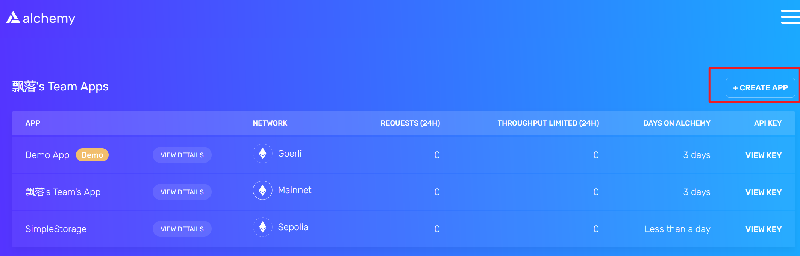
   
   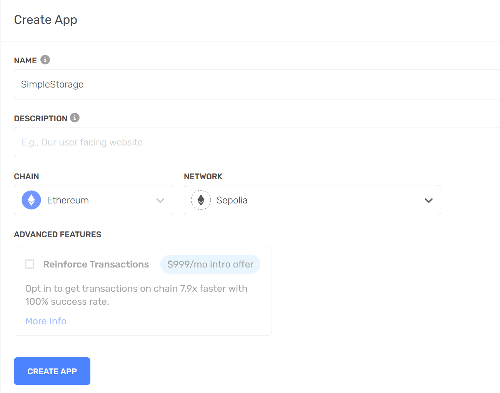

3. 查看私钥

   

   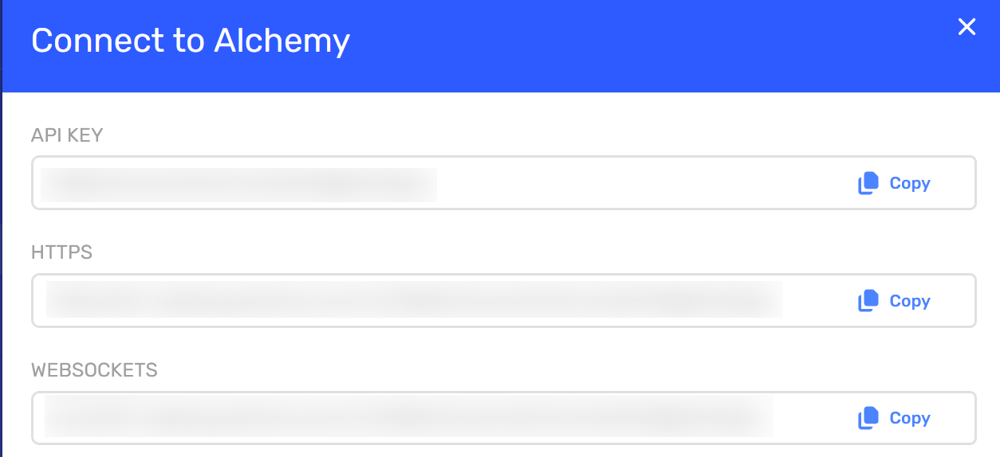

4. 复制https到new ethers.providers.JsonRpcProvider(process.env.RPC_URL)中, 
   修改私钥为指定网络的私钥, 之后连接上了Alchemy网络, 之后就可以部署合约了
   
5. 之后来到https://sepolia.etherscan.io/查看我们部署的合约

   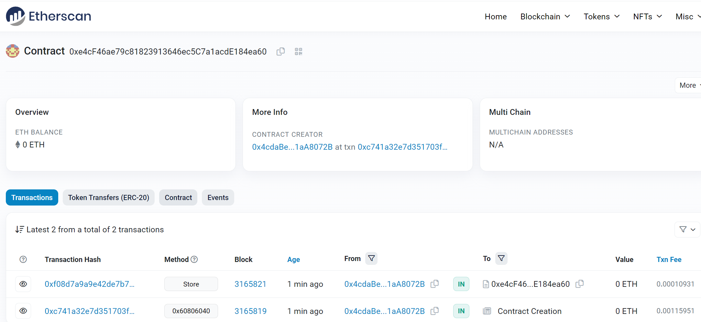

6. 下面有反编译源码和发布源码的按钮, 测试反编译耗时太久, 同时编译出来的代码太复杂, 效果不好

   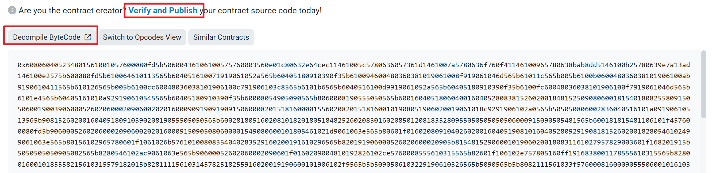

   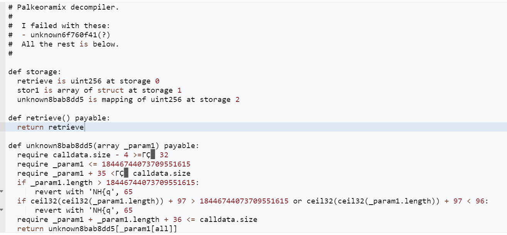

7. 发布合约源码

   - 点击Verify and Publish, 选择合约的地址, 多文件还是单文件, 合约编译的版本, 合约的License

   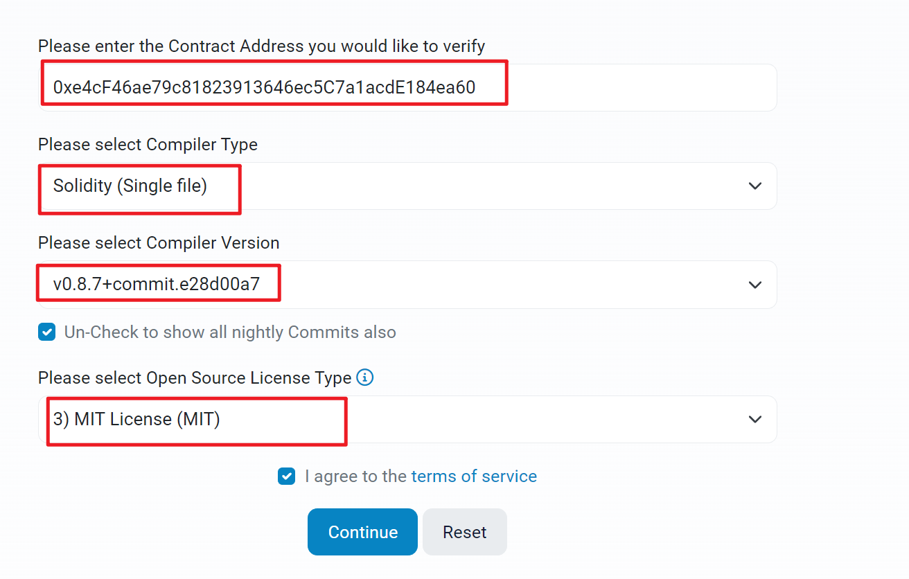

   - 确认合约的地址, 版本, 输入合约的源码, 构造函数的参数, 使用的library

     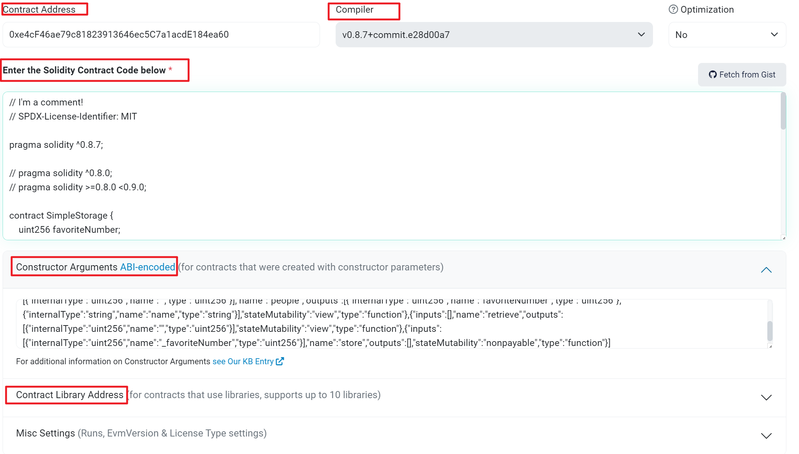

     点击确认, 验证之后即可发布源码

8. 发布之后可以在网站上看到合约的源码

   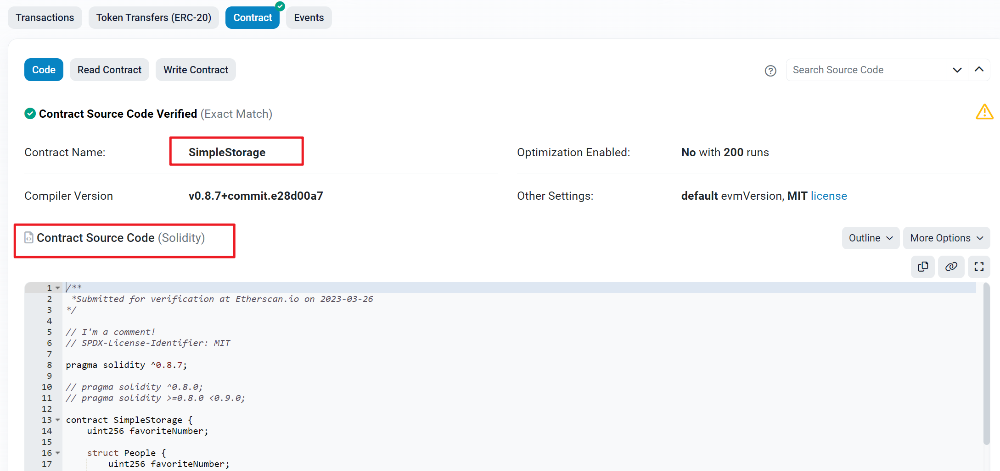

9. 点击Read Contract后可以对合约的所有view函数, public数据进行读取

   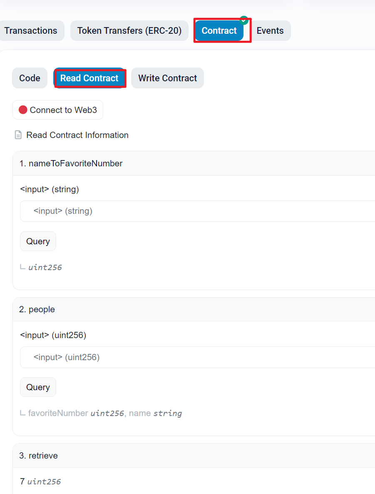

10. 在点击Write Contract按钮后, 可以连接钱包, 对其中的public函数进行调用

    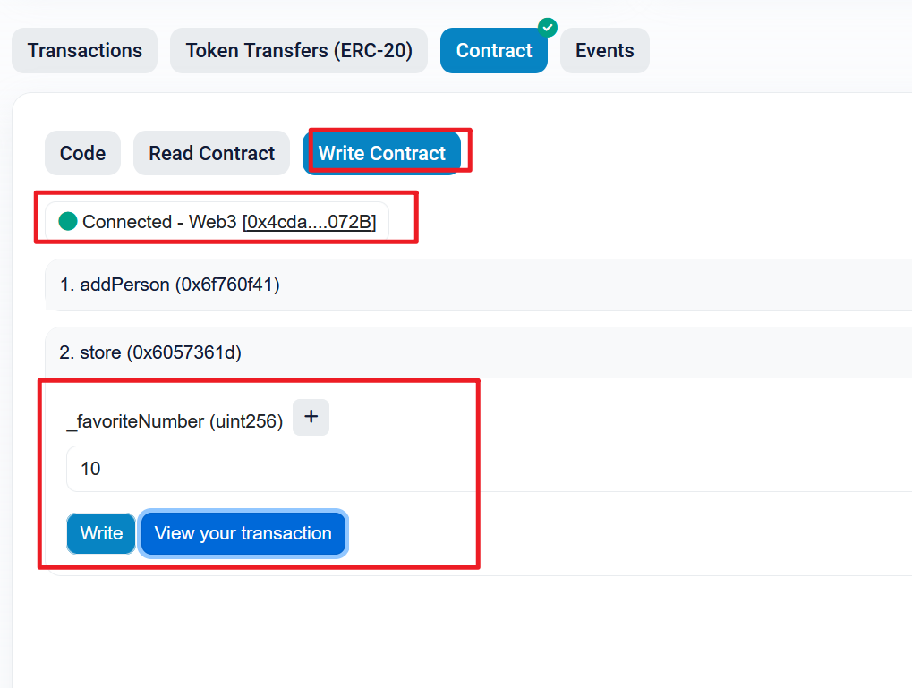