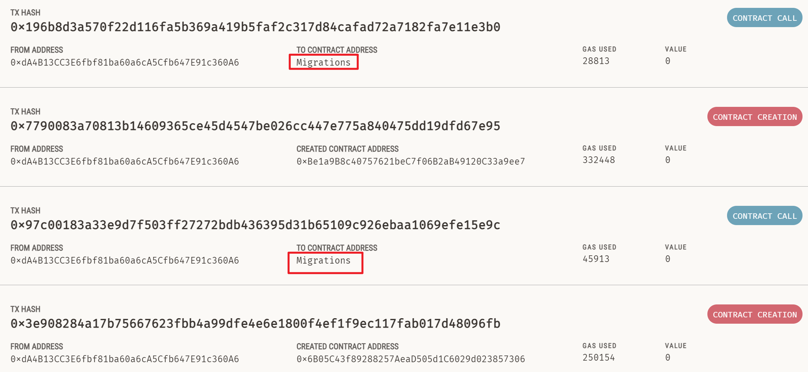

#### truffle教程
> 安装truffle

   `yarn add --dev truffle chai mocha @types/chai @types/mocha`

> 初始化项目

   `yarn truffle init`
   初始化后就有这样的一个项目目录结构：
   - contracts/: Solidity合约目录
   - migrations/: 部署脚本文件目录
   - test/: 测试脚本目录，参考 如何测试合约于应用？
   - truffle-config.js: Truffle 配置文件

> 编译合约

   - 在`contracts`目录下创建合约文件
   - 使用`yarn truffle compile`进行编译,
   - 编译后的文件保存在`build/contracts/`中
   - 默认情况下没有更改的sol文件不会再次编译, 使用`--all`来覆盖这个行为

- 合约内容如下:

   ```sol
// SPDX-License-Identifier:GPL-3.0
pragma solidity ^0.8.17;
contract Migrations {
    address public owner;
    // A function with the signature `last_completed_migration()`, returning a uint, is required.
    uint public last_completed_migration;
    modifier restricted() {
        if (msg.sender == owner) _;
    }
    constructor() {owner = msg.sender;}
    // A function with the signature `setCompleted(uint)` is required.
    function setCompleted(uint completed) public restricted {
        last_completed_migration = completed;
    }
    function upgrade(address new_address) public restricted {
        Migrations upgraded = Migrations(new_address);
        upgraded.setCompleted(last_completed_migration);
    }
}
   ```


> 部署合约并且与合约互动

   - 在`migrations`目录下编写部署脚本`2_deploy_contracts`, 脚本名称前面必须带编号, 用以确定脚本的执行顺序, 并且记录已经运行的脚本(具体查看`Migrations`合约的说明)
   - **truffle默认使用ganache网络, 并且连接127.0.0.1:7545, 所以在部署合约之前需要启动ganache**
   - 启动ganache后, 执行`yarn truffle migrate`会执行部署脚本
   - 脚本内容如下:
   ```js
   var Migrations = artifacts.require("Migrations"); // 通过合约的名字获取合约的抽象对象

// 导出的函数第一个对象必须是 deployer
// 第二个参数是网络相关
// 第三个是连接的节点所提供的账户, 类似于web3.js中的web3.eth.getAccounts()
module.exports = function (deployer, network, accounts) {
  // 通过deployer部署合约
  const constructorArgs = [];
  const options = {
    from: accounts[0], // 部署合约的账户
    gas: 5000000,
    overwrite: false, // 如果之前部署过了该类型的合约, 就不会重复部署了, 对于某些只需要部署一遍的合约很有用
  };
  instance = deployer.deploy(Migrations, ...constructorArgs, options);
  console.log(Migrations);
  console.log("---------------------------");
  console.log(instance);
};
   ```


> 关于Migrations合约的说明

在通过`yarn truffle init`创建的项目文件中, 有可能有`contracts/Migrations.sol`和`migrations/1_initial_migration.js`两个文件, 取决于truffle的版本, 5.3.9是有这两个文件的, 而5.8.4是没有的

两个文件内容如下:

~~~sol
// SPDX-License-Identifier: MIT
pragma solidity >=0.4.22 <0.9.0;

contract Migrations {
  address public owner = msg.sender;
  uint public last_completed_migration;

  modifier restricted() {
    require(
      msg.sender == owner,
      "This function is restricted to the contract's owner"
    );
    _;
  }
  function setCompleted(uint completed) public restricted {
    last_completed_migration = completed;
  }
}
~~~

~~~js
const Migrations = artifacts.require("Migrations");
module.exports = function (deployer) {
  deployer.deploy(Migrations);
};
~~~


关于这两个文件的作用是, 在通过`yarn truffle migrate`执行部署脚本的时候, 如果通过`1_initial_migration.js`这个文件部署了`Migrations`这个合约, truffle就会检测到 , 每次执行`yarn truffle migrate` 都会从`Migrations`中获取已经执行过的部署脚本的编号, 只有大于这个编号的脚本才会执行, 并且执行一个脚本之后会将该脚本的编号写入到`Migrations`中, 供下次使用.

即如果你有两个合约`Migrations`和`Token`, 那么在第一次执行部署脚本的时候, 会产生四次调用

1. 部署`Migrations`合约
2. 调用`Migrations.setCompleted()`方法写入上次执行的脚本编号
3. 部署`Token`合约
4. 调用`Migrations.setCompleted()`方法写入上次执行的脚本编号



你可以通过注释掉`1_initial_migration.js`这个文件的内容来禁用这一功能, 这样每次执行`yarn migrate`都会从头开始执行部署脚本

也可以通过`yarn truffle migrate --reset`选项来从头开始执行部署脚本

或者你也可以修改`Migrations.sol`和`1_initial_migration.js`中的逻辑来达成其他的功能


> 测试合约


> truffle整合typescript

1. 安装typechain

   `  yarn add --dev typechain @typechain/truffle-v5`

2. 通过typechain生成代码

   `yarn truffle compile && yarn typechain --target truffle-v5 './build/contracts/*.json'`

   --target表示生成后的合约代码所使用的框架

   --out-dir表示生成后的代码位置, 默认是在`./types/truffle-contracts/`目录下

3. 在`truffle-config.js`中注册`ts-node`, 代码加在配置文件顶部

   ```js
   require("ts-node").register({
     files: true,
   });
   ```

4. 修改`migrations`目录下的js文件为ts文件, 比如

   ```js
   const Migrations = artifacts.require("Migrations");
   module.exports = function (deployer) {
     deployer.deploy(Migrations);
   };
   ```

   修改为如下, 无用代码可以删除:

   ```ts
   import { AllEvents } from "../types/truffle-contracts/Migrations";
   
     // artifacts这个变量是在通过typechain生成的类型声明文件中定义的, 可以直接使用
     let Migrations = artifacts.require("Migrations");
     // web3这个变量也是在通过typechain生成的类型声明文件中定义的, 可以直接使用
     let Web3 = web3;
   
   module.exports = async ( deployer: Truffle.Deployer, network: string, accounts: string[] ) => {
   
     // 通过deployer部署合约
     const constructorArgs: any[] = [];
     const options = {
       from: accounts[0], // 部署合约的账户
       gas: 5000000,
       overwrite: false, // 如果之前部署过了该类型的合约, 就不会重复部署了, 对于某些只需要部署一遍的合约很有用
     };
     deployer.deploy(Migrations, ...constructorArgs, options);
   
     const instance = await Migrations.deployed(); // 获取部署后的合约实例
     // 与合约进行交互, 多个参数使用逗号隔开
     const result: Truffle.TransactionResponse<AllEvents> =
       await instance.setNumber(100, {
         from: accounts[0],
         gas: 5000000,
         gasPrice: 20000000000,
         value: "10000",
       });
   };
   ```

5. 修改`test`目录下的js文件为ts文件

   