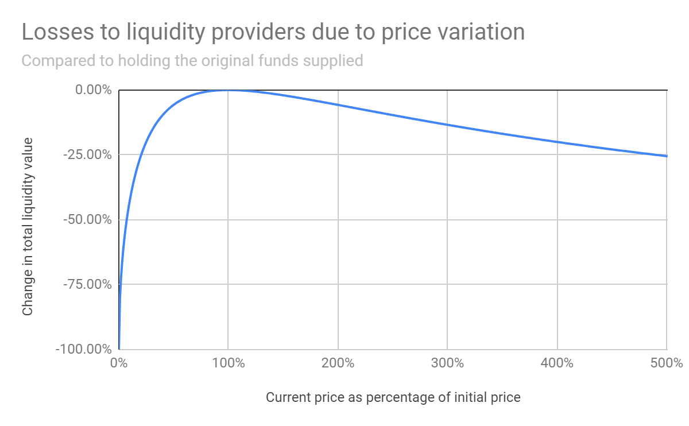
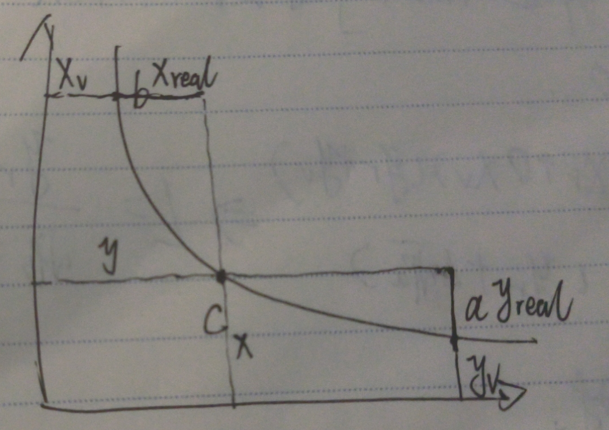

# Uniswap V2


## **恒定乘积做市商模型**

https://zhuanlan.zhihu.com/p/362949468


恒定乘积做市商模型，由Uniswap率先实现并推广，以恒定乘积公式**xy=k**为基础，使交易对的两种资产数量乘积恒定不变来推进市场交易。虽然Uniswap在DeFi领域开创了新时期的先河，成为了DEX领域的龙头，但恒定乘积做市商模型存在的滑点与无常损失仍饱受诟病。


## 基础知识

1. 在uniswap初始的时候, 假如没有特定的交易对池子, 那么任何人都可以往其中添加流动性来创建相应的交易对, 并且比例是随便的(后续会有套利商进来套利, 使得交易对的比例与市场上的比例相同)
2. 假如在uniswap中已经有相应的交易对池子, 那么任何人都可以添加交易对, 成为liquidity provider, 并且拿到LP Token, 但是**添加在流动性的时候, 添加的交易对的比例和现有池子中的比例要相同**
3. 在计算的时候常常忽略手续费, 假定k是恒定的, 但是因为在交易的时候收取了一定的手续费, 所以k是在缓慢变大的
4. 任何人都可以移除流动性拿回自己的token, 并销毁LP Token
5. 交易池中的流动性通过 √xy来衡量,  因为假设一个eth/dai的池子有1:1的流动性, 后续又添加了1:1的流动性, 那么后续的√xy刚好是原来的两倍, 是一个线性的关系


## LP Token的计算

> 添加流动性获得的LP Token

假设在添加流动性之前,  LP Token总量为T

添加了dx和dy token后, 我们获得了S个LP Token

(**流动性√xy 与 LP Token的数量T应该是线性关系, 因为流动性翻倍, T也要翻倍**)

则有
$$
\begin{cases}
\frac{\sqrt {xy}}{\sqrt {dx*dy}} = \frac{T}{S}
\\
dx/dy = x/y
\end{cases}
$$
所以
$$
S = \frac{dx}{x} T =  \frac{dy}{y} T
$$
即按照比例获得LP Token

> 移除流动性

移除同理, 应该按照移除的LP Token的数量和LP Token的总量等比例返还给我们交易对

假设我们移除流动性S个LP Token, 总量为T
$$
\frac{S}{T} = {dx \over x} = {dy \over y}
$$
所以获得的dx和dy分别为
$$
\begin{cases} dx = {S \over T} * x
\\
dy = {S\over T}*y
\end{cases}
$$

## 滑点

什么是滑点，滑点一般指**预设成交价位与真实成交价位的偏差**。恒定乘积AMM中同样存在滑点，一旦发生交易，池中资产的储备发生变化，资产实际的交易执行价就会发生变化，产生滑点。交易额越大，滑点越大，交易者的损失就越大。

> 公式分析

根据恒定乘积，当用dx个dai兑换dy个eth时（忽略手续费），有：
$$
\begin{cases} xy = k\\ (x+dx) (y-dy) = k \end{cases}
$$
可得，兑换量：
$$
dy = \frac{y * dx}{ x+dx}
$$
则在实际兑换中，eth相对dai的单价为：
$$
dx/dy = \frac {x + dx}{y}
$$
而兑换前，池中的y单价为x/y，那么y单价的滑点价格就产生了：
$$
Slippage_y = dx/dy - x/y = \frac{dx}{y}
$$
**交易量dx越大，产生的滑点就越大，偏离实际价位就越大，而池中的资金储备越多、交易深度越大，则能尽量减少滑点的溢价，使用户的交易损耗降低。**


> 已知输出的token的数量, 求输入的token的数量

通过上面的公式已知通过dx个dai, 可以兑换出如下数量的eth
$$
dy = \frac{y * dx}{ x+dx}
$$
当已知兑换出dy个eth时, 计算需要多少dx, 通过上面公式可以得出
$$
dx = \frac {dy * x}{y-dy}
$$


>  实际计算

Uniswap在实际计算交易滑点时，是通过百分比来显示的：


Uniswap源码中对滑点的计算是在`uniswap-v2-sdk/src/entities/trade.ts`文件中的`computePriceImpact`函数中实现的

```text
/**
* Returns the percent difference between the mid price and the execution price, i.e. price impact.
* @param midPrice mid price before the trade
* @param inputAmount the input amount of the trade
* @param outputAmount the output amount of the trade
*/
function computePriceImpact(midPrice: Price, inputAmount: CurrencyAmount, outputAmount: CurrencyAmount): Percent {
 const exactQuote = midPrice.raw.multiply(inputAmount.raw)
 // calculate slippage := (exactQuote - outputAmount) / exactQuote
 const slippage = exactQuote.subtract(outputAmount.raw).divide(exactQuote)
 return new Percent(slippage.numerator, slippage.denominator)
}
```

按照函数中的逻辑，滑点百分比计算公式如下：
$$
PriceImpact = \frac{midPrice*dx - dy}{midPrice*dx}
$$
这里的`midPrice`从代码上看不出是x对y的价格还是y对x的价格，但按照公式的计算逻辑，当`midPrice`代表x对y的价格时，`midPrice·dx`就代表理论应得y的数量，那么这个公式就是按照*滑点差值/理论应得量*的方式计算的

为验证这一点，来到Uniswap界面断点调试，以ETH兑换AAVE为例


可以看到`midPrice`实际采用的确实就是前面猜测的x对y的价格，并且是不同于界面中Price所显示实际兑换价的理论价

那么化简上面公式：
$$
PriceImpace = \frac{y/x*dx - dy}{y/x * dx} = 1-\frac{dy*x}{y*dx}
$$


将前面推导的dy带入上式可得：
$$
PriceImpact = \frac{dx}{x+dx}
$$
那么**滑点百分比即是兑换量占用于兑换的资产储备量的百分比**

当然，这里总结出的滑点计算还只是通过AMM机制所算出的理论滑点，实际上滑点还会受很多因素影响，比如网络延时、区块确认等等。


## **无常损失**

什么是无常损失，当资产价格剧烈波动时，持有的资产净值损耗减少，就会产生暂时性的账面损失。但如果将资产投入流动性资金池提供流动性，由于AMM的机制，价格与外部市场脱离，并不会自动调整价格，而需要依靠套利者买卖资产来使其达到与外部市场价格的平衡，造成越涨越卖、越跌越买的情况，所以这种套利行为的存在会放大账面损失。

> 例子说明

假设我们当前有(1weth, 4000usdt), 当前价格weth/usdt = 4000

我们当前持有的总共的价值为
$$
V_0 = 1weth * 4000 + 4000usdt = 8000usdt
$$
此时我们将其全部投入到pool中, 并且在投入流动性的一段时间之后, weth的价格下降到了1000usdt, 所以我们在开始投入到pool中的(1weth, 4000usdt)被转换为了(2weth, 2000usdt), 我们此时所拥有的总共的价值为
$$
V_1 = 2weth * 1000 + 2000usdt = 4000usdt
$$
如果我们在开始的时候, 不将我们的token投入到pool中, 即一直拿在手上, 当weth的价格下降到1000usdt的时候, 我们此时拥有的总共的价值为
$$
V_{hold} = 1weth * 1000 + 4000usdt = 5000usdt
$$
即如果我们投入到pool中, 我们将会亏损4000usdt, 而如果我们什么都不做, 只会亏损3000usdt

即无常损失为
$$
V = 5000usdt - 4000usdt = 1000usdt
$$


> 公式分析

假定现有一交易对ETH/DAI, 流动性为x:y, 当前k = xy, eth的价格为y/x

当eth价格突然变化了d倍(d<1为下跌, d>1为上涨, d=1不变), eth相对dai的价格变为(y/x)*d

假设是eth上涨, 那么**因为当前dex中的eth/dai价格更便宜(dex中的价格如果没有交易就不会变化, 而cex中的eth价格已经上涨)**, 就会有套利者进行套利, 通过dai购买eth, 直到dex中eth/dai价格与cex中的相等

**在d>1时, 通过dai换eth, d<1时, 通过eth换dai**

假设通过dy个dai购买dx个eth后dex和cex中价格相等, 为y/x*d

则有:
$$
\begin{cases} (y+dy)/(x - dx) = (y/x)*d\\ (x-dx) (y+dy) = k = xy \end{cases}
$$
解得: 
$$
\begin{cases} dy = y(\sqrt d - 1)\\ dx = x(1-\frac{1}{ \sqrt d}) \end{cases}
$$
池子中eth和dai的现有量为:
$$
\begin{cases} T_e = x - dx = \frac{x}{\sqrt d}\\ T_d = y+dy =  y\sqrt d \end{cases}
$$
在实际交换中eth的价格为
$$
\frac {y}{x}(dex中价格) < dy/dx = \frac {y+dy}{x}(根据上面滑点的公式) = \frac{y\sqrt d}{x} < \frac {y*d}{x}(cex中价格)
$$


即当eth上涨时, 兑换的价格总是比dex中的价格贵, 因为存在滑点, 但又比cex中的便宜, 因为可以进行套利.

> 无常损失分析

假如pool中所有的流动性都是我们提供的, 这个时候我们撤回流动性, 即把所有token取出来, 拿去cex中, 将eth兑换成dai, 那么我们兑换后的dai的总数如下: 
$$
T_e * (y/x)*d + T_d =\frac{x}{\sqrt d} * (y/x)*d + y\sqrt d= 2y\sqrt d
$$
我们原先拥有的dai的总数是: 
$$
x * (y/x) + y = 2y
$$
此时因为eth的上涨, 我们赚了dai的个数为
$$
2y(\sqrt d - 1)
$$
那么如果liquidity provider 什么也不做呢,  们的dai的总量为:
$$
x * (y/x) * d + y = y(d+1)
$$ {1}
此时我们因为eth的涨价, 赚了dai的个数为:
$$
y(d+1) - 2y = yd - y
$$
两者的差值为:
$$
yd-y -2y(\sqrt d - 1) = y(d-2 \sqrt d + 1)
$$
也就是说因为我们提供了流动性 , 导致我们少赚了y(d-2√d + 1)个dai, 而这一部分就是被套利商转走了


无常损失在总价值中的占比为:
$$
\frac{y(d-2 \sqrt d + 1)}{y(d+1)} = \frac{d-2 \sqrt d + 1}{d+1} 
$$
该函数的曲线如下: 

https://docs.uniswap.org/contracts/v2/concepts/advanced-topics/understanding-returns

这个图是负的, 反过来看就好了



> 导致无常损失的原因

导致无常损失的原因在于, 我们在提供流动性的时候eth/dai的价格为x/y,  之后两者的价格变化为x/y*d

这就相当于我们之前提供的流动性相对于现在是不正确的

打个比方, 在提供流动性的时候eth/dai = 1:40, 而现在的eth/dai = 1:60

所以我们提供了较为相对于现在较为便宜的eth

而如果提供流动性时eth/dai = 1:60, 而现在eth/dai = 1:40

相当于我们提供了相对于现在较为便宜的dai, 能够被套利商套走


**但是无常损失只有在我们撤出流动性的时候才会真正的发生, 如果我们不撤出流动性, 无常损失只是账面上的**


## 手续费的分配

在使用uniswap中, 使用他需要交千三的手续费, 并且还留了一个功能, 就是uniswap官方还可以收这千三手续费中的**六分之一**, 即判断一个feeTo参数是否是零地址, 如果是零地址说明这个功能没有打开,即将所有的手续费都给liqudity provider,  如果不是零地址, 那么这个功能就打开了, 其中六分之一的手续费要给官方.


那么如果官方打开这个功能之后, 应该怎么来收取这个手续费呢, 

答案是给项目方增发lp token

下面套利三种模型 :

> 手续费全部给项目方


如图所示, 假定S1为初始的Token数量, 

√K1表示初始的流动性

√K2表示经过一段时间后积累了一定量的手续费之后的流动性

Sm表示需要给项目方增发的lp token的数量

所以有下面的公式:
$$
\frac{S_m}{S_1+S_m} = \frac{\sqrt K_2- \sqrt K_1}{\sqrt K_2}
\\
S_m = \frac{\sqrt K_2- \sqrt K_1}{\sqrt K_1} * S_1
$$

> 手续费全部给liquidity provider

在这种情况下, 不需要增发任何的lp token, 多出来的手续费会平均的分配给到lp token上, 相当于lp token更值钱了

假设初始情况下a提供了3:3的xy两种代币, 生成了3个token

b提供了1:1的xy两种代币, 生成了1个token

那么当不停收取手续费之后, 当前流动性从4到了6

那么a手上还是3个token, b手上也还是1个token

但是每个token对应的能够兑换的流动性从1变成了1.5

相当于每个token能够兑换的币变多了

> 手续费中的部分φ给项目方


如上图所示, S1为初始的token

Sm为给项目方增发的token, 占总的新增的手续费φ

√K1为初始流动性

√K2为收取手续费之后的流动性

则有
$$
\frac {新增token}{新增后总token} = \frac{项目方手续费流动性}{总流动性}
\\
\frac {Sm}{S_1 + S_m} = \frac{(\sqrt K_2 - \sqrt K_1) * φ}{\sqrt K2}
$$
解得:
$$
S_m = \frac{(\sqrt K_2 - \sqrt K_1)*S_1}{(\frac{1}{φ} - 1) * \sqrt K_2 + \sqrt K_1}
$$
带入uniswap中的φ=1/6, 得:
$$
S_m = \frac{(\sqrt K_2 - \sqrt K_1)*S_1}{5 * \sqrt K_2 + \sqrt K_1}
$$


## 想法

当交易所和dex中价格有差距的时候, 可以通过套利使得dex和cex中价格相等, 但是能不能预测cex中的价格变化, 提前套利出更多的部分, 减少gas, 也减少竞争


如何进行套利, 加入eth上涨, 可以套利, eth下降, 也可以套利, 那么不管价格怎么变化都可以套利, 那么这部分利润怎么来的


## Uniswap中的价格预言机

因为uniswap也是交易所, 所以uniswap中的价格也可以给其他dapp使用


## Flash Swaps

uniswap中的flash swaps可以理解为**无抵押借贷**, 可以在一个交易中, 从uniswap中接触任意token, 然后do whatever you want, 然后再连本带利还回去就好了.  如果你没有还回去, 那么会revert这笔交易, 从而保护uniswap中的本金不会消失

> 应用1: 套利

比如dex1和dex2中的eth分别为100dai和110dai, 那么就可以在一笔交易中, 从dex1中借出100dai, 购买1个eth, 然后再在dex2中卖掉获得110dai, 然后将100个dai换回dex1中, 并且支付一定的利息


# Uniswap V3

## 为什么出现了V3

> v2的缺点和v3的改进

1. v2资金利用率比较低, v3在v2的基础上进行集中流动性, 增加lp深度

2. 手续费统一的, 千3

   但是对于稳定币来说, 比如usdt和usdc来说, 两者的价格就是1:1稳定的, lp provider的无常损失比较小, 这个时候收取千三的手续费就太高了

   还有一些小币种, 山寨币, 如果价格拨动比较大的话, 那么收取千三的手续费又不足以弥补lp provider的无常损失

   所以在v3中, 可以灵活收取手续费(万五, 千三, 百分之1)

3. 预言机用起来比较麻烦

> v3的使用场景

1. 稳定币兑换(0.99-1.01)
2. 保险
3. IDO
4. 固定收益债券
5. Interest-bearing Asset: xSushi/Sushi

> V3相对于V2的其他变化

1. 无常损失高
2. 波动比例大
3. LP挖矿实现机制的更改


## 关于V2资金使用率低的说明

假设在weth/usdt交易对中, 当前weth/usdt价格为5000, 我们投入(2weth, 10000udst)来做流动性, 此时我们的K = L² = 100000

假设此时weth/usdt的价格震荡到了1250, 即我们投入的weth/usdt从(2weth, 10000udts)转变为了(4weth, 5000usdt), 可以看到我们投入的资金中, 有5000usdt被转化为了2weth, 即我们的资金使用率 = 5000usdt / 10000usdt = 50%

又假如假设此时weth/usdt的价格震荡到了20000, 即我们投入的weth/usdt从(2weth, 10000udts)转变为了(1weth, 20000usdt), 可以看到我们投入的资金中, 有1weth被转化为了10000usdt, 即我们的资金使用率 = 1weth / 2weth = 50%

也就是说, 当weth/usdt的价格在1250~10000的区间波动的时候, **资金使用率最多只有50%**

如果weth/usdt的价格只在1250~10000的区间波动的话, 相当于我们在0-1250和10000-无穷这个区间所做的流动性其实是被浪费掉的, 因为从来没有被使用到

在实际情况中其实是有这样的案例的, 比如usdt/usdc, 他们的价格只会在0.99-1.01中间拨动, 那么在v2中, **他的资金使用率会非常的低**


## V3中的流动性集中

从上面的图中可以看到, 假设在weth/usdt的pool中, 在c点的时候weth/usdt的价格为5000, 此时我们投入(10000usdt, 2weth)

当weth/usdt的价格从c->a点的时候, 我们的资产从(10000usdt, 2weth)变成了(5000usdt, 4weth), 消耗了5000usdt

当weth/usdt的价格从c->b点的时候, 我们的资产从(10000usdt, 2weth)变成了(20000usdt,  1weth), 消耗了1weth

所以理论上来说, 在c点的时候, 我们只需要投入(5000usdt, 1weth)就可以支持价格在[a,b]点之间震荡

这样的话我们就提高了资金使用率

即: 流动性提供者将其提供的流动性限制在任意的价格区间来集中流动性, 也就是在v3版本里允许LPs**把其提供的流动性集中在一段价格区间（position）里，这样不仅能有效的提升资金利用率，同时由于流动性集中在了更小的区间，使得这个价格区间里有更深的交易深度，即更大的流动性。**

> 流动性更大的好处

首先我们来看看更大的流动性有哪些好处，这个原理对v2和v3版本来说都同样适用，下图是不同k值的储备金曲线：


从上图中可以看到，当k越大时（绿色）曲线的弧度越平缓，图中还有两个代表价格的直线，与y=x相交的点，是X = 1Y的价格点，与y=2x相交的点，是X = 2Y的价格点，如果通过交易（不断地买入X）使得X的价格上涨，从1Y变成2Y，那么绿色曲线上Y的数量的变化要远大于蓝色曲线上，即：


也就是说在产生相同的价格变化时，绿色曲线上需要的交易量要远远大于蓝色曲线上的交易量，即绿色曲线上的交易深度更大，流动性更好，反向来解释的话，就是相同的交易量之下，绿色曲线上价格的变化要小于蓝色曲线，即用户承受的滑点损失会比较小。


## V3中的虚拟Token




在上面的图1中, 我们在c点投入流动性, 如果想要达到K = L² = 20000 = xy, 我们投入(10000usdt, 2weth)的资金

但是在V3中, 假设我们只在a, b两点之间做流动性, 那么在c点的时候, 我们只需要投入(5000usdt, 1weth)的资金就行了

我们相对于V2少投入了(5000usdt, 1weth), 我们可以理解为**这部分少投入的资金是流动性池子帮我们虚拟出来的**

这个时候我们就规定, 我们真实投入的资金(5000usdt, 1weth)分别为(y_real, x_real), 简单记为(y_r, x_r)

并且流动性池子帮我们虚拟出来的这部分资金, 也就是我们少投入的资金为(y_virtual, x_virtual), 简单记为(y_v, x_v)

那么则有
$$
(x_r + x_v) (y_r + y_v) = K = L^2
$$
**那么在a, b点(价格为p_a, p_b), 我们提供的流动性为L固定的情况下, x_v和y_v就是图二中表示的, 他是固定的**, 计算如下:
$$
\begin{cases} xy = K = L^2\\ p = \frac{y}{x} \end{cases}  => \begin{cases} x = \frac {L}{\sqrt p}\\ y = L\sqrt p \end{cases}
$$


- 在b点的时候, x_r = 0, 价格为p_b
  $$
  \begin{cases} 
  x = \frac {L}{\sqrt {p_b}} = x_v + x_r 
  \\
  x_r = 0
  \end{cases} 
  = > 
  x_v = \frac {L}{\sqrt {p_b}}
  $$

- 在a点的时候, y_r = 0, 价格为p_a
  $$
  \begin{cases} 
  y = L\sqrt {p_a} = y_v + y_r 
  \\
  y_r = 0
  \end{cases} 
  = > 
  y_v = L\sqrt {p_a}
  $$
  

也就是说, **在a,b两点确定的时候, 我们添加L的流动性, pool虚拟给我们的x_v和y_v是与L呈线性关系的, 并且在L固定的情况下, x_v和y_v也是固定的**

并且
$$
(x_r + x_v) (y_r + y_v) = K =(x_r + \frac {L}{\sqrt {p_b}}) (y_r + L\sqrt {p_a}) = L^2
$$


我们分别画出在L固定的情况下, v2中xy的关系, 和v3中x_r和y_r的关系

其中real reserves的线表示在L固定的情况下, x_r和y_r的关系, 即在v3中xy的关系

virtual reserves表示的是在L固定的情况下, x和y的关系, 即在v2中xy的关系

从函数中我们可以看出来, **其实蓝线和黄线就是同一根曲线, 只是对黄线向右平移了x_v, 向上平移了y_v**
$$
\begin{cases}
(x_r + \frac {L}{\sqrt {p_b}}) (y_r + L\sqrt {p_a}) = L^2
\\
xy = L^2
\end{cases}
$$


## V3中流动性L的计算


还是如上图的情况, 假设我们在价格P的时候, 在a,b的区间内(价格为p_a, p_b)添加资产(x_r weth, y_r usdt), 如何计算流动性L呢?

- 当P ≤ P_a的时候, 即价格在a点右侧的时候添加资产, 此时
  $$
  \begin{cases}
  K = L^2 = (x_r + x_v) (y_r + y_v) = (x_r + \frac {L}{\sqrt {p_b}}) (y_r + L\sqrt {p_a}) 
  \\
  y_r = 0
  \end{cases}
  => 
  L = \frac{\sqrt{p_a *  p_b}}{\sqrt{p_b} - \sqrt{p_a}} * x_r
  $$

- 当P ≥ P_b的时候, 即价格在b点左侧的时候添加资产, 此时
  $$
  \begin{cases}
  K = L^2 = (x_r + x_v) (y_r + y_v) = (x_r + \frac {L}{\sqrt {p_b}}) (y_r + L\sqrt {p_a}) 
  \\
  x_r = 0
  \end{cases}
  => 
  L = \frac{y_r}{\sqrt{p_b} - \sqrt{p_a}}
  $$

- 当P_a < P < P_b的时候, 即价格在a,b点之间的时候添加资产, 此时
  $$
  \begin{cases} xy = K = L^2\\ p = \frac{y}{x} \end{cases}  => 
  \begin{cases} x  = \frac {L}{\sqrt p} = x_r + x_v\\ y  = L\sqrt p = y_r + y_v\end{cases} =>
  \begin{cases} x_r = \frac {L}{\sqrt p} -  x_v = \frac {L}{\sqrt p} -  \frac{L}{\sqrt{p_b}} \\ y_r  = L\sqrt p -  y_v = L\sqrt p -  L\sqrt{p_a}\end{cases}
  
  \\
   => 
  L = \frac{y_r}{\sqrt{p} - \sqrt{p_a}} = \frac{\sqrt{p *  p_b}}{\sqrt{p_b} - \sqrt{p}} * x_r
  $$


## V3中的无常损失

### V2和V3无常损失对比案例

> V2中的无常损失


假设在c点的时候, 我们持有(1weth, 4000usdt),  则此时我们持有的价值为
$$
V_0(初始持有的价值) = 1weth * 4000 + 4000usdt = 8000usdt
$$
我们在此时全部将其投入到pool中, 并且在一段时间之后, weth的价格从p_c = 4000下降到了p_a = 1000, 

那么我们投入到pool中的(1weth, 4000usdt)将会转换为(2weth, 2000usdt), 那么我们此时持有的价值为
$$
V_1 = 2weth * 1000 + 2000usdt = 4000usdt \\
L = \sqrt{1*4000} = \sqrt{2* 2000} = 20\sqrt{10}
$$
如果我们在开始的时候, 不将我们的token投入到pool中, 即一直拿在手上, 当weth的价格下降到1000usdt的时候, 我们此时拥有的总共的价值为
$$
V_{hold} = 1weth * 1000 + 4000usdt = 5000usdt
$$
即如果我们投入到pool中, 我们将会亏损4000usdt, 而如果我们什么都不做, 只会亏损3000usdt

即无常损失为
$$
V = 4000usdt - 3000usdt = 1000usdt
$$

> V3中的无常损失

假设在c点的时候, 我们持有(1weth, 4000usdt),  则此时我们持有的价值为
$$
V_0(初始持有的价值) = 1weth * 4000 + 4000usdt = 8000usdt
$$
我们在此时全部将其投入到pool中, 并且只在ab之间做流动性, 此时我们添加的流动性L为
$$
L = \frac{y_r}{\sqrt{p} - \sqrt{p_a}} = \frac{4000}{\sqrt{4000} - \sqrt{1000}} = 40\sqrt {10} 
\\ 
L = \frac{\sqrt{p *  p_b}}{\sqrt{p_b} - \sqrt{p}} * x_r = \frac{\sqrt{4000 *  16000}}{\sqrt{16000} - \sqrt{4000}} * 1 = 40\sqrt {10}
$$
**注意此时我们应该分别使用x_r和y_r来计算流动性, 然后去较小的L, 因为考虑到如果添加(1weth, 4000usdt)的话, 不一定能够全部添加进池子中, 因为要保证(y_v + y_x)/(x_v + x_r) = p**

比如说, 我们想要往池子中投(1weth, 5000usdt), 那么为了保证(y_v + y_x)/(x_v + x_r) = p的话, 只有(1weth, 4000usdt)能够投入到池子中, 剩下的1000usdt无法投入到池子中

此时pool给我们虚拟出来的token为
$$
\begin{cases}
y_v = L\sqrt {p_a} = 40\sqrt {10}  * 10\sqrt{10} = 4000usdt
\\
x_v = \frac {L}{\sqrt {p_b}} = \frac{40\sqrt{10}}{40\sqrt{10}} = 1weth
\end{cases}
$$


当我们投入流动性之后, weth的价格下降到了1000usdt, 那么我们在最开始投入到pool中的(1weth, 4000usdt)将会转化为
$$
L = \frac{\sqrt{p *  p_b}}{\sqrt{p_b} - \sqrt{p}} * x_r = \frac{\sqrt{1000 *  16000}}{\sqrt{16000} - \sqrt{1000}} * x_r = 40\sqrt {10} 
=> x_r = 3
\\y_r = 0(因为价格到了a点, 而a点位边界, 此时y_r为0, 如果不是边界的话可以使用L与y_r的关系来计算出来)
$$
所以当价格下降之后, 我们投入的(1weth, 4000usdt)转化为了(3weth, 0usdt)

当前我们持有的价值为
$$
V_1 = 3weth * 1000  + 0usdt = 3000usdt
$$
假如我们不投入到pool中, 那么我们持有的价值为
$$
V_{hold} = 1weth * 1000 + 4000usdt = 5000usdt
$$
也就是说, 我们什么都不做的话, 我们将会亏损3000usdt, 假如我们投入到pool中的话, 我们将会亏损5000usdt

所以我们的无常损失为
$$
V = 5000usdt - 3000usdt = 2000usdt
$$

> V2和V3的无常损失对比

我们投入相同的资金(1weth, 4000usdt), 在v2中产生了20√10的流动性, 但是在v3中, 我们却产生了40√10的流动性, 因为pool中帮我们虚拟出来了(1weth, 4000usdt)

与此同时, 在v2中, 我们的无常损失为1000usdt, 在v3中是2000usdt, 可以看到, **流动性扩大两倍的同时, 我们的无常损失也扩大了两倍**

### 无常损失公式计算


