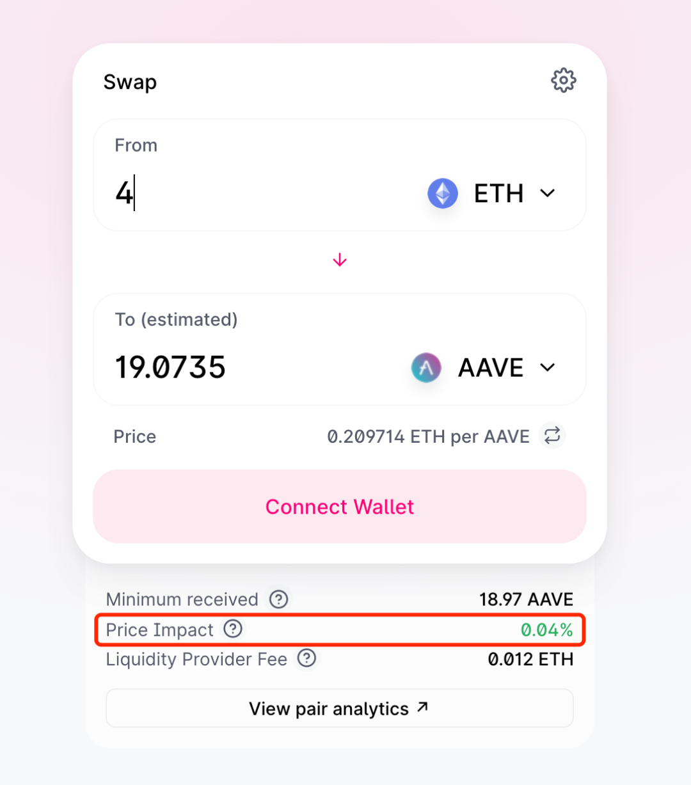
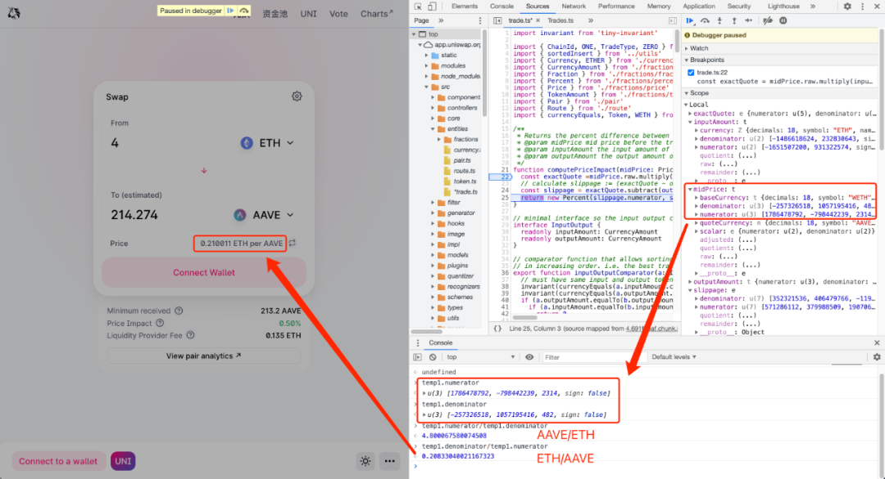
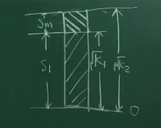
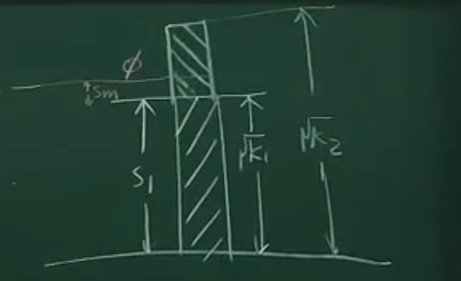

## **恒定乘积做市商模型**

https://zhuanlan.zhihu.com/p/362949468


恒定乘积做市商模型，由Uniswap率先实现并推广，以恒定乘积公式**xy=k**为基础，使交易对的两种资产数量乘积恒定不变来推进市场交易。虽然Uniswap在DeFi领域开创了新时期的先河，成为了DEX领域的龙头，但恒定乘积做市商模型存在的滑点与无常损失仍饱受诟病。


## 基础知识

1. 在uniswap初始的时候, 假如没有特定的交易对池子, 那么任何人都可以往其中添加流动性来创建相应的交易对, 并且比例是随便的(后续会有套利商进来套利, 使得交易对的比例与市场上的比例相同)
2. 假如在uniswap中已经有相应的交易对池子, 那么任何人都可以添加交易对, 成为liquidity provider, 并且拿到LP Token, 但是**添加在流动性的时候, 添加的交易对的比例和现有池子中的比例要相同**
3. 在计算的时候常常忽略手续费, 假定k是恒定的, 但是因为在交易的时候收取了一定的手续费, 所以k是在缓慢变大的
4. 任何人都可以移除流动性拿回自己的token, 并销毁LP Token
5. 交易池中的流动性通过 √xy来衡量,  因为假设一个eth/dai的池子有1:1的流动性, 后续又添加了1:1的流动性, 那么后续的√xy刚好是原来的两倍, 是一个线性的关系


## LP Token的计算

> 添加流动性获得的LP Token

假设在添加流动性之前,  LP Token总量为T

添加了dx和dy token后, 我们获得了S个LP Token

(**流动性√xy 与 LP Token的数量T应该是线性关系, 因为流动性翻倍, T也要翻倍**)

则有
$$
\begin{cases}
\frac{\sqrt {xy}}{\sqrt {dx*dy}} = \frac{T}{S}
\\
dx/dy = x/y
\end{cases}
$$
所以
$$
S = \frac{dx}{x} T =  \frac{dy}{y} T
$$
即按照比例获得LP Token

> 移除流动性

移除同理, 应该按照移除的LP Token的数量和LP Token的总量等比例返还给我们交易对

假设我们移除流动性S个LP Token, 总量为T
$$
\frac{S}{T} = {dx \over x} = {dy \over y}
$$
所以获得的dx和dy分别为
$$
\begin{cases} dx = {S \over T} * x
\\
dy = {S\over T}*y
\end{cases}
$$

## 滑点

什么是滑点，滑点一般指**预设成交价位与真实成交价位的偏差**。恒定乘积AMM中同样存在滑点，一旦发生交易，池中资产的储备发生变化，资产实际的交易执行价就会发生变化，产生滑点。交易额越大，滑点越大，交易者的损失就越大。

> 公式分析

根据恒定乘积，当用dx个dai兑换dy个eth时（忽略手续费），有：
$$
\begin{cases} xy = k\\ (x+dx) (y-dy) = k \end{cases}
$$
可得，兑换量：
$$
dy = \frac{y * dx}{ x+dx}
$$
则在实际兑换中，eth相对dai的单价为：
$$
dx/dy = \frac {x + dx}{y}
$$
而兑换前，池中的y单价为x/y，那么y单价的滑点价格就产生了：
$$
Slippage_y = dx/dy - x/y = \frac{dx}{y}
$$
**交易量dx越大，产生的滑点就越大，偏离实际价位就越大，而池中的资金储备越多、交易深度越大，则能尽量减少滑点的溢价，使用户的交易损耗降低。**

>  实际计算

Uniswap在实际计算交易滑点时，是通过百分比来显示的：



Uniswap源码中对滑点的计算是在`uniswap-v2-sdk/src/entities/trade.ts`文件中的`computePriceImpact`函数中实现的

```text
/**
* Returns the percent difference between the mid price and the execution price, i.e. price impact.
* @param midPrice mid price before the trade
* @param inputAmount the input amount of the trade
* @param outputAmount the output amount of the trade
*/
function computePriceImpact(midPrice: Price, inputAmount: CurrencyAmount, outputAmount: CurrencyAmount): Percent {
 const exactQuote = midPrice.raw.multiply(inputAmount.raw)
 // calculate slippage := (exactQuote - outputAmount) / exactQuote
 const slippage = exactQuote.subtract(outputAmount.raw).divide(exactQuote)
 return new Percent(slippage.numerator, slippage.denominator)
}
```

按照函数中的逻辑，滑点百分比计算公式如下：
$$
PriceImpact = \frac{midPrice*dx - dy}{midPrice*dx}
$$
这里的`midPrice`从代码上看不出是x对y的价格还是y对x的价格，但按照公式的计算逻辑，当`midPrice`代表x对y的价格时，`midPrice·dx`就代表理论应得y的数量，那么这个公式就是按照*滑点差值/理论应得量*的方式计算的

为验证这一点，来到Uniswap界面断点调试，以ETH兑换AAVE为例



可以看到`midPrice`实际采用的确实就是前面猜测的x对y的价格，并且是不同于界面中Price所显示实际兑换价的理论价

那么化简上面公式：
$$
PriceImpace = \frac{y/x*dx - dy}{y/x * dx} = 1-\frac{dy*x}{y*dx}
$$


将前面推导的dy带入上式可得：
$$
PriceImpact = \frac{dx}{x+dx}
$$
那么**滑点百分比即是兑换量占用于兑换的资产储备量的百分比**

当然，这里总结出的滑点计算还只是通过AMM机制所算出的理论滑点，实际上滑点还会受很多因素影响，比如网络延时、区块确认等等。


## **无常损失**

什么是无常损失，当资产价格剧烈波动时，持有的资产净值损耗减少，就会产生暂时性的账面损失。但如果将资产投入流动性资金池提供流动性，由于AMM的机制，价格与外部市场脱离，并不会自动调整价格，而需要依靠套利者买卖资产来使其达到与外部市场价格的平衡，造成越涨越卖、越跌越买的情况，所以这种套利行为的存在会放大账面损失。

> 公式分析

假定现有一交易对ETH/DAI, 流动性为x:y, 当前k = xy, eth的价格为y/x

当eth价格突然变化了d倍(d<1为下跌, d>1为上涨, d=1不变), eth相对dai的价格变为(y/x)*d

假设是eth上涨, 那么因为当前dex中的eth/dai价格更便宜, 就会有套利者进行套利, 通过dai购买eth, 直到dex中eth/dai价格与cex中的相等

**在d>1时, 通过dai换eth, d<1时, 通过eth换dai**

假设通过dy个dai购买dx个eth后dex和cex中价格相等, 为y/x*d

则有:
$$
\begin{cases} (x - dx)/(y+dy) = (y/x)*d\\ (x+dy) (y-dy) = k = xy \end{cases}
$$
解得: 
$$
\begin{cases} dy = y(\sqrt d - 1)\\ dx = x(1-\frac{1}{ \sqrt d}) \end{cases}
$$
池子中eth和dai的现有量为:
$$
\begin{cases} T_e = x - dx = \frac{x}{\sqrt d}\\ T_d = y+dy =  y\sqrt d \end{cases}
$$
在实际交换中eth的价格为
$$
\frac {y}{x} < dy/dx = \frac {y+dy}{x} = \frac{y\sqrt d}{x} < \frac {y*d}{x}
$$


即当eth上涨时, 兑换的价格总是比dex中的价格贵, 因为存在滑点, 但又比cex中的便宜, 因为可以进行套利.

> 无常损失分析

我们通过dy个dai购买了dx个eth, 我们把所有的eth换成dai后池子中dai的个数为:
$$
T_e * (y/x)*d + T_d =\frac{x}{\sqrt d} * (y/x)*d + y\sqrt d= 2y\sqrt d
$$
我们原先拥有的dai的总数是: 
$$
x * (y/x) + y = 2y
$$
此时因为eth的上涨, 我们赚了dai的个数为
$$
2y(\sqrt d - 1)
$$
那么如果liquidity provider 什么也不做呢, 即在一开始的时候不提供流动性, 把所有eth换位dai后我们的dai的总量为:
$$
x * (y/x) * d + y = y(d+1)
$$ {1}
此时我们因为eth的涨价, 赚了dai的个数为:
$$
y(d+1) - 2y = yd - y
$$
两者的差值为:
$$
yd-y -2y(\sqrt d - 1) = y(d-2 \sqrt d + 1)
$$
也就是说因为我们提供了流动性 , 导致我们少赚了y(d-2√d + 1)个dai, 而这一部分就是被套利商转走了


无常损失在总价值中的占比为:
$$
\frac{y(d-2 \sqrt d + 1)}{y(d+1)} = \frac{d-2 \sqrt d + 1}{d+1} 
$$
该函数的曲线如下: 

https://docs.uniswap.org/contracts/v2/concepts/advanced-topics/understanding-returns

这个图是负的, 反过来看就好了


> 导致无常损失的原因

导致无常损失的原因在于, 我们在提供流动性的时候eth/dai的价格为x/y,  之后两者的价格变化为x/y*d

这就相当于我们之前提供的流动性相对于现在是不正确的

打个比方, 在提供流动性的时候eth/dai = 1:40, 而现在的eth/dai = 1:60

所以我们提供了较为相对于现在较为便宜的eth

而如果提供流动性时eth/dai = 1:60, 而现在eth/dai = 1:40

相当于我们提供了相对于现在较为便宜的dai, 能够被套利商套走


**但是无常损失只有在我们撤出流动性的时候才会真正的发生, 如果我们不撤出流动性, 无常损失只是账面上的**


## 手续费的分配

在使用uniswap中, 使用他需要交千三的手续费, 并且还留了一个功能, 就是uniswap官方还可以收这千三手续费中的6%, 即判断一个feeTo参数是否是零地址, 如果是零地址说明这个功能没有打开,即将所有的手续费都给liqudity provider,  如果不是零地址, 那么这个功能就打开了, 其中6%的手续费要给官方.


那么如果官方打开这个功能之后, 应该怎么来收取这个手续费呢, 

答案是给项目方增发lp token

下面套利三种模型 :

> 手续费全部给项目方



如图所示, 假定S1为初始的Token数量, 

√K1表示初始的流动性

√K2表示经过一段时间后积累了一定量的手续费之后的流动性

Sm表示需要给项目方增发的lp token的数量

所以有下面的公式:
$$
\frac{S_m}{S_1+S_m} = \frac{\sqrt K_2- \sqrt K_1}{\sqrt K_2}
\\
S_m = \frac{\sqrt K_2- \sqrt K_1}{\sqrt K_1} * S_1
$$

> 手续费全部给liquidity provider

在这种情况下, 不需要增发任何的lp token, 多出来的手续费会平均的分配给到lp token上, 相当于lp token更值钱了

假设初始情况下a提供了3:3的xy两种代币, 生成了3个token

b提供了1:1的xy两种代币, 生成了1个token

那么当不停收取手续费之后, 当前流动性从4到了6

那么a手上还是3个token, b手上也还是1个token

但是每个token对应的能够兑换的流动性从1变成了1.5

相当于每个token能够兑换的币变多了

> 手续费中的部分φ给项目方



如上图所示, S1为初始的token

Sm为给项目方增发的token, 占总的新增的手续费φ

√K1为初始流动性

√K2为收取手续费之后的流动性

则有
$$
\frac {新增token}{新增后总token} = \frac{项目方手续费流动性}{总流动性}
\\
\frac {Sm}{S_1 + S_m} = \frac{(\sqrt K_2 - \sqrt K_1) * φ}{\sqrt K2}
$$
解得:
$$
S_m = \frac{(\sqrt K_2 - \sqrt K_1)*S_1}{(\frac{1}{φ} - 1) * \sqrt K_2 + \sqrt K_1}
$$
带入uniswap中的φ=1/6, 得:
$$
S_m = \frac{(\sqrt K_2 - \sqrt K_1)*S_1}{5 * \sqrt K_2 + \sqrt K_1}
$$


## 想法

当交易所和dex中价格有差距的时候, 可以通过套利使得dex和cex中价格相等, 但是能不能预测cex中的价格变化, 提前套利出更多的部分, 减少gas, 也减少竞争


如何进行套利, 加入eth上涨, 可以套利, eth下降, 也可以套利, 那么不管价格怎么变化都可以套利, 那么这部分利润怎么来的


## Uniswap中的价格预言机

因为uniswap也是交易所, 所以uniswap中的价格也可以给其他dapp使用


## Flash Swaps

uniswap中的flash swaps可以理解为**无抵押借贷**, 可以在一个交易中, 从uniswap中接触任意token, 然后do whatever you want, 然后再连本带利还回去就好了.  如果你没有还回去, 那么会revert这笔交易, 从而保护uniswap中的本金不会消失

> 应用1: 套利

比如dex1和dex2中的eth分别为100dai和110dai, 那么就可以在一笔交易中, 从dex1中借出100dai, 购买1个eth, 然后再在dex2中卖掉获得110dai, 然后将100个dai换回dex1中, 并且支付一定的利息

