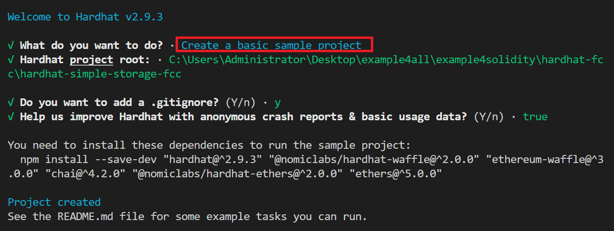

#### 使用hardhat创建项目

1. 使用npm初始化项目
   `npm init --yes`或者
   `yarn init`

2. 安装hardhat
   `npm install --save-dev hardhat@2.9.3`或者
   `yarn add --dev hardhat@2.9.3`

3. 使用hardhat创建一个项目的基本文件
   `npx hardhat init` 或者
   `yarn hardhat init`
   

4. 创建完成后会多出这些文件

    

    contracts是存放sol文件的, scripts是放部署脚本的, test是存放测试脚本的, hardhat.config.js是存放hardhat的配置文件的

5. 如果在使用hardhat中发现这样的问题, 使用

   `npm install -D @nomiclabs/hardhat-waffle ethereum-waffle`


6. 使用`npx hardhat --verbose` 可以查看当前项目的hardhat配置文件在哪里

   如果在使用`npx hardhat init` 的时候无法创建一个项目, 大概率是这个文件已经在别的文件夹中存在了, 把它删了就行了

   

7. 使用`npx hardhat --version`查看版本

   

8. 使用`npx hardhat`查看帮助手册

9. 使用`npx hardhat compile`编译sol文件
10. 使用`npx hardhat clean`删除所有缓存和编译文件

11. 使用`npx hardhat run ./script/deploy.js`来运行部署脚本


#### hardhat默认网络
1. hardhat内部自带了一个虚拟的区块链网络, 名称为"hardhat", 可以在配置文件hardhat.config.js中通过以下代码来设置默认使用的网络
   ```js
   module.exports = {
    defaultNetwork: "hardhat" // 设置默认使用hardhat网络
    };
   ```
   
2. hardhat对于自带的虚拟网络, 内置了20个账号, 可以使用`npx hardhat accounts`来查看

3. 该网络只有在运行脚本的时候才生效, 运行完脚本就停了, 所以连续两次脚本运行使用的都是全新的hardhat网络

   
#### 在hardhat中运行脚本
`npx hardhat run scripts/deploy.js`
`npx hardhat run scripts/deploy.js --network sepolia`设置自动的网络, 该网络需要在hardhat.config.js中设置

#### 在hardhat中添加网络并部署到指定网络

~~~js
module.exports = {
  networks: {
    sepolia: {
      // 新添加一个网络
      url: process.env.SEPOLIA_RPC_URL, // 指定网络的url
      accounts: [process.env.SEPOLIA_PRIVATE_KEY], // 指定网络的账户的私钥, 可以是多个
      chainId: 11155111, // 指定chainId
    },
  },
};
~~~

`npx hardhat run scripts/deploy.js --network sepolia`在运行的时候指定使用的网络


#### 使用hardhat自动发布源码(测试失败, timeout)

该功能需要在测试网或者主网中才能使用, 在内置的虚拟网络是无法使用的

在etherscan上可以进行手动验证和发布源码, 同时etherscan也提供了api给我们, 可以调用他的api来发布验证源码, 同时hardhat又将该功能封装为了插件, 我们使用这个功能就可以了

1. npm安装@nomiclabs/hardhat-etherscan插件

   `npm install -D @nomiclabs/hardhat-etherscan`

2. 在hardhat.config.js中添加如下代码表示启用插件

   ```js
   require("@nomiclabs/hardhat-etherscan")
   ```
   - 启用插件后, 执行`npx hardhat`将会看到一个`verify`的任务, 该任务就是将源码提交的etherscan的任务

   - 可以通过命令行的方式`npx hardhat verify --network mainnet DEPLOY_CONTRACT_ADDRESS "args1, args2..."`来执行验证任务
   - 也可以通过执行代码的方式来执行该任务

3. 使用自动验证需要有etherscan提供的私钥, 所有需要创建etherscan的账号并创建api token

   

4. 获取api token后添加到.env中, 并通过dotenv在hardhat.config.js中获取

   ```TEXT
   ETHERSCAN_API_KEY=UE7YJX9BU4TG5JS9EBFKPQGT5GTDN6CTTX
   ```

   ```js
   require("dotenv").config()
   module.exports = {
       etherscan: {
       	apiKey: process.env.ETHERSCAN_API_KEY,
     	},
   }
   ```

5. 添加了api token之后就可以通过命令行

   `npx hardhat verify --network sepolia DEPLOY_CONTRACT_ADDRESS "contructor arguments"`来手动验证发布源码

6. 执行原理: 
   该插件会将给定地址的合约的字节码拉下来, 并检查本地的哪个合约与其对应, 获取到对应的合约源码后, 先模拟一边提交, 如果成功了就提交的真正的api接口上


7. 下面是通过代码的形式来验证发布源码

   在deploy.js中添加如下代码

   ~~~js
   // imports
   const { ethers, run, network } = require("hardhat")
   
   // async main
   async function main() {
     const SimpleStorageFactory = await ethers.getContractFactory("SimpleStorage")
     console.log("Deploying contract...")
     const simpleStorage = await SimpleStorageFactory.deploy()
     await simpleStorage.deployed()
     console.log(`Deployed contract to: ${simpleStorage.address}`)
     // 通过network可以检测出当前部署的网络, 如果是虚拟网络或者etherscan api token 不存在就不执行验证
     if (network.config.chainId === 11155111 && process.env.ETHERSCAN_API_KEY) {
       console.log("Waiting for block confirmations...")
       await simpleStorage.deployTransaction.wait(6)
       await verify(simpleStorage.address, [])
     }
   
     const currentValue = await simpleStorage.retrieve()
     console.log(`Current Value is: ${currentValue}`)
   
     // Update the current value
     const transactionResponse = await simpleStorage.store(7)
     await transactionResponse.wait(1)
     const updatedValue = await simpleStorage.retrieve()
     console.log(`Updated Value is: ${updatedValue}`)
   }
   
   // 传入合约地址, 合约的构造函数参数, hardhat可以通过地址知道对应的合约文件在哪里
   const verify = async (contractAddress, args) => {
     console.log("Verifying contract...")
     try {
       // run这个变量可以用来执行hardhat的一些子任务
         // 等同于 npx hardhat cmd .....
       await run("verify:verify", {
         address: contractAddress,
         constructorArguments: args,
       })
     } catch (e) {
       if (e.message.toLowerCase().includes("already verified")) {
         console.log("Already Verified!")
       } else {
         console.log(e)
       }
     }
   }
   ~~~

#### hardhat 节点网络

上面说到hardhat自带的hardhat网络只有在运行脚本的时候才存在, 之后再次运行又是一个全新的网络

如果需要以连续的网络, 可以使用`npx hardhat node`命令, 该命令会创建出一个类似ganache的网络


同时添加该网络到hardhat.config.js中

```js
module.exports = {
  networks: {
    localhost: {
      // accounts: [] // 不用再填写账户私钥, hardhat自动知道账户私钥
      url: "http://127.0.0.1:8545/",
      chainId: 31337 // 默认使用这个id
    }
  }
};
```

新开一个终端部署合约`npx hardhat run scripts/deploy.js --network localhost`

在原来启动网络的终端中可以查看网络中发生的交互信息


#### hardhat 自定义任务

在tasks中创建get-block-number.js, 如下内容

~~~js
const { task } = require("hardhat/config")

// 命令的名称与描述
task("block-number", "Prints the current block number").setAction(
    // 命令传入的参数, hardhat runtime environment
  async (taskArgs, hre) => {
    const blockNumber = await hre.ethers.provider.getBlockNumber()
    console.log(`Current block number: ${blockNumber}`)
  }
)

module.exports = {}
~~~

在hardhat.config.js中添加该自定义任务

~~~js
require("./tasks/get-block-number"); // 添加自定义任务
~~~

之后使用`npx hardhat`就可以看到该任务


使用`npx hardhat block-number --network localhost`执行该任务


#### hardhat console命令

`npx hardhat console --network localhost `会开启一个控制台, 可以在该控制台中书写任何js代码, 跟spark-shell类似, 默认已经有很多可以中hardhat中导出的变量


#### hardhat 添加测试任务

在test文件夹中添加test-deploy.js, 内容如下

~~~js
const { ethers } = require("hardhat");
const { expect, assert } = require("chai"); // 安装hardhat会自动安装这个模块, 如果没有安装的话需要手动安装(各版本不同)

/**
 * describe定义了一个测试模块, beforeEache会在最先执行, it表示每个测试任务
 * 执行 npx hardhat test 的时候会执行所有it任务, 如果有it.only的任务, 那么执行命令的实现只会执行这一个任务
 *
 */
describe("SimpleStorage", function () {
  // let simpleStorageFactory
  // let simpleStorage
  let simpleStorageFactory, simpleStorage;
  beforeEach(async function () {
    simpleStorageFactory = await ethers.getContractFactory("SimpleStorage");
    simpleStorage = await simpleStorageFactory.deploy();
  });

  // 如果有it.only, 那么执行npx hardhat test的时候, 只会执行only的任务
  // it.only("xxx", async function () {
  // });

  it("Should start with a favorite number of 0", async function () {
    const currentValue = await simpleStorage.retrieve();
    const expectedValue = "0";

    assert.equal(currentValue.toString(), expectedValue);
    // expect(currentValue.toString()).to.equal(expectedValue)
  });
  it("Should update when we call store", async function () {
    const expectedValue = "7";
    const transactionResponse = await simpleStorage.store(expectedValue);
    await transactionResponse.wait(1);

    const currentValue = await simpleStorage.retrieve();
    assert.equal(currentValue.toString(), expectedValue);
  });

  // Extra - this is not in the video
  it("Should work correctly with the people struct and array", async function () {
    const expectedPersonName = "Patrick";
    const expectedFavoriteNumber = "16";
    const transactionResponse = await simpleStorage.addPerson(
      expectedPersonName,
      expectedFavoriteNumber
    );
    await transactionResponse.wait(1);
    const { favoriteNumber, name } = await simpleStorage.people(0);
    // We could also do it like this
    // const person = await simpleStorage.people(0)
    // const favNumber = person.favoriteNumber
    // const pName = person.name

    assert.equal(name, expectedPersonName);
    assert.equal(favoriteNumber, expectedFavoriteNumber);
  });
});
~~~

使用`npx hardhat test` 会执行test目录下的所有文件中的测试任务

`npx hardhat test ./test/test-deploy.js --grep array` 指定要测试的文件, `--grep`指定要执行的测试任务, 上面会执行所有名称包含array关键字的任务

#### gas-Reporter插件的使用

gas-Reporter这个插件能够在运行测试任务的时候, 打印每个测试任务消耗的gas

1. 安装gas reporter

   `npm install -D hardhat-gas-reporter`

2. 在hardhat.config.js配置文件中启用gas reporter

   ~~~js
   require("hardhat-gas-reporter")

   module.exports = {
       gasReporter: {
           enabled: true,
           // gas消耗记录输出到文件, 如果不需要输出可以不写下面这两个
           outputFile: "gas-report.txt", // 指定将gas消耗的记录输出到文件, 指定输出到文件后将不会输出到控制台了(视频中两处都输出, 版本不同???)
           noColors: true, // 输出的文本不需要颜色, 因为颜色可能导致格式错了(???没测试)
       },
   }
   ~~~

   经过上面的配置就可以输出gas消耗到控制台和文件

   

   同时上面的生成的gas消耗, 默认是部署在eth网络上面的gas消耗, 如果要查看该合约部署在其他evm兼容的网络上的话, 可以通过token来指定

   ~~~js
   gasReporter: {
           enabled: true,
           outputFile: "gas-report.txt",
           noColors: true,
           token: "MATIC"
       },
   ~~~

   上面指定了该合约的部署网络是polygon上的gas消耗

   

   通过如果希望gas reporter能够输出当前gas消耗对应的usd是多少, 可以使用如下方法指定

   ~~~js
   gasReporter: {
           enabled: true,
           currency: "USD", // 指定输出gas消耗对应的usd
           coinmarketcap: "5da11934-d9f6-4192-8ce4-0752cd244af4", // 为了获取不同网络的gas price, 需要连接https://pro.coinmarketcap.com/, 所以需要去他上面注册账号, 获取api token
       },
   ~~~

   经过上面配置后, 执行`npx hardhat test --network localhost`输出如下
   
   

#### solidity-coverage插件的使用

该插件能够输出当前测试的覆盖式, 有哪些测试没有覆盖到

1. `npm install -D solidity-coverage`安装插件

2. 在hardhat.config.js中配置

   ~~~js
   require("solidity-coverage")
   ~~~

3. 执行`npx hardhat coverage`

   

#### hardhat deploy插件的使用

https://github.com/wighawag/hardhat-deploy#the-deployments-field

一般情况下, 我们部署合约需要使用脚本代码, 但是弊端是多次运行部署脚本之间是无关联的

比如在a脚本中部署了一个A合约, 下次在b脚本中我们向使用这个A合约, 那么只能通过地址来获取这个合约

如果是使用hardhat deploy的话, 可以很轻松的获得前一次部署的合约


1. 安装插件: `npm install -D hardhat-deploy`

   在hardhat.config.js中启用插件

   ```js
   require('hardhat-deploy');
   ```
   同时可以使用hardhat-deploy-ethers代替hardhat-ethers中使用的原生的ethers.js, 方法是

   ```js
   npm install --save-dev  @nomiclabs/hardhat-ethers@npm:hardhat-deploy-ethers ethers // 第二个@后面的是版本
   ```

   同时在`hardhat.config.js`中

   ~~~js
   require("@nomiclabs/hardhat-ethers")
   ~~~

   创建deploy文件夹, 所有的部署脚本都放在这里

   执行`npx hardhat deploy`的时候会按照文件属性执行deploy文件中所有脚本, 或者通过--tags来指定需要执行的脚本

   

2. 因为fundme中需要使用到预言机, 但是不同预言机的网络是不同的, 所有预言机的地址不能写死, 而是应该放到构造函数参数中

   

3. 因为fundme中需要使用到预言机, 但是在localhost, hardhat网络中是没有预言机的, 所以如果是localhost, hardhat网络, 我们要先部署预言机

   - 我们要先获取预言机的合约, 创建`contracts/test/Mock.sol`一个文件引入即可

     **!!! 注意这里的solidity是0.6.0的版本, 所以要设置hardhat的solidity编译器为多版本!!!**

     ~~~sol
     pragma solidity ^0.6.0;
     
     import "@chainlink/contracts/src/v0.6/tests/MockV3Aggregator.sol";
     ~~~

     我们引入一个文件就相当于我们在这个文件中定义了引入的文件一样, 所以引入一个文件就行了

   - 在根目录创建一个`helper-hardhat-config.js`用来保存我们的各种非hardhat配置

     ~~~js
     const networkConfig = {
         31337: {
             name: "localhost",
         },
         11155111: {
             name: "sepolia",
             ethUsdPriceFeed: "0x694AA1769357215DE4FAC081bf1f309aDC325306",
         },
     }
     const developmentChains = ["hardhat", "localhost"]
     module.exports = {
         networkConfig,
         developmentChains,
     }
     ~~~
     
   - 在hardhat.config.js中配置namedAccounts

     ~~~js
     module.exports = {
       networks: {
         sepolia: {
           // 新添加一个网络
           url: process.env.SEPOLIA_RPC_URL, // 指定网络的url
           accounts: [process.env.SEPOLIA_PRIVATE_KEY], // 指定网络的账户私钥
           chainId: 11155111, // 指定chainId
         },
         localhost: {
           // accounts: [] // 不用再填写账户私钥, hardhat自动知道账户私钥
           url: "http://127.0.0.1:8545/",
           chainId: 31337, // 默认使用这个id
         },
       },
       // 这个属性是hardhat-deploy扩展的属性
       namedAccounts: {
         deployer: {
           // 定义一个账户叫deployer, 该账户在不同网络中会使用不同的私钥
           default: 0, // 默认情况下使用networks中的accounts的索引位置0的账户
           sepolia: 0, // 在sepolia网络下, 使用accounts的索引位置0的账户, 即process.env.SEPOLIA_PRIVATE_KEY, key必须在networks中配置过才行
           localhost: 1, // 在localhost网络下, 使用accounts的索引位置1的账户
         },
         deployer2: {
           default: 0,
           sepolia: 0,
           localhost: 1,
         },
       },
     };
     ~~~
     
     
     
   - 创建`deploy/00_deploy-mock.js`来部署这个合约

     ```js
     const { network } = require("hardhat")
     const {developmentChains} = require("helper-hardhat-config.js")
     module.exports = async ({ getNamedAccounts, deployments }) => {
         const { deploy, log } = deployments
           // 需要先在在hardhat.config.js中配置namedAccounts
       // 获得deployer这个账户, deployer这个账户会根据不同的网络获得不同的私钥
         const { deployer } = await getNamedAccounts()
         const chainId = network.config.chainId
         // 如果当前网络是测试网络, 那么就部署
         if (developmentChains.includes(network.name)) {
             log("Local network detected! Deploying mocks...")
             await deploy("Mock", { // 指定部署后合约实例的名字, 可以通过deployments.get()来获得
                 contract: "MockV3Aggregator", // 指定需要部署的合约名, 如果不指定的话, 那么部署的合约与第一个参数重名, 不需要指定文件名, 自动发现
                 from: deployer,
                 log: true,
                 args: ["8", "200000000000"],
             })
             log("Mocks Deployed!")
         }
     }
     // 定义当前脚本的tag, 在之后的npx hardhat deploy时, 可以通过--tags指定需要运行的js脚本
     // npx hardhat deploy --tags mocks 执行当前脚本
     // 不指定--tags的时候会执行包含all 的脚本
     module.exports.tags = ["all", "mocks"] 
     ```

4. 创建`deploy/01_deploy-fund-me.js`

   ~~~js
   const { network } = require("hardhat")
   const { networkConfig, developmentChains } = require("../helper-hardhat-config")
   require("dotenv").config()
   
   module.exports = async ({ getNamedAccounts, deployments }) => {
       const { deploy, log } = deployments
         // 需要先在在hardhat.config.js中配置namedAccounts
     // 获得deployer这个账户, deployer这个账户会根据不同的网络获得不同的私钥
       const { deployer } = await getNamedAccounts()
       const chainId = network.config.chainId
       let ethUsdPriceFeedAddress
       if (chainId == 31337) {
           const ethUsdAggregator = await deployments.get("Mock") // 通过名字获得已经部署的合约
           ethUsdPriceFeedAddress = ethUsdAggregator.address
       } else {
           ethUsdPriceFeedAddress = networkConfig[chainId]["ethUsdPriceFeed"]
       }
       log("----------------------------------------------------")
       log("Deploying FundMe and waiting for confirmations...")
       const fundMe = await deploy("FundMe", {
           from: deployer,
           args: [ethUsdPriceFeedAddress],
           log: true,
           // we need to wait if on a live network so we can verify properly
           waitConfirmations: network.config.blockConfirmations || 1,
       })
       log(`FundMe deployed at ${fundMe.address}`)
   }
   module.exports.tags = ["all", "fundme"]
   ~~~

   


#### hardhat sol文件多版本的解决方案

~~~js
// solidity可以是字符串, 也可以是对象
module.exports = {
    // solidity: 0.8.7
    solidity: {
        compilers: [
            {
                version: "0.8.7",
            },
            {
                version: "0.6.6",
            },
        ],
    },
}
~~~

