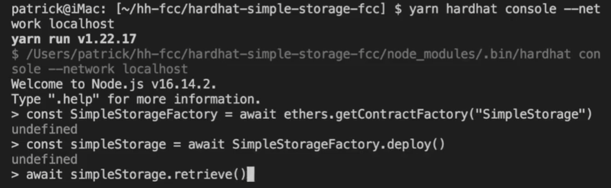

#### 使用hardhat创建项目

1. 使用npm初始化项目
   `npm init --yes`或者
   `yarn init`

2. 安装hardhat
   `npm install --save-dev hardhat@2.9.3`或者
   `yarn add --dev hardhat@2.9.3`

3. 使用hardhat创建一个项目的基本文件
   `npx hardhat init` 或者
   `yarn hardhat init`
   

4. 创建完成后会多出这些文件

    

    contracts是存放sol文件的, scripts是放部署脚本的, test是存放测试脚本的, hardhat.config.js是存放hardhat的配置文件的

5. 如果在使用hardhat中发现这样的问题, 使用

   `npm install -D @nomiclabs/hardhat-waffle ethereum-waffle`


6. 使用`npx hardhat --verbose` 可以查看当前项目的hardhat配置文件在哪里

   如果在使用`npx hardhat init` 的时候无法创建一个项目, 大概率是这个文件已经在别的文件夹中存在了, 把它删了就行了

   

7. 使用`npx hardhat --version`查看版本

   

8. 使用`npx hardhat`查看帮助手册

9. 使用`npx hardhat compile`编译sol文件
10. 使用`npx hardhat clean`删除所有缓存和编译文件

11. 使用`npx hardhat run ./script/deploy.js`来运行部署脚本


#### hardhat默认网络
1. hardhat内部自带了一个虚拟的区块链网络, 名称为"hardhat", 可以在配置文件hardhat.config.js中通过以下代码来设置默认使用的网络
   ```js
   module.exports = {
    defaultNetwork: "hardhat" // 设置默认使用hardhat网络
    };
   ```
   
2. hardhat对于自带的虚拟网络, 内置了20个账号, 可以使用`npx hardhat accounts`来查看

3. 该网络只有在运行脚本的时候才生效, 运行完脚本就停了, 所以连续两次脚本运行使用的都是全新的hardhat网络

   
#### 在hardhat中运行脚本
`npx hardhat run scripts/deploy.js`
`npx hardhat run scripts/deploy.js --network sepolia`设置自动的网络, 该网络需要在hardhat.config.js中设置

#### 在hardhat中添加网络并部署到指定网络

~~~js
module.exports = {
  networks: {
    sepolia: {
      // 新添加一个网络
      url: process.env.SEPOLIA_RPC_URL, // 指定网络的url
      accounts: [process.env.SEPOLIA_PRIVATE_KEY], // 指定网络的账户的私钥, 可以是多个
      chainId: 11155111, // 指定chainId
    },
  },
};
~~~

`npx hardhat run scripts/deploy.js --network sepolia`在运行的时候指定使用的网络


#### 使用hardhat自动发布源码(测试失败, timeout)

该功能需要在测试网或者主网中才能使用, 在内置的虚拟网络是无法使用的

在etherscan上可以进行手动验证和发布源码, 同时etherscan也提供了api给我们, 可以调用他的api来发布验证源码, 同时hardhat又将该功能封装为了插件, 我们使用这个功能就可以了

1. npm安装@nomiclabs/hardhat-etherscan插件

   `npm install -D @nomiclabs/hardhat-etherscan`

2. 在hardhat.config.js中添加如下代码表示启用插件

   ```js
   require("@nomiclabs/hardhat-etherscan")
   ```
   - 启用插件后, 执行`npx hardhat`将会看到一个`verify`的任务, 该任务就是将源码提交的etherscan的任务

   - 可以通过命令行的方式`npx hardhat verify --network mainnet DEPLOY_CONTRACT_ADDRESS "args1, args2..."`来执行验证任务
   - 也可以通过执行代码的方式来执行该任务

3. 使用自动验证需要有etherscan提供的私钥, 所有需要创建etherscan的账号并创建api token

   

4. 获取api token后添加到.env中, 并通过dotenv在hardhat.config.js中获取

   ```TEXT
   ETHERSCAN_API_KEY=UE7YJX9BU4TG5JS9EBFKPQGT5GTDN6CTTX
   ```

   ```js
   require("dotenv").config()
   module.exports = {
       etherscan: {
       	apiKey: process.env.ETHERSCAN_API_KEY,
     	},
   }
   ```

5. 添加了api token之后就可以通过命令行

   `npx hardhat verify --network sepolia DEPLOY_CONTRACT_ADDRESS "contructor arguments"`来手动验证发布源码

6. 执行原理: 
   该插件会将给定地址的合约的字节码拉下来, 并检查本地的哪个合约与其对应, 获取到对应的合约源码后, 先模拟一边提交, 如果成功了就提交的真正的api接口上


7. 下面是通过代码的形式来验证发布源码

   在deploy.js中添加如下代码

   ~~~js
   // imports
   const { ethers, run, network } = require("hardhat")
   
   // async main
   async function main() {
     const SimpleStorageFactory = await ethers.getContractFactory("SimpleStorage")
     console.log("Deploying contract...")
     const simpleStorage = await SimpleStorageFactory.deploy()
     await simpleStorage.deployed()
     console.log(`Deployed contract to: ${simpleStorage.address}`)
     // 通过network可以检测出当前部署的网络, 如果是虚拟网络或者etherscan api token 不存在就不执行验证
     if (network.config.chainId === 11155111 && process.env.ETHERSCAN_API_KEY) {
       console.log("Waiting for block confirmations...")
       await simpleStorage.deployTransaction.wait(6)
       await verify(simpleStorage.address, [])
     }
   
     const currentValue = await simpleStorage.retrieve()
     console.log(`Current Value is: ${currentValue}`)
   
     // Update the current value
     const transactionResponse = await simpleStorage.store(7)
     await transactionResponse.wait(1)
     const updatedValue = await simpleStorage.retrieve()
     console.log(`Updated Value is: ${updatedValue}`)
   }
   
   // 传入合约地址, 合约的构造函数参数, hardhat可以通过地址知道对应的合约文件在哪里
   const verify = async (contractAddress, args) => {
     console.log("Verifying contract...")
     try {
       // run这个变量可以用来执行hardhat的一些子任务
         // 等同于 npx hardhat cmd .....
       await run("verify:verify", {
         address: contractAddress,
         constructorArguments: args,
       })
     } catch (e) {
       if (e.message.toLowerCase().includes("already verified")) {
         console.log("Already Verified!")
       } else {
         console.log(e)
       }
     }
   }
   ~~~

#### hardhat 节点网络

上面说到hardhat自带的hardhat网络只有在运行脚本的时候才存在, 之后再次运行又是一个全新的网络

如果需要以连续的网络, 可以使用`npx hardhat node`命令, 该命令会创建出一个类似ganache的网络


同时添加该网络到hardhat.config.js中

```js
module.exports = {
  networks: {
    localhost: {
      // accounts: [] // 不用再填写账户私钥, hardhat自动知道账户私钥
      url: "http://127.0.0.1:8545/",
      chainId: 31337 // 默认使用这个id
    }
  }
};
```

新开一个终端部署合约`npx hardhat run scripts/deploy.js --network localhost`

在原来启动网络的终端中可以查看网络中发生的交互信息


#### hardhat 自定义任务

在tasks中创建get-block-number.js, 如下内容

~~~js
const { task } = require("hardhat/config")

// 命令的名称与描述
task("block-number", "Prints the current block number").setAction(
    // 命令传入的参数, hardhat runtime environment
  async (taskArgs, hre) => {
    const blockNumber = await hre.ethers.provider.getBlockNumber()
    console.log(`Current block number: ${blockNumber}`)
  }
)

module.exports = {}
~~~

在hardhat.config.js中添加该自定义任务

~~~js
require("./tasks/get-block-number"); // 添加自定义任务
~~~

之后使用`npx hardhat`就可以看到该任务


使用`npx hardhat block-number --network localhost`执行该任务


#### hardhat console命令

`npx hardhat console --network localhost `会开启一个控制台, 可以在该控制台中书写任何js代码, 跟spark-shell类似, 默认已经有很多可以中hardhat中导出的变量



#### hardhat 添加测试任务

在test文件夹中添加test-deploy.js, 内容如下

~~~js
const { ethers } = require("hardhat");
const { expect, assert } = require("chai"); // 安装hardhat会自动安装这个模块, 如果没有安装的话需要手动安装(各版本不同)

/**
 * describe定义了一个测试模块, beforeEache会在最先执行, it表示每个测试任务
 * 执行 npx hardhat test 的时候会执行所有it任务, 如果有it.only的任务, 那么执行命令的实现只会执行这一个任务
 *
 */
describe("SimpleStorage", function () {
  // let simpleStorageFactory
  // let simpleStorage
  let simpleStorageFactory, simpleStorage;
  beforeEach(async function () {
    simpleStorageFactory = await ethers.getContractFactory("SimpleStorage");
    simpleStorage = await simpleStorageFactory.deploy();
  });

  // 如果有it.only, 那么执行npx hardhat test的时候, 只会执行only的任务
  // it.only("xxx", async function () {
  // });

  it("Should start with a favorite number of 0", async function () {
    const currentValue = await simpleStorage.retrieve();
    const expectedValue = "0";

    assert.equal(currentValue.toString(), expectedValue);
    // expect(currentValue.toString()).to.equal(expectedValue)
  });
  it("Should update when we call store", async function () {
    const expectedValue = "7";
    const transactionResponse = await simpleStorage.store(expectedValue);
    await transactionResponse.wait(1);

    const currentValue = await simpleStorage.retrieve();
    assert.equal(currentValue.toString(), expectedValue);
  });

  // Extra - this is not in the video
  it("Should work correctly with the people struct and array", async function () {
    const expectedPersonName = "Patrick";
    const expectedFavoriteNumber = "16";
    const transactionResponse = await simpleStorage.addPerson(
      expectedPersonName,
      expectedFavoriteNumber
    );
    await transactionResponse.wait(1);
    const { favoriteNumber, name } = await simpleStorage.people(0);
    // We could also do it like this
    // const person = await simpleStorage.people(0)
    // const favNumber = person.favoriteNumber
    // const pName = person.name

    assert.equal(name, expectedPersonName);
    assert.equal(favoriteNumber, expectedFavoriteNumber);
  });
});
~~~

使用`npx hardhat test` 会执行test目录下的所有文件中的测试任务

`npx hardhat test ./test/test-deploy.js --grep array` 指定要测试的文件, `--grep`指定要执行的测试任务, 上面会执行所有名称包含array关键字的任务

#### gas-Reporter插件的使用

gas-Reporter这个插件能够在运行测试任务的时候, 打印每个测试任务消耗的gas

1. 安装gas reporter

   `npm install -D hardhat-gas-reporter`

2. 在hardhat.config.js配置文件中启用gas reporter

   ~~~js
   require("hardhat-gas-reporter")

   module.exports = {
       gasReporter: {
           enabled: true,
           // gas消耗记录输出到文件, 如果不需要输出可以不写下面这两个
           outputFile: "gas-report.txt", // 指定将gas消耗的记录输出到文件, 指定输出到文件后将不会输出到控制台了(视频中两处都输出, 版本不同???)
           noColors: true, // 输出的文本不需要颜色, 因为颜色可能导致格式错了(???没测试)
       },
   }
   ~~~

   经过上面的配置就可以输出gas消耗到控制台和文件

   

   同时上面的生成的gas消耗, 默认是部署在eth网络上面的gas消耗, 如果要查看该合约部署在其他evm兼容的网络上的话, 可以通过token来指定

   ~~~js
   gasReporter: {
           enabled: true,
           outputFile: "gas-report.txt",
           noColors: true,
           token: "MATIC"
       },
   ~~~

   上面指定了该合约的部署网络是polygon上的gas消耗

   

   通过如果希望gas reporter能够输出当前gas消耗对应的usd是多少, 可以使用如下方法指定

   ~~~js
   gasReporter: {
           enabled: true,
           currency: "USD", // 指定输出gas消耗对应的usd
           coinmarketcap: "5da11934-d9f6-4192-8ce4-0752cd244af4", // 为了获取不同网络的gas price, 需要连接https://pro.coinmarketcap.com/, 所以需要去他上面注册账号, 获取api token
       },
   ~~~

   经过上面配置后, 执行`npx hardhat test --network localhost`输出如下
   
   

#### solidity-coverage插件的使用

该插件能够输出当前测试的覆盖式, 有哪些测试没有覆盖到

1. `npm install -D solidity-coverage`安装插件

2. 在hardhat.config.js中配置

   ~~~js
   require("solidity-coverage")
   ~~~

3. 执行`npx hardhat coverage`

   

#### hardhat deploy插件的使用

https://github.com/wighawag/hardhat-deploy#the-deployments-field

一般情况下, 我们部署合约需要使用脚本代码, 但是弊端是多次运行部署脚本之间是无关联的

比如在a脚本中部署了一个A合约, 下次在b脚本中我们向使用这个A合约, 那么只能通过地址来获取这个合约

如果是使用hardhat deploy的话, 可以很轻松的获得前一次部署的合约


1. 安装插件: `npm install -D hardhat-deploy`

   在hardhat.config.js中启用插件

   ```js
   require('hardhat-deploy');
   ```
   同时可以使用hardhat-deploy-ethers代替hardhat-ethers中使用的原生的ethers.js, 方法是

   ```js
   npm install --save-dev  @nomiclabs/hardhat-ethers@npm:hardhat-deploy-ethers ethers // 第二个@后面的是版本
   ```

   同时在`hardhat.config.js`中

   ~~~js
   require("@nomiclabs/hardhat-ethers")
   ~~~

   创建deploy文件夹, 所有的部署脚本都放在这里

   执行`npx hardhat deploy`的时候会按照文件属性执行deploy文件中所有脚本, 或者通过--tags来指定需要执行的脚本

   

2. 因为fundme中需要使用到预言机, 但是不同预言机的网络是不同的, 所有预言机的地址不能写死, 而是应该放到构造函数参数中

   

3. 因为fundme中需要使用到预言机, 但是在localhost, hardhat网络中是没有预言机的, 所以如果是localhost, hardhat网络, 我们要先部署预言机

   - 我们要先获取预言机的合约, 创建`contracts/test/Mock.sol`一个文件引入即可

     **!!! 注意这里的solidity是0.6.0的版本, 所以要设置hardhat的solidity编译器为多版本!!!**

     ~~~sol
     pragma solidity ^0.6.0;
     
     import "@chainlink/contracts/src/v0.6/tests/MockV3Aggregator.sol";
     ~~~

     我们引入一个文件就相当于我们在这个文件中定义了引入的文件一样, 所以引入一个文件就行了

   - 在根目录创建一个`helper-hardhat-config.js`用来保存我们的各种非hardhat配置

     ~~~js
     const networkConfig = {
         31337: {
             name: "localhost",
         },
         11155111: {
             name: "sepolia",
             ethUsdPriceFeed: "0x694AA1769357215DE4FAC081bf1f309aDC325306",
         },
     }
     const developmentChains = ["hardhat", "localhost"]
     module.exports = {
         networkConfig,
         developmentChains,
     }
     ~~~
     
   - 在hardhat.config.js中配置namedAccounts

     ~~~js
     module.exports = {
       networks: {
         sepolia: {
           // 新添加一个网络
           url: process.env.SEPOLIA_RPC_URL, // 指定网络的url
           accounts: [process.env.SEPOLIA_PRIVATE_KEY], // 指定网络的账户私钥
           chainId: 11155111, // 指定chainId
         },
         localhost: {
           // accounts: [] // 不用再填写账户私钥, hardhat自动知道账户私钥
           url: "http://127.0.0.1:8545/",
           chainId: 31337, // 默认使用这个id
         },
       },
       // 这个属性是hardhat-deploy扩展的属性
       namedAccounts: {
         deployer: {
           // 定义一个账户叫deployer, 该账户在不同网络中会使用不同的私钥
           default: 0, // 默认情况下使用networks中的accounts的索引位置0的账户
           sepolia: 0, // 在sepolia网络下, 使用accounts的索引位置0的账户, 即process.env.SEPOLIA_PRIVATE_KEY, key必须在networks中配置过才行
           localhost: 1, // 在localhost网络下, 使用accounts的索引位置1的账户
         },
         deployer2: {
           default: 0,
           sepolia: 0,
           localhost: 1,
         },
       },
     };
     ~~~
     
     
     
   - 创建`deploy/00_deploy-mock.js`来部署这个合约

     ```js
     const { network } = require("hardhat")
     const {developmentChains} = require("helper-hardhat-config.js")
     module.exports = async ({ getNamedAccounts, deployments }) => {
         const { deploy, log } = deployments
           // 需要先在在hardhat.config.js中配置namedAccounts
       // 获得deployer这个账户, deployer这个账户会根据不同的网络获得不同的私钥
         const { deployer } = await getNamedAccounts()
         const chainId = network.config.chainId
         // 如果当前网络是测试网络, 那么就部署
         if (developmentChains.includes(network.name)) {
             log("Local network detected! Deploying mocks...")
             await deploy("Mock", { // 指定部署后合约实例的名字, 可以通过deployments.get()来获得
                 contract: "MockV3Aggregator", // 指定需要部署的合约名, 如果不指定的话, 那么部署的合约与第一个参数重名, 不需要指定文件名, 自动发现
                 from: deployer,
                 log: true,
                 args: ["8", "200000000000"],
             })
             log("Mocks Deployed!")
         }
     }
     // 定义当前脚本的tag, 在之后的npx hardhat deploy时, 可以通过--tags指定需要运行的js脚本
     // npx hardhat deploy --tags mocks 执行当前脚本
     // 不指定--tags的时候会执行包含all 的脚本
     module.exports.tags = ["all", "mocks"] 
     ```

4. 创建`deploy/01_deploy-fund-me.js`

   ~~~js
   const { network } = require("hardhat")
   const { networkConfig, developmentChains } = require("../helper-hardhat-config")
   require("dotenv").config()
   
   module.exports = async ({ getNamedAccounts, deployments }) => {
       const { deploy, log } = deployments
         // 需要先在在hardhat.config.js中配置namedAccounts
     // 获得deployer这个账户, deployer这个账户会根据不同的网络获得不同的私钥
       const { deployer } = await getNamedAccounts()
       const chainId = network.config.chainId
       let ethUsdPriceFeedAddress
       if (chainId == 31337) {
           const ethUsdAggregator = await deployments.get("Mock") // 通过名字获得已经部署的合约
           ethUsdPriceFeedAddress = ethUsdAggregator.address
       } else {
           ethUsdPriceFeedAddress = networkConfig[chainId]["ethUsdPriceFeed"]
       }
       log("----------------------------------------------------")
       log("Deploying FundMe and waiting for confirmations...")
       const fundMe = await deploy("FundMe", {
           from: deployer,
           args: [ethUsdPriceFeedAddress],
           log: true,
           // we need to wait if on a live network so we can verify properly
           waitConfirmations: network.config.blockConfirmations || 1,
       })
       log(`FundMe deployed at ${fundMe.address}`)
   }
   module.exports.tags = ["all", "fundme"]
   ~~~

   
#### hardhat使用typechain
参考https://github.com/dethcrypto/TypeChain/tree/master/packages/hardhat
typechain是一个为solidity生成typescript接口的一个工具, 这样通过生成的ts代码来调用solidity中的方法

> 安装

1. 如果是ethers/waffle用户, 使用

  ~~~shell
  npm install --save-dev typechain @typechain/hardhat @typechain/ethers-v5
  ~~~

  如果是truffle用户, 使用
  `npm install --save-dev typechain @typechain/hardhat @typechain/truffle-v5`

2. 如果使用的是js, 在`hardhat.config.js`中添加

  ~~~js
  require('@typechain/hardhat')
  require('@nomiclabs/hardhat-ethers') // 经过测试, 好像不需要羡慕两个依赖也可以
  require('@nomiclabs/hardhat-waffle')
  ~~~

  如果使用的ts, 在`hardhat.config.js`中添加

  ~~~ts
  import '@typechain/hardhat'
  import '@nomiclabs/hardhat-ethers' // 经过测试, 好像不需要羡慕两个依赖也可以
  import '@nomiclabs/hardhat-waffle'
  ~~~

3. 在`hardhat.config.ts(如果是ts)`文件中添加`harhhat-typechain`的配置

   ~~~ts
   module.exports = {
     typechain: {
       outDir: 'src/types', // 生成ts的目录
       target: 'ethers-v5' // ts代码中使用的库, 其他可选值有: 
     },
   }
   ~~~

4. 如果是ts, 在`tsconfig.json`中添加

   ~~~js
   "include": ["./typechain-types"],
   ~~~

> 编译

使用`npx hardhat typechain `生成ts代码

如果是第一次使用必须执行`npx hardhat clean`, 否则typechain不会生成ts代码

> 引入

1. 在ts代码中使用

   ~~~ts
   import { SimpleStorage, SimpleStorage__factory } from "../typechain-types"
   ~~~

   


#### hardhat sol文件多版本的解决方案

~~~js
// solidity可以是字符串, 也可以是对象
module.exports = {
    // solidity: 0.8.7
    solidity: {
        compilers: [ { version: "0.8.7", }, { version: "0.6.6", },
        ],
    },
}
~~~

#### hardhat使用hardhat deploy

> 安装

```js
npm i -D hardhat-deploy hardhat-deploy-ethers
```

> 配置

1. 在`tsconfig.json`中添加`deploy`路径

   ```json
   {
    "include": [ "hardhat.config.ts", "./deploy", "./test", ]
   }
   ```

2. 在`hardhat.config.ts`中配置`namedAccounts`, 这个属性可以定义账户, 然后将账户与不同网络下的以太坊账户关联起来

   ~~~ts
   import {HardhatUserConfig} from 'hardhat/types';
   import 'hardhat-deploy';
   import 'hardhat-deploy-ethers';
   
   const config: HardhatUserConfig = {
     namedAccounts: {
       deployer: 0, // deployer在不同网络都关联networks.networkname.accounts中索引为0的以太坊地址
       tokenOwner: 1,
     },
     networks: {
       sepolia: {
         // 新添加一个网络
         url: process.env.SEPOLIA_RPC_URL as string, // 指定网络的url
         accounts: [process.env.SEPOLIA_PRIVATE_KEY as string], // 指定网络的账户私钥
         chainId: 11155111, 
       },
       localhost: {
         url: "http://127.0.0.1:8545/",
         chainId: 31337, 
       },
     },
   };
   export default config;
   ~~~

> 使用

1. 创建一个以太坊erc20合约, 用以测试, 名字叫`MyToken`

   ~~~sol
   import "@openzeppelin/contracts/token/ERC20/ERC20.sol";
   contract MyToken is ERC20 {
       constructor() ERC20("MyToken", "MCO") {
           _mint(msg.sender, 1000000000000000000000000);
       }
   }
   ~~~

2. 编写部署脚本

   在`deploy`中创建`001_deploy_mytoken.ts`,  执行`npx hardhat deploy`的时候, **插件会按照顺序执行该目录下的脚本, 所以前面要按照添加顺序编号**

   ~~~ts
   import {HardhatRuntimeEnvironment} from 'hardhat/types'; 
   import {DeployFunction} from 'hardhat-deploy/types'; 
   const func: DeployFunction = async function (hre: HardhatRuntimeEnvironment) { 
     const {deployments, getNamedAccounts} = hre; // 这两个属性由hardhat-deploy提供
     const {deploy} = deployments; 
   
     const {deployer, tokenOwner} = await getNamedAccounts(); // 获取在hardhat.config.ts中配置的namedAccounts
     await deploy('Token', {  // 部署后这个合约的实例名, 之后就可以通过实例名获取已经不是的合约
         contract: "MyToken", // 需要部署的合约
       from: deployer, // 执行部署所使用的的账户
       args: [tokenOwner], // 构造函数参数
       log: true, // 打印部署后的合约地址和消耗的gas
     });
   };
   export default func;
   func.tags = ['Token']; // 定义该部署脚本的tag
   ~~~

3. 编写测试脚本

   在`test`目录下编写`Test.test.ts`

   ~~~ts
   import {ethers, deployments, getNamedAccounts} from 'hardhat';
   describe("Token contract", function() {
     it("Deployment should assign the total supply of tokens to the owner", async function() {
       await deployments.fixture(["Token"]); // 这一行表示执行tag为Token的部署脚本, 并生成一个evm快照, 然后再别的it测试任务中再次使用这个代码, 即可快速回复到evm快照的位置, 避免重复部署
       const {tokenOwner} = await getNamedAccounts(); // 获取namedAccounts, 解构赋值
       const Token = await ethers.getContract("Token"); // 获取部署后的合约实例, 通过实例名, 默认该合约关联的账户是部署该实例的账户
       const ownerBalance = await Token.balanceOf(tokenOwner);
       const supply = await Token.totalSupply();
       expect(ownerBalance).to.equal(supply); // chai
     });
   });
   ~~~

   上面通过`const Token = await ethers.getContract("Token");`来获取实例, 在调用实例的方法的时候, 默认使用的是部署该实例使用的账户, 如果需要将该合约实例关联其他的账户, 使用`const TokenAsOwner = await ethers.getContract("Token", tokenOwner);`,  类似于`ethers`的`contract.connect()`方法


#### hardhat所需要的包

~~~shell
npm i -D hardhat@2.14.0
npm i -D @nomicfoundation/hardhat-toolbox@2.0.2, // hardhat的工具箱, 要安装这个

npm i -D @openzeppelin/contracts@4.8.3 // openzeppelin
npm i -D @chainlink/contracts // chainlink

npm i -D dotenv

npm install --save-dev typechain @typechain/hardhat @typechain/ethers-v5 //typechain相关
~~~


#### 使用Chainlink VRF创建随机数

https://docs.chain.link/vrf/v2/subscription/examples/get-a-random-number

https://learnblockchain.cn/article/4858

1. 在metamask添加LINK代币, 地址为`0x779877A7B0D9E8603169DdbD7836e478b4624789`, 可以在https://docs.chain.link/resources/acquire-link查看

   

2. 在https://faucets.chain.link/领取一些测试用的LINK代币, 在此过程中需要连接推特, (使用了一次vrf随机数就花费了10个link, 操)

   

3. 在https://vrf.chain.link/创建一个订阅

   

   

4. 创建订阅后, 如果连接了钱包, 可以在https://vrf.chain.link/看到我们创建的订阅

   

5. 点击订阅的ID进入详情页, 然后点击ACTION, 往里面存入一些LINK

   

6. 通过npm下载chainlink代码

   ~~~shell
   npm i -D @chainlink/contracts
   ~~~

7. 下面是chainlink的实现原理图

   

8. 创建合约

   ~~~sol
   // SPDX-License-Identifier:GPL-3.0
   pragma solidity ^0.8.17;
   
   // vrf协调器的接口
   import "@chainlink/contracts/src/v0.8/interfaces/VRFCoordinatorV2Interface.sol";
   // vrf协调器执行回调的接口
   import "@chainlink/contracts/src/v0.8/VRFConsumerBaseV2.sol";
   
   contract VRFv2Consumer is VRFConsumerBaseV2 { // 实现接口
       event RequestSent(uint256 requestId, uint32 numWords);
       event RequestFulfilled(uint256 requestId, uint256[] randomWords);
   
       struct RequestStatus { // 用以保存请求的执行状态
           bool fulfilled; // 请求是否已经完成
           bool exists; // 请求ID是否存在
           uint256[] randomWords; // 保存生成的随机数
       }
       mapping(uint256 => RequestStatus) public s_requests; // 请求ID => 请求状态
       VRFCoordinatorV2Interface COORDINATOR; // VRF协调器
   
       uint64 s_subscriptionId; // 订阅ID
   
       uint256[] public requestIds; // 记录所有requestId
   
       // The gas lane to use, which specifies the maximum gas price to bump to.
       // For a list of available gas lanes on each network,
       // see https://docs.chain.link/docs/vrf/v2/subscription/supported-networks/#configurations
       bytes32 keyHash = 0x474e34a077df58807dbe9c96d3c009b23b3c6d0cce433e59bbf5b34f823bc56c;
   
       // Depends on the number of requested values that you want sent to the
       // fulfillRandomWords() function. Storing each word costs about 20,000 gas,
       // so 100,000 is a safe default for this example contract. Test and adjust
       // this limit based on the network that you select, the size of the request,
       // and the processing of the callback request in the fulfillRandomWords()
       // function.
       uint32 callbackGasLimit = 100000;
   
       // The default is 3, but you can set this higher.
       uint16 requestConfirmations = 3;
   
       // For this example, retrieve 2 random values in one request.
       // Cannot exceed VRFCoordinatorV2.MAX_NUM_WORDS.
       uint32 numWords = 2;
   
       address private owner;
       modifier onlyOwner() {
           require(msg.sender == owner, "Not owner");
           _;
       }
   
       /**
        * COORDINATOR: 0x8103B0A8A00be2DDC778e6e7eaa21791Cd364625  for sepolia
        */
       constructor(uint64 subscriptionId, address coordinatorAddr) VRFConsumerBaseV2(coordinatorAddr) {
           owner = msg.sender;
           COORDINATOR = VRFCoordinatorV2Interface(coordinatorAddr); // vrf协调器的地址
           s_subscriptionId = subscriptionId; // 订阅的id
       }
   
       // 该方法用以请求随机数
       function requestRandomWords() external onlyOwner returns (uint256 requestId) {
           // 请求随机数, 如果订阅ID不正确, 或者订阅中没有足够的LINK会报错
           requestId = COORDINATOR.requestRandomWords(
               keyHash, // 生成随机数的链下的vrf任务的id, 同时也定义了愿意支付的最大gas price
               s_subscriptionId, // 订阅id
               requestConfirmations, // 在进行回调之前chainlink应该等待多少个confirmations
               callbackGasLimit, // 用于回调的gas limit, 如果fulfillRandomWords函数很复杂, 就需要多一些gas
               numWords // 要生成的随机数的个数, 可以在一次请求中生成多个随机数
           );
           s_requests[requestId] = RequestStatus({randomWords: new uint256[](0), exists: true, fulfilled: false});
           requestIds.push(requestId);
           emit RequestSent(requestId, numWords);
           return requestId;
       }
   
       /**
        * 该方法将由链上的VRF协调器进行回调
        * 继承VRFConsumerBaseV2的方法
        * 用以保存生成的随机数
        * 最好在该方法上添加一个modifier, 保证该方法只能有coordinator来执行!!!!!!
        */
       function fulfillRandomWords(uint256 _requestId, uint256[] memory _randomWords) internal override {
           require(s_requests[_requestId].exists, "request not found");
           s_requests[_requestId].fulfilled = true;
           s_requests[_requestId].randomWords = _randomWords;
           emit RequestFulfilled(_requestId, _randomWords);
       }
   
       /**
        * 根据请求id获取请求状态
        */
       function getRequestStatus(uint256 _requestId) external view returns (bool fulfilled, uint256[] memory randomWords) {
           require(s_requests[_requestId].exists, "request not found");
           RequestStatus memory request = s_requests[_requestId];
           return (request.fulfilled, request.randomWords);
       }
   }
   ~~~

9. sepolia的测试步骤, 部署任务后(remix), 在页面中将合约地址添加上

   


10. 调用合约的requestRandomWords()方法来请求随机数, 调用合约的getRequestStates()来查询随机数

    

11. 如果想要删除订阅, 可以点击


12. 在本地网络创建chainlink的coordinator, 在remix中部署VRFCoordinatorV2Mock合约, 该合约需要两个构造参数, 可以设置为_BASEFEE=100000000000000000, _GASPRICELINK=1000000000

    第一个参数表示每次生成随机数需要消耗的基础的link数量

    第二个参数表示执行回调时消耗的每个gas需要消耗多少link( link per gas ), 他是一个浮动的值, 因为chainlink执行回调消耗eth然后获得link, 所以eth和link的价格比值在拨动, 所以这个值也会拨动, 才能够达成平衡

    ~~~sol
    // SPDX-License-Identifier: MIT
    pragma solidity ^0.8.7;
    import "@chainlink/contracts/src/v0.8/mocks/VRFCoordinatorV2Mock.sol";
    ~~~

    

13. 部署测试的coordinator后将会有以下方法

    - createSubscription() : 创建一个订阅

    - addConsumer(uint64 _subId, address _consumer): 给订阅添加消费者

    - cancelSubscription(uint64 _subId, address _to): 取消订阅

    - removeConsumer(uint64 _subId, address _consumer): 取消订阅的消费者

    - fundSubscription(uint64 _subId, uint96 _amount): 给某个订阅的消费者添加LINK金额

    - requestRandomWords(

        bytes32 _keyHash,

        uint64 _subId,

        uint16 _minimumRequestConfirmations,

        uint32 _callbackGasLimit,

        uint32 _numWords

       ): 用于外部消费者调用, 请求随机数

    - fulfillRandomWords(uint256 _requestId, address _consumer): 手动生成随机数回调请求, 随机数默认为0

    - fulfillRandomWordsWithOverride(uint256 _requestId,address _consumer,uint256[]memory _words): 手动生成随机数执行回调

14. 执行测试步骤

    1. 调用createSubscription()创建一个订阅, 将会返回订阅的id

    2. 调用addConsumer()将我们的consumer合约添加到消费者中

       

    3. 调用fundSubscription()给订阅添加上一些金额

       

    4. 执行consumer合约的requestRandomWords()来请求生成随机数

    5. 执行fulfillRandomWordsWithOverride()手动生成随机数并执行consumer的回调

       

    6. 调用consumer的getRequestStates()来获取随机数

       

#### 使用Chainlink创建基于时间的Automation

https://docs.chain.link/chainlink-automation/job-scheduler/

1. 访问https://automation.chain.link/sepolia/new, 连接钱包, 注册一个Upkeep, 相当于执行器, 并选择类型

   

2. 创建一个计数器合约, 并使用remix中的injected provider 部署到sepolia网络

   ~~~sol
   // SPDX-License-Identifier: GPL-3.0
   
   pragma solidity >=0.7.0 <0.9.0;
   contract Counter {
       uint public count;
       event CountAdd(address caller, uint count);
       function add() public returns (uint) {
           count++;
           emit CountAdd(msg.sender, count);
           return count;
       }
   }
   ~~~

3. 填入合约的地址, 并复制abi

   

4. 填入abi后, 会出现target function这个选项, 选择要定时执行的函数, 并设定cron表达式

   

5. 给当前的upkeep创建一个名字, 并且给定回调函数的gas limit, 以及存入的link数量, 每次执行定时任务都需要消耗link

   

6. 注册upkeep, 期间一共要交两次手续费, 真狠呀

   

   7. 可以在https://automation.chain.link/看到我们创建的upkeep

      

8. 点击name可以进入详情页, 其中可以查看upkeep的余额, 近期执行的回调, gas limit, cron表达式, 取消upkeep

   

9. 回到remix中获取count, 发现已经被调用两次了

   

10. 回到chainlink的界面, 取消upkeep, 发现需要50个confirmation之后才可以取回剩余的link

    

#### 使用chainlink创建基于自定义逻辑的Automation

要创建基于自定义逻辑的automation, 必须要我们的合约实现AutomationCompatibleInterface这个接口

并且实现该接口的两个方法

1. function checkUpkeep(bytes calldata checkData) external returns (bool upkeepNeeded, bytes memory performData);

   该方法用于计算是否调用performUpkeep, 该方法会在每个区块被挖出的时候都执行一次, 但是不会在链上执行, 而是在链下模拟执行, 参数checkData是在创建Upkeep的时候指定的, 固定的

   返回值upkeepNeeded表示是否需要执行performUpkeep函数, performData是传递给performUpkeep的参数, 如果需要传递这个参数, 请通过abi.encode进行编码

2. function performUpkeep(bytes calldata performData) external

   执行任务

下面是一个监控以太坊地址的合约, 每个监控的地址都有一个minBalanceWei, 如果余额低于这个数, 就从合约中发送topUpAmountWei给他, lastTopUpTimestamp是这个合约上一次充值的时间, s_minWaitPeriodSeconds是最小的间隔时间

~~~sol
// SPDX-License-Identifier: MIT

pragma solidity ^0.8.7;

// 该方法必须实现performUpkeep和checkUpkeep方法, performUpkeep执行回调, checkUpkeep检测是否执行performUpkeep
import "@chainlink/contracts/src/v0.8/interfaces/AutomationCompatibleInterface.sol";

contract EthBalanceMonitor is AutomationCompatibleInterface {
    // observed limit of 45K + 10k buffer
    uint256 public constant MIN_GAS_FOR_TRANSFER = 55_000;

    event TopUpSucceeded(address indexed recipient);
    event TopUpFailed(address indexed recipient);

    error InvalidWatchList();
    error OnlyKeeperRegistry();
    error DuplicateAddress(address duplicate);

    struct Target {
        bool isActive; // 是否生效
        uint96 minBalanceWei; // 最小的余额, 低于余额就给他发送topUpAmountWei金额
        uint96 topUpAmountWei; // 发送的金额
        uint56 lastTopUpTimestamp; // 上一次检查的时间戳
    }

    address public s_keeperRegistryAddress; // keeperRegistry的地址
    uint256 public s_minWaitPeriodSeconds; // 最小的间隔
    address[] public s_watchList; // 记录所有监控的地址
    mapping(address => Target) public s_targets; // 记录所有监控地址的信息

    address owner;
    error OnlyOwnerError();
    modifier onlyOwner() {
        if (msg.sender != owner) {
            revert OnlyOwnerError();
        }
        _;
    }
    // 第一个参数表示回调的地址, performUpkeep只有该地址才能够调用
    constructor(address keeperRegistryAddress, uint256 minWaitPeriodSeconds) {
        owner = msg.sender;
        require(keeperRegistryAddress != address(0));
        s_keeperRegistryAddress = keeperRegistryAddress; // 设置keeperRegistryAddress
        s_minWaitPeriodSeconds = minWaitPeriodSeconds; // 设置最小等待时间
    }

    /**
     * 清除上一次的watchlist, 并添加新的watchlist
     */
    function setWatchList(
        address[] calldata addresses,
        uint96[] calldata minBalancesWei,
        uint96[] calldata topUpAmountsWei
    ) external onlyOwner {
        if (addresses.length != minBalancesWei.length || addresses.length != topUpAmountsWei.length) {
            revert InvalidWatchList();
        }
        address[] memory oldWatchList = s_watchList;
        for (uint256 idx = 0; idx < oldWatchList.length; idx++) {
            s_targets[oldWatchList[idx]].isActive = false; // 清除以前的watchlist
        }
        for (uint256 idx = 0; idx < addresses.length; idx++) {
            if (s_targets[addresses[idx]].isActive) {
                revert DuplicateAddress(addresses[idx]);
            }
            if (addresses[idx] == address(0)) {
                revert InvalidWatchList();
            }
            if (topUpAmountsWei[idx] == 0) {
                revert InvalidWatchList();
            }
            // 添加新的watchlist
            s_targets[addresses[idx]] = Target({
                isActive: true,
                minBalanceWei: minBalancesWei[idx],
                topUpAmountWei: topUpAmountsWei[idx],
                lastTopUpTimestamp: 0
            });
        }
        s_watchList = addresses;
    }
    // 获取需要充值的地址
    function getUnderfundedAddresses() public view returns (address[] memory) {
        address[] memory watchList = s_watchList;
        address[] memory needsFunding = new address[](watchList.length);
        uint256 count = 0;
        uint256 minWaitPeriod = s_minWaitPeriodSeconds;
        uint256 balance = address(this).balance;
        Target memory target;
        for (uint256 idx = 0; idx < watchList.length; idx++) {
            target = s_targets[watchList[idx]];
            if (
                // 上次检查的时间戳 + 最小等待时间 <= 当前时间戳
                // 当前余额 >= topUpAmountWei
                // 监控账户余额 < minBalanceWei
                target.lastTopUpTimestamp + minWaitPeriod <= block.timestamp &&
                balance >= target.topUpAmountWei &&
                watchList[idx].balance < target.minBalanceWei 
            ) {
                needsFunding[count] = watchList[idx]; // 记录需要充值的地址
                count++;
                balance -= target.topUpAmountWei;
            }
        }
        if (count != watchList.length) {
            assembly {
                mstore(needsFunding, count) // 直接修改needsFunding的长度
            }
        }
        return needsFunding;
    }
    // 充值
    function topUp(address[] memory needsFunding) public {
        uint256 minWaitPeriodSeconds = s_minWaitPeriodSeconds;
        Target memory target;
        for (uint256 idx = 0; idx < needsFunding.length; idx++) {
            target = s_targets[needsFunding[idx]];
            if (
                // 需要重新验证参数
                target.isActive &&
                target.lastTopUpTimestamp + minWaitPeriodSeconds <= block.timestamp &&
                needsFunding[idx].balance < target.minBalanceWei
            ) {
                // 直接发送topUpAmountWei金额
                bool success = payable(needsFunding[idx]).send(target.topUpAmountWei);
                if (success) {
                    s_targets[needsFunding[idx]].lastTopUpTimestamp = uint56(block.timestamp);
                    emit TopUpSucceeded(needsFunding[idx]);
                } else {
                    emit TopUpFailed(needsFunding[idx]);
                }
            }
            if (gasleft() < MIN_GAS_FOR_TRANSFER) { // 留点gas执行后续操作
                return;
            }
        }
    }
    function checkUpkeep(
        bytes calldata
    ) external view override returns (bool upkeepNeeded, bytes memory performData) {
        // 获取需要充值的地址
        address[] memory needsFunding = getUnderfundedAddresses();
        upkeepNeeded = needsFunding.length > 0;
        performData = abi.encode(needsFunding);
        return (upkeepNeeded, performData);
    }
    function performUpkeep(bytes calldata performData) external override onlyKeeperRegistry {
        address[] memory needsFunding = abi.decode(performData, (address[]));
        // 进行充值
        topUp(needsFunding);
    }

    function withdraw() external onlyOwner {
        (payable(owner)).transfer(address(this).balance);
    }
    receive() external payable {}
    
    modifier onlyKeeperRegistry() {
        if (msg.sender != s_keeperRegistryAddress) {
            revert OnlyKeeperRegistry();
        }
        _;
    }
}
~~~

1. 在remix中部署该合约, keeperRegistryAddress可以在https://automation.chain.link/获取

   

2. 给该合约发送一点eth, 并且设置监控的地址

   

3. 注册upkeep

   

4. 查看upkeep详情

   

