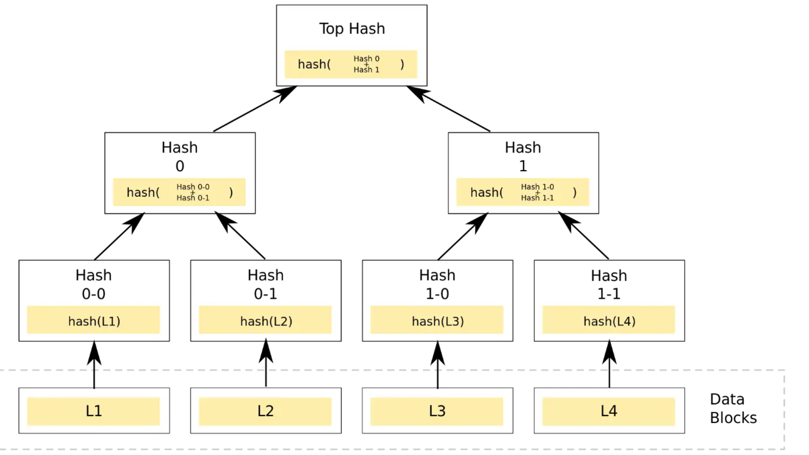

#### 通过Merkle来实现NFT白名单

https://learnblockchain.cn/article/4521

https://www.wtf.academy/solidity-application/NFTSwap/

> MerkleTree

1. **叶子节点** - 叶子节点位于树的最底部，它们的值是**原始数据**根据指定的哈希函数进行哈希的结果。一棵树上有多少个叶子节点，就有多少个需要哈希的原始数据。例如，如果有7个数据需要被哈希，就会有7个叶子节点。
2. **父节点** - 父节点可以位于树的不同层次，这取决于整个树的大小，父节点总是位于叶节点之上。父节点的值是由它下面的节点的哈希值决定的，通常从左到右开始。由于不同的输入总是会产生不同的哈希值，不考虑哈希值的碰撞，节点哈希值的连接顺序很重要。值得一提的是，根据树的大小，父节点可以Hash其他父节点。
3. **根节点** - 根节点位于树的顶端，由位于它下面的两个父节点的哈希值连接而成，同样从左到右开始。任何默克尔树上都只有一个根节点，根节点拥有根哈希值。

> 通过MerkleTree实现nft白名单

在现实情况下, 如果你的项目确定了一个白名单, 该白名单中的用户才能够mint nft, 或者为选定的钱包地址保留任意数量的代币

如果这些地址通过一个mapping存储, 那么我们要将这些地址全部保存到链上的话, 那么我们所需要的gas费将会非常的高

所以我们采用如下的方式来进行:

	1. 对所有白名单地址生成一个Merkle Tree, 并将root hash放在链上
 	2. 当用户在网站连接钱包的时候, 通过js请求后端, 获取该地址的proof
 	3. 前段接收到proof后, 将其作为参数与参与者的交易一起发送到合约
 	4. 在合约中, 将proof和地址生成的leaf节点依次进行hash, 看能够得到root hash
 	5. 如果能够得到root hash, 进行后续的mint操作