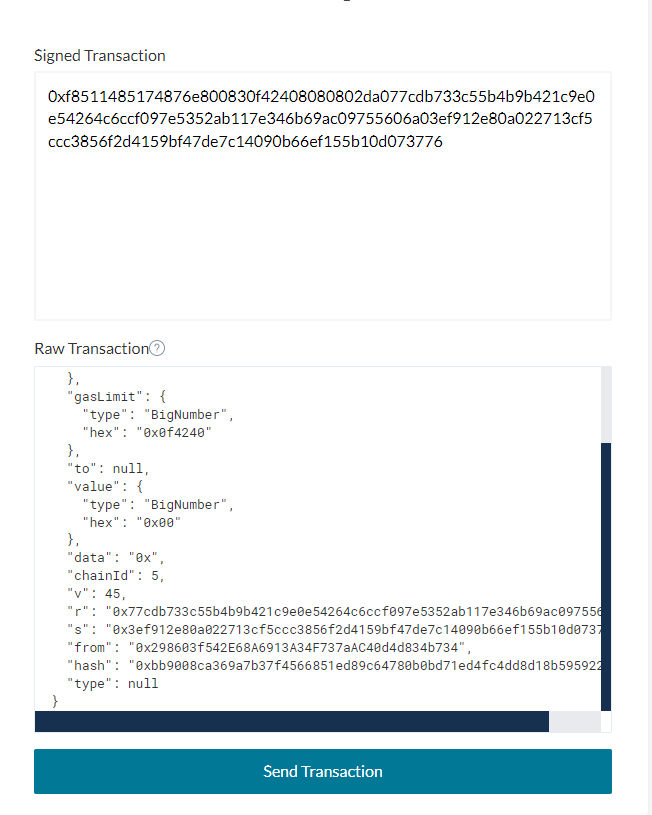

https://www.wtf.academy/solidity-application/Signature/

https://learnblockchain.cn/article/5012

#### 什么是签名

现实生活中的签名可以是对一份文件签名, 带有该签名的文件就具备了法律效应
其中对文件签名的隐含意思就是: 

​	对于当前这个文件, 产生一个只有你能产生的标识, 带有这个标识的这个文件就可以百分百确定是你产生的

对于数字世界的签名也是同样的意思

​	我们对一份数据通过私钥对其进行加密, 产生的这个加密后的内容就可以称为签名, 因为这个签名只有你通过私钥才够产生

#### 以太坊中的签名概述

在以太坊中, 我们发送交易, 需要在交易中给出交易信息, 公钥, 签名

- **签名**即`ECDSA正向算法（消息 + 私钥 + 随机数）= 签名`，其中**消息**是公开的，**私钥**是隐私的，经过ECDSA正向算法可得到**签名，即r、s、v**（不用纠结与r、s、v到底什么，只需要知道这就是签名即可）。
- **验证**即`ECDSA反向算法（消息 + 签名）= 公钥`，其中**消息**是公开的，**签名**是公开的，经过ECDSA反向算法可得到**公钥**，然后对比**已公开的公钥。**

在以太坊中, 需要进行签名的消息有大致两种

1. 对交易内容进行签名, 即发送交易的时候对交易内容进行签名
2. 对非交易内容进行签名, 一般是消息, 消息中附带着各种参数

#### 以太坊对交易的签名与验证的过程

> 签名

1. 构建交易内容

   - **nonce**: 记录发起交易的账户已执行交易总数。Nonce的值随着每个新交易的执行不断增加，这能让网络了解执行交易需要遵循的顺序，并且作为交易的重放保护。
   - **gasPrice**:该交易每单位gas的价格，Gas价格目前以Gwei为单位（即10^9wei），其范围是大于0.1Gwei，可进行灵活设置。
   - **gasLimit**:该交易支付的最高gas上限。该上限能确保在出现交易执行问题（比如陷入无限循环）之时，交易账户不会耗尽所有资金。一旦交易执行完毕，剩余所有gas会返还至交易账户。
   - **to**：该交易被送往的地址（调用的合约地址或转账对方的账户地址）。
   - **value**：交易发送的以太币总量。
   - **data**:
     - 若该交易是以太币交易，则data为空；
     - 若是部署合约，则data为合约的bytecode；
     - 若是合约调用，则需要从合约ABI中获取函数签名，并取函数签名hash值前4字节与所有参数的编码方式值进行拼接而成，具体参见文章[Ethereum的合约ABI拓展](https://github.com/linjie-1/guigulive-operation/wiki/Ethereum的合约ABI拓展)
   - **chainId**：防止跨链重放攻击。 ->EIP155

2. 签名交易并发送交易: 我们使用ether库进行演示

   ~~~js
   const ethers = require("ethers")
   require("dotenv").config()
   
   async function main() {
       // 将RPC与私钥存储在环境变量中
       // RPC节点连接，直接用alchemy即可
       let provider = new ethers.providers.JsonRpcProvider(process.env.RPC_URL)
       // 新建钱包对象
       let wallet = new ethers.Wallet(process.env.PRIVATE_KEY, provider)
       // 返回这个地址已经发送过多少次交易
       const nonce = await wallet.getTransactionCount()
       // 构造raw TX
       tx = {
         nonce: nonce,
         gasPrice: 100000000000,
         gasLimit: 1000000,
         to: null,
         value: 0,
         data: "",
         chainId: 1, //也可以自动获取chainId = provider.getNetwork()
       }
       // 签名，其中过程见下面详述
       let resp = await wallet.signTransaction(tx)
     	console.log(resp)
       // 发送交易
       const sentTxResponse = await wallet.sendTransaction(tx);
   }
   
   main()
       .then(() => process.exit(0))
       .catch((error) => {
           console.error(error)
           process.exit(1)
       })
   ~~~

   **wallet.signTransaction中发生了什么？**

   1. 对`(nonce, gasPrice, gasLimit, to, value, data, chainId, 0, 0)`进行**RLP**编码；

   2. 对上面的**RLP**编码值进行**Keccak256** ；

   3. 对上面的**Keccak256**值进行**ECDSA私钥签名（即正向算法）**；

   4. 对上面的**ECDSA私钥签名(v、r、s)\**结果与交易消息再次进行\**RPL**编码，即`RLP(nonce, gasPrice, gasLimit, to, value, data, v, r, s)`，可得到如下编码

      ```text
      0xf8511485174876e800830f42408080802da077cdb733c55b4b9b421c9e0e54264c6ccf097e5352ab117e346b69ac09755606a03ef912e80a022713cf5ccc3856f2d4159bf47de7c14090b66ef155b10d073776
      ```

      细心的同学可能会问，为什么步骤1中包含chainId字段，而步骤4中再次编码时没有chainId字段？原始消息内容都不一样，怎么可能会验证通过？先别急，这是因为chainId 是被编码到签名的 `v`参数中的，因此我们不会将chainId本身包含在最终的签名交易数据中（下面一小节也有阐述）。当然，我们也不会提供任何发送方地址，因为地址可以通过签名恢复。这就是以太坊网络内部用来验证交易的方式。

> 验证

1. 对上面最终的RPL解码，可得到`(nonce, gasPrice, gasLimit, to, value, data, v, r, s)`；
2. 对`(nonce, gasPrice, gasLimit, to, value, data)`和`(v,r,s)`**ECDSA验证（即反向算法）**，得到**签名者的address**，细心的同学可以看到第一个括号少了`chainId`，这是因为`chainId`在**ECDSA私钥签名（即正向算法）** 时被编码到了`v`，所以由`v`可以直接解码出`chainId`(所以在对上面的`RLP编码值进行Keccak256；`这一步，肯定是把`chainId`复制了一下，给`对上面的Keccak256值进行ECDSA私钥签名（即正向算法）；`这一步用)；
3. 对上面得到的**签名者的address**与**签名者公钥推导的address**进行比对，相等即完成身份认证、不可否认性、完整性。

我们可以去[MyCrypto - Ethereum Wallet Manager](https://app.mycrypto.com/broadcast-transaction)，将wallet.signTransaction生成的编码复制进去，对上述验证步骤有一个直观的感受，比对一下ECDSA反向算法得出的`"from"`是不是自己的地址？


>  安全问题

我们注意到原始交易对象里由**Nonce**和**ChainID**两个字段，这是为了防范**双花攻击\重放攻击（双花**与**重放**是相对的，本质都是重复使用一个签名，用自己的签名做对自己有利的重复叫**双花**，用别人的签名做对自己有利的重复叫**重放）**：

- **Nonce**：账户交易计数，以太坊的账户模型中记录着每个账户Nonce，即此账户发起过多少次交易。
- **ChainId**：分叉链区分，比如我在以太坊链上给evil进行一笔转账交易，evil又可以去以太坊经典链上重放这笔交易，这时如果我在以太坊经典上也有资产，那么会遭受损失。所以EIP155提议加入ChainId，以防止跨链重放。以太坊ChainId为1，以太坊经典ChainId为61。

#### 以太坊对消息的签名的使用场景

> 使用场景

以太坊除了需要对交易内容进行签名, 在什么时候还要对其他内容进行签名呢?

可以考虑nft白名单的问题, 现在有两种解法:

1. 把白名单存入链上的mapping中, 当目标地址调用mint函数的时候进行判断目标地址是否在白名单中.

   这种方法因为要存储大量的白名单地址, 所以会消耗大量的gas

2. 通过merkle tree来验证白名单.  

   1. 我们将所有地址构建为一个merkle tree, 然后叫root hash放在链上
   2. 当用户来要求铸造mint的时候, 先根据用户的地址, 前端请求链下数据来获取当前地址的proof, 如果无法获取到proof说明该地址不在白名单中
   3. 如果获取了proof, 将其作为参数一起传入mint函数中, 在mint函数中将msg.sender和proof进行一直hash可以得到root tree
   4. 获得root hash后跟链上root hash进行对比就可以判断该地址是否在白名单中

   这种方法因为要传入一个数组的proof, 虽然比第一种方式节省了很多gas, 但是还是会消耗很多gas

下面我们还可以通过签名的方式来进行

1. 我们先创建一对公私钥, 公钥生成的地址放在链上, 私钥自己保管

2. 当用户过来mint的时候, 通过前端js请求服务器对消息(可以是用户的address和可以mint的tokenid)进行ECDSA签名, 会生成一个签名, 如果用户不在白名单中, 那么服务器拒绝签名

3. 获得签名后将消息(address和tokenid)和签名一起传入mint函数中, 在mint函数中通过address和tokenid和签名进行ECDSA反向运算解析出公钥, 并推出地址

4. 将获得的地址与链上的地址进行对比, 就能够确定用户是否在白名单中, 并且还可以通过传入的address和msg.sender比较, 判断该用户有没有冒用别人的签名,

   因为还对tokenid进行了签名, 所以还可以现在用户只能mint指定id的nft

可以看到这这种方法和第三种方法中, 用户为了调用mint函数都需要给出一个类似通行证的东西, 区别在于第二种方法是通过merkle tree来给出通行证, 而第三种方法是通过对特定内容进行签名来给出通行证


所以对消息的签名的使用场景一般就是通行证的作用, 即服务商对特定的参数进行签名, 然后你拿着这个通行证来调用服务商的函数, 如果这个通行证进行解析之后确定是服务商给出的, 那么你就可以调用这个函数


另外一个场景就是多签钱包:

​	如果有一个3人持有的多签钱包, 需要两个人都授权才能取走硬币, 那么在传统模式下, 要三次调用合约才能将钱取走(两次授权, 一次转账)

​	如果使用签名, 那么只需要在取钱的时候传入两个人的签名, 然后钱包验证签名是否是正确的, 如果是正确的即可取钱. 至于如何获取两个人的签名, 通过线下即可


下面是通过签名来实现nft白名单的实现逻辑

~~~solidity
// SPDX-License-Identifier: UNLICENSED
pragma solidity ^0.8.7;

import "@openzeppelin/contracts/utils/cryptography/ECDSA.sol";
import "@openzeppelin/contracts/token/ERC721/ERC721.sol";

error SignatureNFT__VerifyFailed();

contract SignatureNFT is ERC721 {
    address public immutable i_signer;
    constructor(address signer) ERC721("Test Signature NFT", "TSN") {
        // 指定签名的公钥推出的地址
        i_signer = signer;
    }
    // mint NFT
    function mintNft(
        address account,
        uint256 tokenId,
        bytes memory signature
    ) public {
        if (!verify(account, tokenId, signature)) {
            revert SignatureNFT__VerifyFailed();
        }
        _safeMint(account, tokenId);
    }
    function verify(
        address account,
        uint256 tokenId,
        bytes memory signature
    ) public view returns (bool) {
    	// 通过recoverSigner函数推出地址, 然后跟链上的地址进行对比
        address signer = recoverSigner(account, tokenId, signature);
        return signer == i_signer;
    }

    // 通过消息和签名反向推出公钥的地址
    function recoverSigner(
        address account,
        uint256 tokenId,
        bytes memory signature
    ) public pure returns (address) {
        // 打包消息, 生成256位
        bytes32 msgHash = keccak256(abi.encodePacked(account, tokenId));
        // 生成指定格式的消息
        bytes32 msgEthHash = ECDSA.toEthSignedMessageHash(msgHash);
        // 通过ECDSA反向计算出公钥的地址
        address signer = ECDSA.recover(msgEthHash, signature);
        return signer;
    }
}
~~~

下面是前端根据tokenid和address生成签名的过程

~~~js
const { ethers } = require("hardhat")

// 对要签名的参数进行编码
function getMessageBytes(account, tokenId) {
    // 对应solidity的Keccak256
    const messageHash = ethers.utils.solidityKeccak256(["address", "uint256"], [account, tokenId])
    console.log("Message Hash: ", messageHash)
  	// 由于 ethers 库的要求，需要先对哈希值数组化
    const messageBytes = ethers.utils.arrayify(messageHash)
    console.log("messageBytes: ", messageBytes)
  	// 返回数组化的hash
    return messageBytes
}

// 返回签名
async function getSignature(signer, account, tokenId) {
    const messageBytes = getMessageBytes(account, tokenId)
    // 对数组化hash进行签名，自动添加"\x19Ethereum Signed Message:\n32"并进行签名
    const signature = await signer.signMessage(messageBytes)
    console.log("Signature: ", signature)
}

async function main() {
    signers = await ethers.getSigners()
    // 我们将accounts[0]作为deployer和signer，account[1]、account[2]、account[3]作为白名单地址
    for (let index = 1; index < 4; index++) {
        await getSignature(signers[0], signers[index].address, index)
    }
}

main()
    .then(() => process.exit(0))
    .catch((error) => {
        console.error(error)
        process.exit(1)
    })
~~~

下面是合约的部署脚本

~~~js
const { network, ethers } = require("hardhat")

module.exports = async ({ getNamedAccounts, deployments }) => {
    const { deployer } = await getNamedAccounts()
    console.log(deployer)
    const { deploy, log } = deployments
    const chainId = network.config.chainId

    const args = [deployer]

    await deploy("SignatureNFT", {
        contract: "SignatureNFT",
        from: deployer,
        log: true,
        args: args,
        waitConfirmations: network.config.waitConfirmations || 1,
    })
    log("[==>]------Deployed!------------------------------------------")
}
module.exports.tags = ["SignatureNFT"]
~~~

下面是hardhat的测试脚本

~~~js
const { getNamedAccounts, ethers, network } = require("hardhat")
const { assert, expect } = require("chai")

describe("SignatureNFT", function () {
    let signatureNFT, deployer

    beforeEach(async function () {
        // 我们将accounts[0]作为deployer和signer，account[1]、account[2]、account[3]作为白名单地址
        accounts = await ethers.getSigners()
        console.log(`accounts[0]:${accounts[0].address}`)
        console.log(`accounts[1]:${accounts[1].address}`)
        // 通过hardhat.config.js配置deployer就是accounts[0]
        // 当然直接用accounts[0]也行，这里显得直观些
        deployer = (await getNamedAccounts()).deployer
        console.log(`deployer:${deployer}`)
        // 部署合约
        await deployments.fixture(["SignatureNFT"])
        // 获得合约对象，若getContract没有account传入，则为deployer连接
        signatureNFT = await ethers.getContract("SignatureNFT")
    })

    // test constructor
    describe("constructor", function () {
        it("i_signer is deploy_address when deploy constract", async function () {
            const signer = await signatureNFT.i_signer()
            assert.equal(signer, deployer)
        })
    })

    //test recoverSigner
    describe("recoverSigner", function () {
        it("recoverSigner could return address of account[0](deployer) when contract deploy in default chain", async function () {
            const signature =
                "0x46bd542e1c97a9fd5541efbfa649dd8cecc0c7bb00c79bcac48f7986f45174893ce2063168c862996ebfa272cbc245cab3b93d0b49c8a5c5f3eec2d51ad5c6941c"
            const tokenId = 3
            const account = accounts[3]
            const signer = await signatureNFT.recoverSigner(account.address, tokenId, signature)
            assert.equal(signer, deployer)
        })
    })

    //test varify
    describe("varify", function () {
        it("function varify should return ture", async function () {
            const signature =
                "0x46bd542e1c97a9fd5541efbfa649dd8cecc0c7bb00c79bcac48f7986f45174893ce2063168c862996ebfa272cbc245cab3b93d0b49c8a5c5f3eec2d51ad5c6941c"
            const tokenId = 3
            const account = accounts[3]
            const verify = await signatureNFT.verify(account.address, tokenId, signature)
            assert.equal(verify, true)
        })
    })

    // correct mintNft
    describe("mintNft", function () {
        it("the third tokenId should belong to account[3] when mint the third signature", async function () {
            const signature =
                "0x46bd542e1c97a9fd5541efbfa649dd8cecc0c7bb00c79bcac48f7986f45174893ce2063168c862996ebfa272cbc245cab3b93d0b49c8a5c5f3eec2d51ad5c6941c"
            const tokenId = 3
            const account = accounts[3]
            const verify = await signatureNFT.mintNft(account.address, tokenId, signature)
            const owner = await signatureNFT.ownerOf(3)
            assert.equal(owner, account.address)
        })

        // incorrect mintNft shoule trigger error of SignatureNFT__VerifyFailed
        it("incorrect mintNft shoule trigger error of SignatureNFT__VerifyFailed", async function () {
            const signature =
                "0x46bd542e1c97a9fd5541efbfa649dd8cecc0c7bb00c79bcac48f7986f45174893ce2063168c862996ebfa272cbc245cab3b93d0b49c8a5c5f3eec2d51ad5c6941c"
            // 我们规定accounts[3]只能Mint tokenId_3，他想Mint tokenId_2，那肯定不可以。
          	const tokenId = 2
            const account = accounts[3]
            // 这里有个注意点
            await expect(
                signatureNFT.mintNft(account.address, tokenId, signature)
            ).to.be.revertedWithCustomError(signatureNFT, "SignatureNFT__VerifyFailed")
        })
    })
})
~~~

#### 对以太坊签名消息的格式的说明

上面我们举了通过签名来实现nft白名单这个例子, 这个例子中我们对address和tokenid进行了签名, **但是address和tokenid需要经过一定转换后生成eth signed message(以太坊签名消息)**,  以太坊签名消息的keccak256的哈希 才是ECDSA真正签名的部分


那么address和tokenid要如何转换才能生成eth signed message呢?

以太坊当前规定了eth signed message的格式: 

~~~text
0x19 <1 byte version> <version specific data> <data to sign>.
~~~

0x19是固定的

1 byte version表示的是一个字节的用于表示版本, 目前可选的版本是0x00, 0x01, 0x45

version specific data表示对应版本需要的特殊数据

data to sign表示我们要签名的数据

> eth signed message 0x45的版本

该版本在eip197中提出

在该版本中version被指定为了0x45

version specific data被指定为了"thereum Signed Message:\n + len(message)"

data to sign被指定为需要签名的数据

在一般情况下data to sign都是keccak256(abi.encodePacked(param1, param2...)), 在上面的例子中就是keccak256(abi.encodePacked(address, tokenid)), 所以version specific data一般都是"thereum Signed Message:\n32"


使用该版本的签名称为**通用签名方式**, 即在一般场景下都使用这种方式


PS: 这个版本应该是在没有出规定之前, 大家都是在keccak256(abi.encodePacked(param1, param2...))签名加一个"\x19Ethereum Signed Message:\n32"就当做eth signed message, 所以出规定之后, version specific data被指定为了"thereum Signed Message:\n + len(message)", 确实的那个大写的E的ascii的十六进制就是0x45, 所以刚好凑成了"\x19Ethereum Signed Message:\n32"


> eth signed message 0x00的版本

该版本在eip197中提出

在该版本中version被指定为了0x00

version specific data被指定为了一个地址address

data to sign被指定为需要签名的数据, 任何都可以


该版本主要是用在防止重放攻击的

考虑如下情况: 上面的多签钱包的案例, 三个人(eva, alice, tom)持有, 取钱需要两个人的签名(签名使用0x45的版本)https://www.youtube.com/watch?v=jq1b-ZDRVDc&ab_channel=SmartContractProgrammer

​	第一次eva取钱, alice同意, 那么alice可以将自己的签名发给eva, eva拿着自己和alice的签名就可以将钱从钱包中取出来, 但是eva可以保存alice的签名, 第二次取钱的时候依旧可以使用

​	更可怕的是, 如果eva, alice, tom三人还有一个一模一样的多签钱包, 那么alice给出的签名在另外一个钱包中依旧可以使用, 这就造成了重放攻击

该版本就是为了应对重复攻击产生的, 在version specific data被指定为一个address, 表示当前签名只有在地址为address的合约中才能使用, 从而达到限制重复攻击的效果


但是在生产中一般很少使用这种方式


> eth signed message 0x01的版本

https://eips.ethereum.org/EIPS/eip-712

https://learnblockchain.cn/article/5012#EIP-712

https://mirror.xyz/xyyme.eth/cJX3zqiiUg2dxB1nmbXbDcQ1DSdajHP5iNgBc6wEZz4

该版本在eip721中提出, 该版本的提出是为了在签名时不仅能够对普通消息签名, 还可以对结构化的数据进行签名

在该版本中version被指定为了0x01

version specific data被指定为DOMAIN_SEPARATOR

~~~JS
DOMAIN_SEPARATOR = keccak256(
        abi.encode(
            // encodeType
            keccak256('EIP712Domain(string name,string version,uint256 chainId,address verifyingContract)'), // 这个EIP712Domain是固定的, 属性也是固定的, 但是可以再添加一个bytes32 salt属性, 这个属性一般不使用
            // encodeData
          	keccak256(bytes(name)), // 给上面的属性赋值, name
            keccak256(bytes('1')), // version
            chainId, // chainId
            address(this) // verifyingContract
        )
    );
~~~

data to sign被指定为

~~~js
// PERMIT_TYPEHASH是我们要哈希的结构体的结构的哈希, 结构体的表示不要使用换行, 
// 如果结构体中还有结构体, 那么将多个结构体依次连接即可, 比如
// Transaction(Person from,Person to,Asset tx)Asset(address token,uint256 amount)Person(address wallet,string name)


// keccak256("Permit(address owner,address spender,uint256 value,uint256 nonce,uint256 deadline)");
bytes32 public constant PERMIT_TYPEHASH = 0x6e71edae12b1b97f4d1f60370fef10105fa2faae0126114a169c64845d6126c9;
// 将结构体的哈希, 和结构体的属性值依次传入, 如果属性值的类型为string和bytes, 那么要先进行keccak256哈希
// The array values are encoded as the keccak256 hash of the concatenated encodeData of their contents (i.e. the encoding of SomeType[5] is identical to that of a struct containing five members of type SomeType).
 data_to_sign = keccak256(abi.encode(PERMIT_TYPEHASH, owner, spender, value, nonces[owner]++, deadline)
~~~

下面是生成signed message的整个代码

~~~js
bytes32 digest = keccak256(
        abi.encodePacked(
            '\x19\x01',
            DOMAIN_SEPARATOR,
            keccak256(abi.encode(PERMIT_TYPEHASH, owner, spender, value, nonces[owner]++, deadline))
        )
    );
~~~

