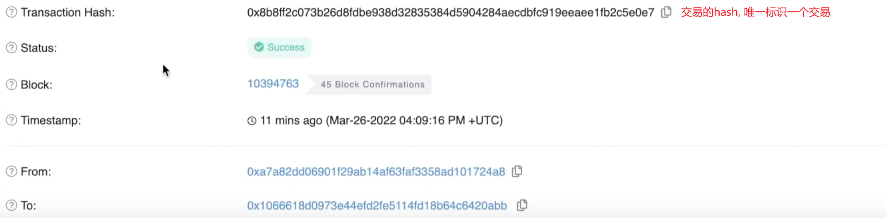
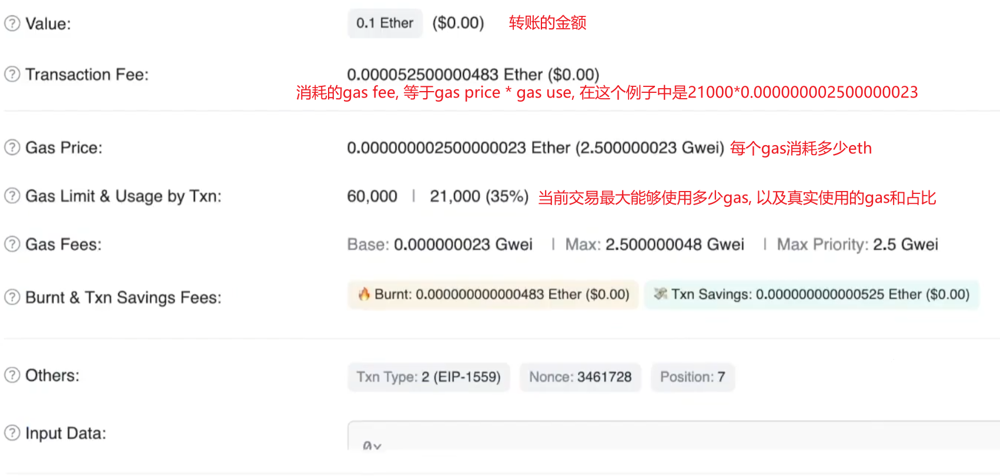
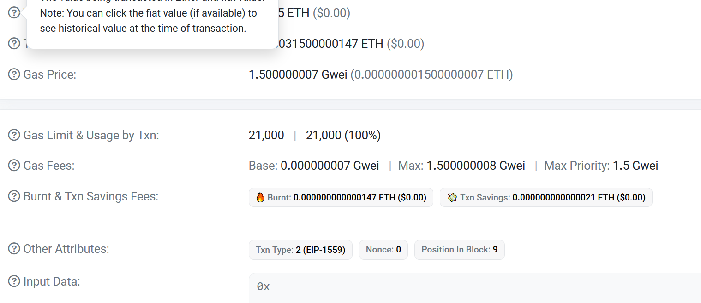
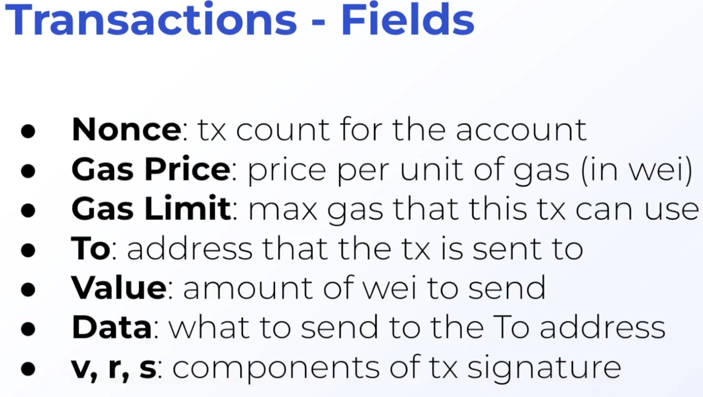
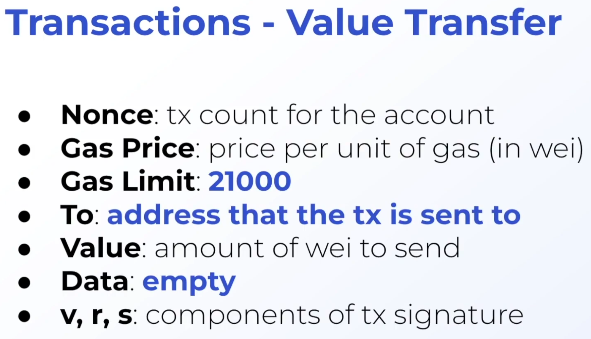

#### 交易记录的说明

gas是一个计量单位, 类似于计算量, 交易需要执行的步骤越多, 消耗的gas越多, 如果超过gas limit就会执行失败, **同时gas费也会被消耗掉**

### 关于gas费的说明

https://www.jianshu.com/p/eacbb32d2991

https://ethereum.org/zh/developers/docs/gas/

总共消耗的gas费为: Transaction Fee = Gas Used * Gas Price

Gas Price = Base Gas Price + Max Priority

Base Gas产生的费用被燃烧掉, 退出流通: Burnt = Base Gas Price * Gas Used

Base Gas Price的价格由系统自动计算, 当网络上交易多的时候就高, 交易少就低, 具体的计算规则可以查看上面的链接二

Max Priority产生的费用是给矿工的费用

Max Price是我们能够接受的最高的Gas Price, 即Base Gas Price + Max Priority<= Max Price

Txn Saving Fees是交易时退回给我们的钱: Txn Saving Fees = (Max Price - Gas Price - Max Priority) * Gas Used

这样的费用模型是在2019年提出来的, 被称为eip 1559

在这之前的模型是竞价, 即谁出价高谁就优先打包, 矿工获取所有的gas费

