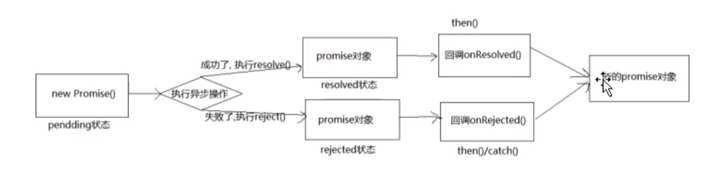

## Promise的基本流程

## Promise的API

### 构造函数: Promise(executor){}

1. executor函数: (resolve, reject) => {}, executor是同步执行的, 然后再executor内部执行异步操作
2. resolve函数: 在内部会调用value=>{}函数
3. reject函数: 在内部会调用reason=>{}函数

resolve和reject都可以在调用时传递参数, 该参数会被传递给onResolved / onRejected函数

#### Promise.prototype.then方法: (onResolved, onRejected) => {}

1. onResolved函数: 在resolve内部被调用, 可以通过参数接收resolve传递的参数
2. onRejected函数: 在reject内部被调用, 可以通过参数接收reject传递的参数

都可以通过参数来接收resolve/reject传递过来的数据

都返回一个新的Promise对象

#### Promise.prototype.catch 方法: (onRejected) => {}  

1. onRejected 函数: 失败的回调函数 (reason) => {}
   then()的语法糖, 相当于: then(undefined, onRejected)  

#### 
