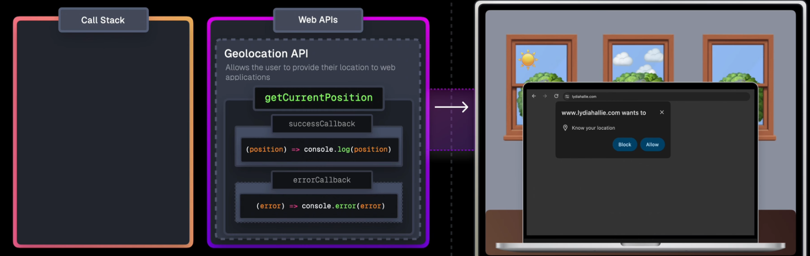

# nodejs安装

## 安装

https://blog.csdn.net/WHF__/article/details/129362462

1. 进入官网地址下载安装包[Node.js 中文网](https://www.nodejs.com.cn/download.html)

   选择对应你系统的Node.js版本，这里我选择的是[Windows系统](https://so.csdn.net/so/search?q=Windows系统&spm=1001.2101.3001.7020)、64位

2. 下载完成后，双击安装包，开始安装Node.js

3. 在安装过程中, node会自动的

   - 添加安装路径到系统环境变量的path下, 这样我们就可以直接在控制台使用npm, node这些命令了

   - 添加`C:\Users\Administrator\AppData\Roaming\npm`到用户环境变量下, 这个目录是npm全局安装的默认路径

     这样我们就可以自己使用npm全局安装的工具了

4. 测试安装是否成功，按下【win+R】键，输入cmd，打开cmd窗口    

   ~~~shell
   node -v   // 显示node.js版本
   npm -v   // 显示npm版本
   ~~~

## 配置

1. 默认情况下, npm会将全局安装包放在`$(prefix)/node_module`下, prefix默认等于`C:\Users\Administrator\AppData\Roaming\npm`

   也就是说默认情况下安装包会放在`C:\Users\Administrator\AppData\Roaming\npm\node_module`下

   我们可以使用如下命令来获得prefix的值, 和全局安装包的具体路径

   ~~~shell
   node config get prefix # C:\Users\Administrator\AppData\Roaming\npm
   node root -g # C:\Users\Administrator\AppData\Roaming\npm\node_module
   ~~~

   我们可以通过如下方式来设置prefix来修改全局安装的路径

   ~~~shell
   npm config set prefix "C:\node\node_global"
   ~~~

   同时我们还要删除掉node安装时添加到用户环境变量path下的`C:\Users\Administrator\AppData\Roaming\npm`路径, 并把修改后的prefix的值设置到系统的环境变量path下, 这样我们才可以在cmd中使用全局安装的工具

2. 默认情况下, 全局安装的包, 我们只能在cmd中使用, 但是不能再代码中require, 因为require不能找到全局安装的包的路径

   所以我们需要在环境变量中配置一个`NODE_PATH`, 他的值就是全局安装包的路径, 可以通过`node root -g`来获得

   这样全局安装的包我们也能require了

3. 默认情况下, node会有一些缓存的东西, 默认放在`C:\Users\Administrator\AppData\Local\npm-cache`, 这个路径可以通过如下方式来查看和修改

   ~~~shell
   npm config get cache # 查看缓存路径
   npm config set cache "C:\node\node_cache" # 设置缓存路径
   npm cache clean --force # 清理全局的缓存
   ~~~

## 执行nodejs

创建一个js文件

~~~js
console.log("hello world")
~~~

然后通过`node hello.js`就可以执行该文件了

# npm配置镜像

~~~shell
npm config get registry # 查看进行
npm config set registry https://registry.npmmirror.com # 设置使用淘宝镜像
npm config delete registry # 删除镜像
~~~

# npm设置代理

~~~shell
npm config get proxy # 查看代理
npm config get https-proxy

npm config set proxy http://127.0.0.1:7890/ # 设置使用淘宝镜像
npm config set https-proxy http://127.0.0.1:7890/

npm config delete proxy # 删除镜像
npm config delete https-proxy
~~~

# npm命令

## 配置相关

npm会使用`用户家目录/.npmrc`文件来作为npm的配置文件, 你可以使用如下命令来查看该文件的配置

~~~shell
npm config ls # 列出文件内容
npm config set xxx = "aaa" # 添加配置到配置文件中
npm config get xxx # 读取指定的配置
npm config delete xxx # 设置指定的配置
~~~

## 镜像相关

~~~shell
npm config get registry # 查看进行
npm config set registry https://registry.npmmirror.com # 设置使用淘宝镜像
npm config delete registry # 删除镜像
~~~

## 代理相关

~~~shell
npm config get proxy # 查看代理
npm config get https-proxy

npm config set proxy http://127.0.0.1:7890/ # 设置使用淘宝镜像
npm config set https-proxy http://127.0.0.1:7890/

npm config delete proxy # 删除镜像
npm config delete https-proxy
~~~

## 依赖相关

~~~shell
npm -v # 查看npm版本
npm search xxx # 搜索包

# 安装包到当前目录下的node_module, 当前目录下必须要有package.json, 否则安装不上
# 等效于npm i xxx
# 不加版本号默认使用latest, 也可以使用 `模块@latest`来表示最新版本
# 不加-g只操作当前目录下的模块, 添加-g操作全局中的模块
# 还会将安装的依赖添加的package.json的dependencies中, -g全局安装的不会添加到package.json中
npm install 模块[@版本号]  [-g]
# --save-dev表示当前安装的模块是dev环境下使用的, 模块将在package.json的devDependencies中出现
npm install 模块[@版本号] [--save-dev]
# 从淘宝镜像下载包到当前项目或者全局目录
npm install [-g] --registry=https://registry.npm.taobao.org xxx

npm install # 安装package.json中指定的依赖到当前项目的node_module中

npm list [-g],  不加-g列举当前目录下的模块, 添加-g列举全局目录下的模块
npm uninstall xxx [-g] # 删除当前/全局目录下安装的xxx
npm update xxx [-g] # 更新当前/全局目录下的包

npm info 模块, 列举模块的详细信息
npm info 模块 version, 获取模块的最新版本
npm outdated, 检测模块是否过时
~~~

## 项目相关

~~~shell
npm init # 交互式创建一个package.json文件,  或者说创建一个项目
~~~

# npx

`npx command`等效于`npm exec command 和 npm x command`, 他的作用主要是用来执行项目中, 或者全局安装包中的二进制命令的

当我们使用`npm install package[-g]`的时候, npm会检查安装包的`package.json`查看其中是否有`bin`字段

假设下载下来的安装包的`package.json`是如下内容

~~~json
{
  "name": "kay-cli",
  "version": "1.0.0",
  "main": "index.js",
  "bin": {
    "kaysay": "./bin/cli.js"
  }
}
~~~

那么npm就会创建一个`kaysay,  kaysay.cmd, kaysay.ps1`三个文件, 并放在

- 如果是本地安装, 放在`node_modules/.bin/`下
- 如果是全局安装, 放在`${npm config ls prefix}/`目录下

在npx出现之前, 如果我们要执行保存在`node_modules/.bin`下的二进制文件, 那么我们必须使用`./node_modules/.bin/xxx`的形式来执行

有了npx之后当我们通过`npx kaysay`执行命令的时候, node首先会创建一个shell, 并将`node_modules/.bin`目录加入PATH变量，所以执行命令的时候, 可以不用带`node_modules/.bin`前缀

然后node会在PATH环境变量中查找对应的命令来执行, 比如上面的`kaysay`, 执行他就会去执行指定的cli.js文件, 并将参数传递给这个JS脚本文件

如果npx找了一圈都没有找到对应的命令, 那么他会将这个command作为一个package, 然后联网下载到`${npm config get cache}`中, 然后查看该安装包的package.json的bin字段

- 如果bin字段中只有一个命令, 那么就执行这个命令

- 如果bin字段中有多个命令, 那么就执行和`name`字段相同的那个命令

- 否则就报错

执行结束后，再将PATH变量恢复原样

比如我们执行`npx create-vite`, 如果你当前项目或者全局安装了`create-vite`的话, 那么就会查找到对应的命令, 当然你也可以使用`--ignore-existing`选项来忽略本地的这个命令, 而强制联网下载

你没有安装create-vite这个包的话, 那么他就会联网去下载这个包, 查看其中的bin字段, 当然你也可以使用`--no-install`来强制使用本地的命令, 如果本地没有的话就会报错

~~~js
{
  "name": "create-vite",
  "version": "6.1.1",
  "type": "module",
  "bin": {
    "create-vite": "index.js",
    "cva": "index.js"
  }
}
~~~

因为bin中有一个字段与name相同, 那么就会执行这个command, 从而执行对应的index.js

另外npx也可以执行系统命令, 比如`npx ls`

### npm init和npm create

其实`npm init`，`npm create`，`npm innit`三个命令是完全等价的。

1. `npm init`/ `npm create`/ `npm innit`这种后面没有`<initializer>`是用来创建package.json文件的

2. `npm init <initializer>`/ `npm create <initializer>`/ `npm innit <initializer>`

   这里的`npm init <initializer>`实际会调用`npm exec create-<initializer>`, 也相当于`npx create-<initializer>`。 我们可以把这个`<initializer>`理解为 有特殊格式包名的包 的简称，它真正的包名为`create-<initializer>`，也只有符合这种特殊格式(`create-<xxxx>`)的包才可以执行这样的命令。

   比如`create-vite`这个包, 我们可以使用如下命令来使用这个包

   ~~~js
   npm init vite
   npm create vite
   npm innit vite
   
   npm exec create-vite
   npm x create-vite
   
   npx create-vite
   ~~~

   

   

# node多版本管理

在使用node的时候, 有时候需要安装多个node以应对不同项目, 因为有些项目的依赖必须使用指定的版本
我们可以使用nvm来进行node多版本管理

参考
https://juejin.cn/post/7094576504243224612

1. 首先删除本地安装的node.js
   具体就是通过控制面板卸载node.js, 然后删除对应的环境变量

   具体有哪些环境变量可以查看安装的时候设置了哪些

2. 下载nvm
        地址:https://github.com/coreybutler/nvm-windows/releases

3. 安装nvm, 一直点击下一步即可
         在这个过程中需要**指定下载的node的保存地址**, 以及nvm的安装路径

4. 使用`nvm v`查看当前nvm的版本号

5. 通过`nvm ls available`来查看当前有哪些可以安装的node版本

6. `nvm install 14.17.4` 来安装node指定的版本

7. 设置npm相关配置

   ~~~shell
   npm config set cache "C:\node\node_cache" # 设置缓存路径
   npm config set prefix "C:\node\node_global"
   ~~~

   并添加`NODE_PATH`环境变量, 值是`node root -g`命令执行的结果, 这样我们就可以require全局安装的包了

8. `node -v` 查看当前使用的node的版本

8. `nvm ls` 查看当前已经安装的node

9. `nvm use 14.17.4` 切换到指定的node版本

## nvm设置代理

~~~shell
nvm proxy # 查看代理
nvm proxy http://127.0.0.1:7890 # 设置代理
~~~

## nvm设置镜像

镜像主要有两个, 一个是npm下载包的镜像, 一个是下载nodejs的镜像

~~~shell
nvm node_mirror # 查看node镜像
nvm node_mirror https://npm.taobao.org/mirrors/node/ # 设置node镜像

nvm npm_mirror # 查看npm镜像
nvm npm_mirror https://npm.taobao.org/mirrors/npm/ # 设置npm镜像
~~~

## nvm相关命令

~~~shell
nvm version # 显示NVM for Windows的当前运行版本。
nvm root # 查看当前存储不同版本的node.js的目录
nvm root <path> # 设置nvm应在其中存储不同版本的node.js的目录。如果<path>未设置，将显示当前根目录。

nvm install <version> # 该版本可以是node.js版本，也可以是最新的稳定版本的“最新”版本。
nvm install latest # 安装最新版本
nvm list [available] # 列出node.js安装。available在末尾键入以显示可供下载的版本列表。
nvm on # 启用node.js版本管理。
nvm off # 禁用node.js版本管理（不卸载任何内容）。
nvm uninstall <version> # 卸载特定版本。
nvm use <version> # 切换为使用指定的版本。
nvm current # 查看当前使用的node的版本

# 可以在安装的目录下找到settings.txt文件, 然后进行设置, 也可以使用如下命令设置
nvm proxy [url] # 设置用于下载的代理。留[url]空白，以查看当前的代理。设置[url]为“无”以删除代理。
nvm node_mirror <node_mirror_url> # 设置节点镜像。
nvm npm_mirror <npm_mirror_url> # 设置npm镜像。
~~~

# WebStorm配置node解释器

# 全局对象

在nodejs中, 有一个global对象, 他的功能和浏览器中的window对象类似

所有定义的全局变量都会变成他的属性, 同时在代码的任何地方, 都可以直接调用他的属性

但是在nodejs中, 需要注意的是

- 在 Node.js 中你不可能在最外层定义变量，因为所有用户代码都是属于当前模块的， 而模块本身不是最外层上下文。

- 最好不要使用 var 定义变量以避免引入全局变量，因为全局变量会污染命名空间，提高代码的耦合风险。

同时global身上还有如下可以直接使用的属性

- __filename:表示当前文件所在的绝对路径

  ~~~js
  // 输出全局变量 __filename 的值
  console.log( __filename );
  ~~~

  ~~~shell
  $ node main.js
  /web/com/runoob/nodejs/main.js
  ~~~

- __dirnane: 当前文件所在的目录的绝对路径

  ~~~js
  // 输出全局变量 __dirname 的值
  console.log( __dirname );
  ~~~

  ~~~shell
  $ node main.js
  /web/com/runoob/nodejs
  ~~~

- setTimeout(callback, ms):  多少毫秒之后定时执行

  ~~~js
  function printHello(){
     console.log( "Hello, World!");
  }
  // 两秒后执行以上函数
  setTimeout(printHello, 2000);
  ~~~

- clearTimeout(t): 取消定时任务

  ~~~js
  function printHello(){
     console.log( "Hello, World!");
  }
  // 两秒后执行以上函数
  var t = setTimeout(printHello, 2000);
  
  // 清除定时器
  clearTimeout(t);
  ~~~
  
- setInterval(callback, ms):   循环执行

  ~~~js
  function printHello(){
     console.log( "Hello, World!");
  }
  // 每隔两秒执行一次函数
  setInterval(printHello, 2000);
  ~~~

- console:  用于控制台输出

  ~~~js
  console.log([data][, ...]) 向标准输出流打印字符并以换行符结束
  console.info([data][, ...]) 这个命令与console.log差别并不大，除了在chrome中只会输出文字外，其余的会显示一个蓝色的惊叹号。
  console.warn([data][, ...]) 输出警告消息。控制台出现有黄色的惊叹号。
  console.error([data][, ...]) 输出错误消息的。控制台在出现错误时会显示是红色的叉子。
  
  console.dir(obj[, options]) 用来对一个对象进行检查（inspect），并以易于阅读和打印的格式显示。
  
  console.time(label) 输出时间，表示计时开始。
  console.timeEnd(label) 结束时间，表示计时结束
  
  console.trace(message[, ...]) 当前执行的代码在堆栈中的调用路径，这个测试函数运行很有帮助，只要给想测试的函数里面加入
  
  console.trace(message[, ...]) 当前执行的代码在堆栈中的调用路径，这个测试函数运行很有帮助，只要给想测试的函数里面加入
  ~~~

- process: 描述当前Node.js 进程状态的对象，提供了一个与操作系统的简单接口, 相当于Java中的System和Runtime

  process中有众多属性和方法, 都是和系统先关, 详细可以查看https://www.runoob.com/nodejs/nodejs-global-object.html

  

  

# 模块化

## CommonJS标准

在CommonJS标准中, 可以使用`request()`来导入一个文件

- 使用相对路径, `.js`后缀可以省略

- 这会执行a.js文件, 并使用`module.exports`作为返回值, 同时`exports = module.exports`

  ~~~js
  var a = require("./a.js"); 
  ~~~

- 在执行a.js的时候, 会将文件中的代码放到一个函数中执行

  ~~~js
  function (exports, require, module, __filename, __dirname) {
      // 将a文件的内容放到其中
  }
  ~~~

  可以通过如下的方式来打印这个函数

  ~~~js
  // a.js.js
  console.log(arguments.callee + "") // 输出当前函数本身的代码
  
  // b.js
  require("./b.js")
  ~~~

- 导出变量其实就是设置`module.exports`参数

  1. 方式1

     ~~~js
     function test() {
         console.log("test-a.js.file")
     }
     module.exports = test // 直接将module.export设置为test函数
     
     // 不能使用 exports = test来导出test, 虽然exports和module.exports指向同一个对象
     // 但是exports = xxx并不会导致module.export修改, 因为是引用类型
     // 但是可以使用export.xxx = test会导致module.export修改
     ~~~

     后续使用如下方式来使用该文件

     ~~~js
     var test = require("./a.js")
     test()
     ~~~

  2. 方式2

     ~~~js
     // 如果需要一次性导出多个对象, 可以将这些对象打包为一个对象
     var test = "xxx"
     var upper = "xxx"
     module.exports = {
          test: test,
          upper: upper
     }
     
     // 上面的方法可以使用es6的对象简写形式
     // moudle.exports = {
     //     test,
     //     upper
     // }
     
     // 还可以使用这种方式将要导入的对象作为exports的属性
     module.exports.test = test;
     module.upper = upper;
     
     // 还可以使用如下方式导出
     exports.test = test;
     ~~~

     后续使用如下方式来使用

     ~~~js
     var b = require("./b")
     console.log(b.test)
     
     // 或者通过解构赋值
     var {test, upper} = require("./b.js")
     
     // 结构赋值的时候还可以重命名变量
     var {test:test1, upper:upper1} = require("./b.js")
     ~~~

- 多次导入只会执行一次文件

  ~~~js
  // a.js.js
  console.log("hello")
  
  // b.js
  var a = require("./a.js")
  
  // main.js
  var a = require("./a.js") // 执行a文件
  var b = require("./b") // 执行b文件的时候, 再次require a文件, 不会执行
  ~~~

## 依赖的版本号说明

在nodejs中, 每个模块都有版本号, 一般是三个数字   `主版本号.副版本号.补丁号(majro.minor.patch)`

~~~js
范围指定: 使用< <= > >=
     >=1.2.7 <1.3 表示只能使用大于等于1.2.7小于1.3.0的版本
     =1.2.7, 1.2.7  表示只能使用1.2.7版本
横杆:
     1.2.3 - 2.3.4 表示 >=1.2.3 <=2.3.4
     1.2 - 2.3.4 表示 >=1.2.0 <=2.3.4
     1.2.3 - 2.3 表示 >=1.2.3 <2.4.0
     1.2.3 - 2 表示 >=1.2.3 <3.0.0
波浪号:
     只能修改最后一个非零的数字
     ~1.2.3 表示 >=1.2.3 <1.3.0
     ~1.2 表示 >=1.2.0 <1.3.0
     ~0.2 表示 >=0.2.0 <0.3.0
     ~1 表示 >=1.0.0 <2.0.0
     ~0表示 >=0.0.0 <1.0.0
尖括号:
     固定左侧第一个非零数字
     ^1.2.3 := >=1.2.3 <2.0.0
     ^0.2.3 := >=0.2.3 <0.3.0
     ^0.0.3 := >=0.0.3 <0.0.4
~~~

## ES6模块化

注意: nodejs使用package.json中的type字段来控制使用CommonJS的导入导出还是ES6的导入导出

默认情况下是使用CommonJS语法

设置为`type:commonjs`指定使用CommonJS语法, 不能使用ES6语法

设置为`type:module`指定使用ES6语法, 不能使用CommonJS语法

而在html中, 如果想要使用ES6的模块化功能, 必须使用如下方式

~~~html
<body>
    

    <!-- 导入带有导入导入功能的js -->
    
</body>
~~~

### 基本语法

导出

~~~js
// 分别导出
export let school1 = '尚硅谷';
export function teach() {
    console.log("我们可以教给你开发技能");
}

// 统一导出
let name = '尚硅谷';
function findJob() {
    console.log("我们可以帮助你找工作!!");
}
// 导出的时候可以重命名, 防止暴露内部变量的名字
export { school1 as school, findJob };

// 默认导出
export default {
    age: 18,
    change: function(){
        console.log("我们可以改变你!!");
    }
}

// 分别导出, 统一导出, 默认导出可以同时使用
// 分别导出, 统一导出可以有多个, 但是默认导出只能有一个
~~~

导入

~~~js
// es6的导入需要文件后缀, 而require不需要
// es6的import只能放在文件开始, 而require就是一个函数, 可以随便放
// 在导入的时候, 可以通过as来重命名

import * as a from "./a.js"
console.log(a.school, a.name, a.default.age) // 通过module.default来使用默认导出
a.teach()
a.findJob()
a.default change()

// 解构赋值
import {school as school1, teach, name, findJob as findJob1, default as adefault} from "./a.js" 
console.log(school1, name, default.age)
teach()
findJob1()
adefault.change()

// 默认导出还可以通过如下的方式来使用
import adefault from "./a.js"
adefault.change()

// import还可以不接受任何值, 这样的目的就是单纯的执行文件
import "./a.js"
~~~

### 注意点

所有导出的对象都是const的, 不能修改

~~~js
// 导出
export let num = 1
export const addNumber = ()=>{
    num++
}

import {  num , addNumber } from './test.js'
// num = 2 // 该语句报错, num is read-only, 可以理解为被const修饰了
addNumber() // 但是可以通过函数修改
console.log(num) // 2
~~~

### 导出重定向

通常我们在导入一个模块的时候, node都会查找该模块中的package.json中的main字段, 然后导入该文件

如果没有package.json或者没有main字段, 那么就会默认导入index.js

所以我们就可以将其他文件中的变量导入到index.js中, 然后在index.js中将他们导出去

~~~js
// 从其中文件中导入到index.js
import {aa, bb} from "other.js"
// 在index.js中导出
export {aa, bb}
~~~

当然这可以通过一行代码来搞定

~~~js
export {aa, bb} from "other.js"
~~~

## CommonJS和ES6的区别

1. 可以理解为**CommonJS导出的是变量的复制, 而ES6导出的是变量的地址**

   比如如下代码

   ~~~js
   // a.js 导出
   export age = 1
   export add = () => {
       age++
   }
   
   // b.js 导入
   import {age, add} from "./a.js"
   console.log(age) // 1
   add()
   console.log(age) // 2
   ~~~

   但是在CommonJS中

   ~~~js
   // a.js 导出
   let age = 1
   let add = () => {
       add++
   }
   module.exports = {
       age,
       add
   }
   
   // b.js 导入
   var {age, add} = require("./a.js")
   console.log(age) // 1
   add()
   console.log(age) // 1
   ~~~

   主要原因是: 

   - CommonJS的导出原理就是在b模块中创建了一个变量age, 等于a模块中的age

     ~~~js
     let age = age
     ~~~

     所以a模块中的age之后再如何变化, 都不会影响b模块中的age
     
   - ES6中的导出原理是ES6中内置一个功能叫模块环境记录，它的作用是实时绑定导出内容，**每当导出内容变化，它会删除旧的绑定内容，重新绑定一个新的内容。**
   
     
   
     根据图示，export和import中的变量实际为环境记录模块中的同一个变量，所以当a.js中导出变量发生变化的时候，环境记录模块会删除旧变量，绑定新变量，b.js中的导入也随之变化。

## 模块的搜索路径

1. 如果我们导入的是核心模块, 那么nodejs会直接从sdk中加载

2. 如果是以`/`, `./`, `../`开头, 那么他会根据路径去查找对应的模块, .js文件

3. 否则他会在当前目录下的`node_module`文件夹中查找对应的模块, 

4. 如果还是没有, 那么会在父目录下的`node_module`中查找,  一直向上查找到磁盘根目录下的`node_module`中

5. 如果还是没有, 那么会去`NODE_PATH`环境变量中查找

6. 如果查找到的是js文件, 那么会执行他

   如果查找到的是模块, 那么会去模块下的package.json中查找`main/module`指定的文件, 然后导入他

   ~~~json
   // package.json
   {
     "name": "hello",
     "version": "1.0.0",
     "description": "",
     "main": "./dist/main.js", // 使用require, 引入了hello模块就相当于引入了main.js
       "module": "./dist/main.ems.js" // 使用es6的import语法, 那么会使用这个字段
   }
   ~~~

   如果模块中没有package.json, 或者json中没有指定main/module字段, 那么就会导入目录下的`index.js`

# Promise

https://www.bilibili.com/video/BV1GA411x7z1/

## promise的使用

Promise主要用来解决回调地狱的, 他可以封装一个异步操作(网络请求, io操作, 文件读取)

返回的Promise表示一个即将到来的异步操作的结果

**!!!在构造函数中会立即执行这个传入的函数!!!!!**

~~~js
// 封装一个异步函数, 会在Promise构造函数中立即执行这个异步操作
const p = new Promise((resolve, reject) => {
    fs.readFile('./resources/为学.md', (err, data) => {
        // 在回调函数中, 通过resolve或者reject来设置Promise的状态
        if (err) {
            // 此时Promise的状态转为rejected, PromiseValue设置为err
            reject(err)
        } else {
            // 此时Promise的状态转为success, PromiseValue设置为data
            resolve(data)
        }
    });
})
~~~

Promise有两个属性:

- PromiseStatus: Promise的状态
- PromiseValue: Promise保存的值

在最开始的时候, PromiseStatus为pending, PromiseValue为undefined

- 如果异步操作成功了, 那么我们需要在异步操作的回调函数中调用resolve并传入成功的结果(如果没有可以不传)
  之后PromiseStatus会转为success, PromiseValue会被设置为传入的参数

- 如果异步操作失败了, 我们需要在异步操作的回调函数中调用reject并传入异常信息
  之后PromiseStatus会被转为rejected, PromiseValue会被设置为传入的异常信息

## then方法

我们可以调用then()处理上一步的结果, 然后设置下一步需要做的事情, then方法需要两个函数作为参数, 第一个用于正确结果的处理, 第二个用于异常结果的处理

- 如果p的状态转为了success, 那么会执行第一个参数

- 如果p的状态转换为了rejected, 表示异步操作失败了, 那么会执行第二个参数

调用 then 方法  then方法的返回结果是又是一个 *Promise* 对象, 并且这个Promise对象状态由回调函数的执行结果决定

1. 如果回调函数中返回的结果是 非 promise 类型的属性, 状态为success, PromiseValue就是返回的值
                如果函数没有return, 那么返回值就是undefined, 状态也为success, PromiseValue就是undefined
2.  如果是一个promise, 那么他的状态取决于返回的Promise执行后的状态, 并且PromiseValue就是返回的Promise的值
3. 如果回调函数抛出了异常, 那么Promise的状态是rejected, 并且PromiseValue就是抛出的异常

~~~js
const p2 = p.then(value => {
    //1. 非 promise 类型的属性, p2的状态转为success
    // return 'iloveyou';
    // return;

    //2. p2的状态取决于这个Promise执行后的状态
    return new Promise((resolve, reject) => {
        // 封装一个定时的异步任务
        setTimeout(function () {
            // resolve('ok');
            reject('error');
        }, 1000)
    });

    //3. 抛出错误, p2的状态转换为rejected
    // throw new Error('出错啦!');
    // throw '出错啦!';
}, reason => {
    // 在这里处理异步任务失败的情况
    console.warn(reason);
});
~~~

**then()也可以只传入一个处理成功情况的函数, 省略异常处理的函数**

**如果p2的状态转换为了success, 那么会执行传入的函数**

**如果p2的状态转换为了rejected, 那么p3的PromiseStatus也会转为rejected, 并且p3的PromiseValue就是p2的PromiseValue**

~~~js
const p3 = p2.then((data) => {
    console.log(data)
})
~~~

## promise的链式调用

因为then方法返回的又是一个Promise, 那么就可以进行链式调用了

~~~js
const p = new Promise((resolve, reject) => {
    setTimeout(() => {
        reject("err")
    }, 1000)
})
.then((data) => {}, (err) => {})
.then((data) => {}, (err) => {}) 
.then((data) => {}, (err) => {}) 
~~~

## promise的异常传播

如果Promise出现了异常, 但是没有处理, 那么他会一直将异常传播给下游的Promise

~~~js
const p = new Promise((resolve, reject) => {
    setTimeout(() => {
        reject("err")
    }, 1000)
}) // p的状态转为rejected, PromiseValue为"err"
const p1 = p.then((data) => {
    
}) // p的then方法中没有处理异常, 那么p1也会跟随p, PromiseState也会转为rejected, PromiseValue转为"err"
const p2 = p1.then((data) => {
    
}) // p1的then方法中也没有处理异常, 那么p2也会跟随p1, PromiseState也会转为rejected, PromiseValue转为"err"

// p2没有后续的处理了, 那么就会抛出异常
// 并且这个异常用try catch没有办法捕获, 因为状态的转换和异常的抛出都是异步的
try {
    const p2 = p1.then((data) => {
        
    })
} catch (e) {
    // 没有办法捕获抛出的异常, 因为异常的抛出是异步的, 而try catch捕获的是同步的异常
    // 就好比任务的编排, promise就是编排任务的, 而异常是在实际执行的时候抛出的
}
~~~

如果想要不抛出异常, 就要在then的第二个参数中捕获异常, 或者调用catch方法来处理异常

~~~js
// 方式1
const p = new Promise((resolve, reject) => {
    setTimeout(() => {
        reject("err")
    }, 1000)
})
const p1 = p.then((data) => {}, (err) => {}) // 第二个参数处理p的异常
const p2 = p1.then((data) => {}, (err) => {}) // 第二个参数处理p1的异常
const p3 = p2.then((data) => {}, (err) => {}) // 第二个参数处理p2的异常

// 方式2
const p = new Promise((resolve, reject) => {
    setTimeout(() => {
        reject("err")
    }, 1000)
})
p.then((data) => {}) // 处理上一步的正常结果, 如果上一步异常了, 那么会传播异常到这里
    .catch((err) => {})  // 处理上一步的异常
	.then((data) => {}) // 
    .catch((err) => {})
// 方式3
cosnt p4 = p3.then((data) => {})
    .then((data) => {})
    .then((data) => {})
    .catch((data) => {}) // 如果上面的任务一个步骤出现了异常, 那么都会传播到这里, 然后在这里处理异常, 缺点就是不清楚上面的哪一步出现了异常
~~~

## promise解决回调地狱

在promise以前, 如果我们要处理异步操作的结果, 就必须在回调函数中处理

如果有多个连续的异步操作, 那么就要和下面一样

~~~js
fs.readFile("a.md", (err, data) => {
    console.log(data)
    // 第一步结果出来了, 执行第二个异步操作
    fs.readFile("b.md", (err, data) => {
    	console.log(data)
        // 第二个异步操作的结果出来了, 执行第三个异步操作
    	fs.readFile("c.md", (err, data) => {
    		console.log(data)
    
		})
	})
})
~~~

现在有了promise, 我们就可以通过如下的方式了

~~~js
new Promise((resolve, reject) => {
	fs.readFile("a.md", (err, data) => {
		resolve(data)
    })
}).then((data => {
    console.log(data)// 处理上一步的结果
    // 设置下一步的任务
    return new Promise((resolve, reject) => {
		fs.readFile("b.md", (err, data) => {
			resolve(data)
    	})
	})
})).then((data) => {
    console.log(data)// 处理上一步的结果
    // 设置下一步的任务
    return new Promise((resolve, reject) => {
		fs.readFile("c.md", (err, data) => {
			resolve(data)
    	})
	})
}).then((data) => {
    console.log(data)// 处理上一步的结果
}).catch(err => {
    console.log(err) // 处理异常
}
~~~

## promise的一般用法

~~~js
// 方式1: 缺点就是最后处理err的时候, 不知道是哪一步的异常
new Promise((resolve, reject) => {
	fs.readFile("a.md", (err, data) => {
		resolve(data)
    })
}).then((data => {
	// 第二步骤
})).then((data) => {
	// 第三步骤
}).then((data) => {
	// 第四步骤
}).catch(err => {
    console.log(err) // 处理异常
}
         
// 方式2
new Promise((resolve, reject) => {
	fs.readFile("a.md", (err, data) => {
		resolve(data)
    })
})
    .then((data) => {}, err=> {}))
    .then((data) => {}, err=> {})
    .then((data) => {}, err=> {})

// 方式3
new Promise((resolve, reject) => {
	fs.readFile("a.md", (err, data) => {
		resolve(data)
    })
})
    .then((data) => {}).catch(err=> {})
    .then((data) => {}).catch(err=> {})
    .then((data) => {}).catch(err=> {})
~~~

## promise的其他方法

1. Promise.resolve

   该方法接受一个参数, 并返回一个Promise

   - 如果参数是非Promise类型, 那么返回一个成功的Promise, 并且PromiseState就是传入的参数

   - 如果参数是Promise类型, 那么返回的Promise的PromiseState和PromiseValue就是传入的Promise的对应属性

   ~~~js
   let p1 = Promise.resolve(123) // PromiseState为success, PromiseValue为123
   let p2 = Promise.resolve(new Promise(resolve, reject) => {
       reject(123)
   }) // PromiseState为rejected, PromiseValue为123
   ~~~

   这个方法的主要作用是, 不管你传入什么参数, 都能得到一个Promise, 有点wrap的意思

   ~~~js
   let p1 = Promise.resolve(123) // 传入普通的参数, 等到一个Promise
   let p2 = Promise.resolve(new Promise(resolve, reject) => {
       reject(123)
   }) // 传入一个Promise, 也得到一个Promise, 并且外面的promise的状态取决于里面的Promise
   ~~~

   

2. Promise.reject

   该方法接受一个参数, 返回一个失败的Promise, PromiseValue就是传入的参数

   ~~~js
   let p1 = Promise.reject(123) // 返回的Promise的PromiseState为rejected, PromiseValue为123
   let p2 = Promise.reject(new Promise(resolve, reject) => {
       reject(123)
   }) // PromiseState为rejected, PromiseValue为传入的Promise
   ~~~

3. Promise.all

   接受一个Promise数组, 并返回一个Promise

   如果所有Promise的状态都转换为success, 那么返回的Promise的状态也转换为success, 并且PromiseValue是所有Promise的PromiseValue的数组

   如果有一个Promise失败了, 那么返回的Promise的状态也转为失败, 并且PromiseValue就是**第一个**失败的Promise的PromiseValue

   ~~~js
   // 返回的p1的状态为success, PromiseValue为[123, 456, 789]
   let p1= Promise.all([Promise.resolve(123), Promise.resolve(456),Promise.resolve(789)])
   
   // 返回的p1的状态为rejected, PromiseValue为[456, 789]
   let p2 = Promise.all([Promise.resolve(123), Promise.reject(456),Promise.reject(789)])
   ~~~

4. Promise.race

   接受一个Promise的数组, 返回一个Promise

   返回的Promise的状态和值就是**第一个完成的Promise的状态和值**

   ~~~js
   let p = Promise.race(new Promise((resolve, reject) => {
       setTimeout(() => {
           resolve(111)
       }, 1000)
   }), new Promise((resolve, reject) => {
       setTimeout(() => {
           resolve(222)
       }, 5000)
   }), new Promise((resolve, reject) => {
       setTimeout(() => {
           resolve(333)
       }, 7000)
   }))
   ~~~

   

## promise的关键问题

1. 如何改变 promise 的状态?
   - resolve(value): 如果当前是 pending 就会变为 resolved
   - reject(reason): 如果当前是 pending 就会变为 rejected
   - 抛出异常: 如果当前是 pending 就会变为 rejected
   
2. 一个 promise 指定多个 成功 / 失败 回调函数, 都会调用吗?
     当 promise 改变为对应状态时都会调用
     
3. 改变 promise 状态和指定回调函数谁先谁后?
   
   都有可能, 正常情况下是先指定回调再改变状态, 但也可以先改状态再指定回调
   
   
   
   如何先改状态再指定回调?
   
   - 在传入的函数中同步调用 resolve()/reject(),  此时Promise会立刻有结果, 然后在执行后面的then
   - 延迟调用 then(),  此时Promise会先得出结果, 然后在调用then
   
   
   
   什么时候才能得到数据?
   
   - 如果先指定的回调, 那当状态发生改变时, 回调函数就会调用, 得到数据
   - 如果先改变的状态, 那当指定回调时, 回调函数就会调用, 得到数据

4. promise.then()返回的新 promise 的结果状态由什么决定?
     (1) 简单表达: 由 then()指定的回调函数执行的结果决定
     (2) 详细表达:
     ① 如果抛出异常, 新 promise 变为 rejected, reason 为抛出的异常
     ② 如果返回的是非 promise 的任意值, 新 promise 变为 resolved, value 为返回的值
     ③ 如果返回的是另一个新 promise, 此 promise 的结果就会成为新 promise 的结果

5. promise 如何串连多个操作任务?
     (1) promise 的 then()返回一个新的 promise, 可以开成 then()的链式调用
     (2) 通过 then 的链式调用串连多个同步/异步任务

6. promise 异常传传播
     (1) 当使用 promise 的 then 链式调用时, 可以在最后指定失败的回调,
     (2) 前面任何操作出了异常, 都会传到最后失败的回调中处理

     
     

# 生成器

## 迭代器

如果需要一个对象能够使用`for...of`, 那么该对象需要有一个名叫`Symbol.iterator`的属性, 
该属性是一个函数, 调用`[Symbol.iterator]`返回一个迭代器对象, 
该迭代器需要有一个`next`方法,调用next方法返回一个对象,value表示当前迭代的值, done表示是否迭代完成

~~~js
        const banji = {
            name: "终极一班",
            stus: [
                'xiaoming',
                'xiaoning',
                'xiaotian',
                'knight'
            ],
            // 迭代器函数, 需要返回一个迭代器
            [Symbol.iterator]() {
                let index = 0;
                let _this = this;
                return {
                    next: function () {
                        // 迭代stus
                        if (index < _this.stus.length) {
                            const result = { value: _this.stus[index], done: false };
                            index++;
                            return result;
                        } else {
                            // 完成迭代
                            return { value: undefined, done: true };
                        }
                    }
                };
            }
        }

        //遍历这个对象, 实际上是迭代stus属性
        for (let v of banji) {
            console.log(v);
        }
~~~

## 生成器的基本使用

- 生成器其实就是一个特殊的函数, 需要添加*

- 在生成器函数中可以使用yield关键字来将代码分割为多个部分

- 调用生成器函数, 他不会执行, 而是返回一个迭代器iterator

- 我们可以调用iterator.next()来驱动生成器函数执行

- 当执行生成器函数的时候, 如果碰到yield, 那么next函数就会退出, 并返回一个对象`{value: xxx,  done: false}`

  value是yield后面的值,  done表示函数是否执行完毕

~~~js
        // 下面通过yield将生成器函数分割成了四部分
		// 每调用一次next就执行一部分函数, 同时yield后面的参数作为next的返回值
        function * gen(){
            console.log(111); // 函数的第一部分
            
            yield '一'; 

            console.log(222); // 函数的第二部分
            yield '二'; 

            console.log(333);// 函数的第三部分
            yield '三';

            console.log(444);// 函数的第四部分
        }

        let iterator = gen(); // 生成器函数返回一个迭代器, 有next方法
        console.log(iterator.next()); // 驱动生成器执行第一部分代码, 返回{value: "一", done: false}
        console.log(iterator.next()); // 驱动生成器执行第二部分代码, 返回{value: "二", done: false}
        console.log(iterator.next()); // 驱动生成器执行第三部分代码, 返回{value: "三", done: false}
        console.log(iterator.next()); // 驱动生成器执行第四部分代码, 返回{value: undefined, done: true}
~~~

如果生成器在执行的时候, 抛出了异常, 那么同样的, next()也会抛出异常

~~~js
        function * gen(){
            console.log(111); 
            
            yield '一'; 
		   throw "aaaaa" // 抛出一个异常
            console.log(222); 
            yield '二'; 

            console.log(333);
            yield '三';

            console.log(444);
        }
        let iterator = gen(); // 生成器函数返回一个迭代器, 有next方法
        console.log(iterator.next()); // 驱动生成器执行第一部分代码, 返回{value: "一", done: false}
        try {
            console.log(iterator.next()); // 驱动生成器执行第二部分代码, 在第二部分执行过程中, 抛出了异常, 那么next()方法也会抛出异常
        } catch (e) {
            
        }
~~~

## 生成器传参

在调用next()函数的时候, 我们可以给next函数传参, 他会作为yield的返回值

~~~js
        // yield后面的参数作为next函数的返回值的value属性
        // next函数可以传入参数, 传入的参数作为yield的返回值
        function * gen(arg){
            console.log(arg); // AAA
            let one = yield 111;

            console.log(one); // BBB
            let two = yield 222;

            console.log(two); // CCC
            let three = yield 333;

            console.log(three); // DDD
        }

        // 获取迭代去, 可以传参, 他会变为arg
        let iterator = gen('AAA');

		// 驱动执行第一部分代码, 打印AAA, 然后碰到了yield 111, next()函数返回{value: 111, done: false}
        // 注意第一个next不能传参, 因为在获取迭代器的时候传了参数
        console.log(iterator.next()); 

        // 驱动执行第二部分代码, 并且BBB作为第一个yield的返回值, 赋值给one
		// 碰到第二个yield后, 返回{value: 222, done: false}
        console.log(iterator.next('BBB'));

        // 驱动执行第三部分代码, 并且CCC作为第二个yield的返回值, 赋值给two
		// 碰到第三个yield后, 返回{value: 333, done: false}
        console.log(iterator.next('CCC'));

        // 驱动执行第四部分代码, 并且DDD作为第三个yield的返回值, 赋值给three
		// 函数执行完毕, next()返回{value: undefined, done: true}
        console.log(iterator.next('DDD'));
~~~

## 生成器与异常

返回的迭代器中, 还有一个throw方法, 他与next()类似, 都是驱动下一次执行, 不同点在于throw会让yield报错, 此时我们可以在生成器内部使用try catch进行捕获

~~~js
        function * gen(){
            console.log(111); // 函数的第一部分
            
            try {
                yield '一'; 
            } catch (e) {
                console.log(e)
            }

            console.log(222); 
            yield '二'; 

            console.log(333);
        }
     	let iterator = gen(); 
        console.log(iterator.next()); // 驱动生成器执行第一部分代码, 返回{value: "一", done: false}, 此时代码停在第一个yield的地方
        console.log(iterator.throw("xxx")); //  让第一个yield报错
~~~

## 迭代生成器

因为调用Generator函数, 他返回的是一个迭代器, 所以我们可以使用for of 来迭代这个迭代器

但是要注意的是，用作迭代器中的使用，则只会作用于`yield`
`return`的返回值不计入迭代

~~~js
function * oddGenerator () {
  yield 1
  yield 3
  yield 5

  return 'won\'t be iterate'
}

// for of会一直调用next, 来驱动生成器函数不停的执行
for (let value of oddGenerator()) {
  console.log(value)
}
// > 1
// > 3
// > 5
~~~

## 生成器内部的生成器

除了yield语法以外，其实还有一个yield*语法，可以粗略的理解为是Generator函数版的[...]
用来展开Generator迭代器的。

~~~js
function * gen1 () {
  yield 1
  yield* gen2() // 展开gen2
  yield 5
}

function * gen2 () {
  yield 2
  yield 3
  yield 4
  return 'won\'t be iterate'
}

for (let value of gen1()) {
  console.log(value) // 1 2 3 4 5
}
~~~

## 使用生成器来迭代对象

如果需要一个对象能够使用`for...of`, 那么该对象需要有一个名叫`Symbol.iterator`的属性, 
该属性是一个函数, 调用`[Symbol.iterator]`返回一个迭代器对象, 
该迭代器需要有一个`next`方法,调用next方法返回一个对象,value表示当前迭代的值, done表示是否迭代完成

~~~js
        const banji = {
            name: "终极一班",
            stus: [
                'xiaoming',
                'xiaoning',
                'xiaotian',
                'knight'
            ],
            // 迭代器函数, 需要返回一个迭代器
            [Symbol.iterator]() {
                let index = 0;
                let _this = this;
                return {
                    next: function () {
                        // 迭代stus
                        if (index < _this.stus.length) {
                            const result = { value: _this.stus[index], done: false };
                            index++;
                            return result;
                        } else {
                            // 完成迭代
                            return { value: undefined, done: true };
                        }
                    }
                };
            }
        }

        //遍历这个对象, 实际上是迭代stus属性
        for (let v of banji) {
            console.log(v);
        }
~~~

下面通过生成器来迭代对象

~~~js
const banji = {
    name: "终极一班",
    stus: [
        'xiaoming',
        'xiaoning',
        'xiaotian',
        'knight'
    ],
    // 迭代器函数, 需要返回一个迭代器
    [Symbol.iterator]: function * () {
        let index = 0;
        let _this = this;
        // 迭代stus
        while (index < _this.stus.length) {
            yield _this.stus[index];
            index ++
        }
    }
}

//遍历这个对象, 实际上是迭代stus属性
for (let v of banji) {
    console.log(v);
}
~~~

# async/await

## async

async用来标识一个函数, 调用该函数会返回一个Promise, Promise的状态根据返回值来决定

- 返回值是非 Promise 类型的对象, Promise的PromiseState为resolved, PromiseResult为返回值
- 返回值是 Promise 对象, Promise的状态和结果与返回的Promise一样
- 不返回任何对象, Promise状态为success, PromiseResult为undefined
- 抛出了异常, 返回的Promise的PromiseState为rejected, PromiseResult为抛出的错误

~~~js
      async function main() {
        //1. 如果返回值是一个非Promise类型的数据, 
        // 返回的Promise的PromiseState为resolved, PromiseResult为返回值
        // return 521;

        //2. 如果返回的是一个Promise对象, Promise的PromiseState为返回的Promise对象的状态,PromiseResult为返回的Promise对象的PromiseResult
        // return new Promise((resolve, reject) => {
        //     // resolve('OK');
        //     reject('Error');
        // });

        //3. 抛出错误, 返回的Promise的PromiseState为rejected, PromiseResult为抛出的错误
        throw "Oh NO";
          
        //4. 不返回任何, 状态为fulfilled, 结果为undefined
      }

      // 对async函数的调用会返回一个Promise对象
      let result = main();

      console.log(result);
~~~

## await

await表示等待一个async函数的结果, 所以右侧的表达式一般为 promise 对象(async函数的执行结果), 但也可以是其它的值

await 只能在async函数中使用, 但是async函数中可以没有await

- 如果await后面的promise成功了, 那么await会返回promise的PromiseResult

- 如果await后面的promise失败了, 则会抛出异常, 需要通过 try...catch 捕获处理

- 如果await后面的是其他值, 那么await会直接将这个值作为返回值

~~~js
async function main() {
    //1. 右侧为promise的情况
    let p = await new Promise((resolve, reject) => {
        resolve("OK");
    });
    console.log(p);
    // 更多情况下, 不是直接await一个promise, 而是await一个async函数的返回值
    let func = async function() {
     // ...   
    }
    let p1 = await func()

    //2. 右侧为其他类型的数据
    let res2 = await 20; // res2就是20
    console.log(res2);

    //3. 如果promise是失败的状态
    try {
        let res3 = await await new Promise((resolve, reject) => {
            reject("Error");
        });
    } catch (e) {
        console.log(e);
    }
}

main();
~~~

## async和await结合使用

### 文件读取

在一个连续读取文件的方法中, 如果我们不使用async和await, 而是使用普通的回调函数, 那么就会产生回调地狱

~~~js
fs.readFile('./resource/1.html', (err, data1) => {
    if(err) throw err;
    fs.readFile('./resource/2.html', (err, data2) => {
        if(err) throw err;
        fs.readFile('./resource/3.html', (err, data3) => {
            if(err) throw err;
            console.log(data1 + data2 + data3);
        });
    });
});
~~~

而如果使用async和await的方式

~~~js
const fs = require('fs');
const util = require('util');
// promisify的作用是让fs.readFile从回调的方式
// 变为返回一个Promise, 这样就可以进行await了
const mineReadFile = util.promisify(fs.readFile);

//async 与 await
async function main(){
    try{
        //读取第一个文件的内容
        let data1 = await mineReadFile('./resource/1x.html');
        let data2 = await mineReadFile('./resource/2.html');
        let data3 = await mineReadFile('./resource/3.html');
        console.log(data1 + data2 + data3);
    }catch(e){
        console.log(e.code);
    }
}

main();
~~~

### 网络请求

~~~js
        function sendAJAX(url){
            return new Promise((resolve, reject) => {
                const xhr = new XMLHttpRequest();
                xhr.responseType = 'json';
                xhr.open("GET", url);
                xhr.send();
                //处理结果
                xhr.onreadystatechange = function(){
                    if(xhr.readyState === 4){
                        //判断成功
                        if(xhr.status >= 200 && xhr.status < 300){
                            //成功的结果
                            resolve(xhr.response);
                        }else{
                            reject(xhr.status);
                        }
                    }
                }
            });
        }

        //段子接口地址 https://api.apiopen.top/getJoke
        let btn = document.querySelector('#btn');

        btn.addEventListener('click',async function(){
            //获取段子信息
            let duanzi = await sendAJAX('https://api.apiopen.top/getJoke');
            console.log(duanzi);
        });
~~~

## 从生成器到async和await

假设我们有一个异步任务

~~~js
const fs = require("fs")
const readFile = function(file){
    return new Promise((resolve, reject) => {
        fs.readFile(file, (err, data) => {
            if (err) {
                reject(err)
            } else {
                resolve(data)
            }
        })
    })
};
~~~

我们需要让他按照顺序执行多次, 那么我们可以在生成器中这样

~~~js
const generator = function *generator(message){
    console.log(message)
    const response_1 = yield readFile("a.txt"); // 如果doSomething执行失败了, 那么驱动器就会调用gen.throw()让这个yield抛出异常
    // throw new Error("hahaha ") // 如果这里抛出了异常, 那么对应的yield也会抛出异常
    const response_2 = yield readFile("b.txt");
    const response_3 = yield readFile("b.txt");
    console.log('response_1: %s;response_2: %s;response_3: %s;',response_1,response_2,response_3);
};
~~~

那么我们需要一个驱动函数, 来不停的驱动生成器去执行

~~~js
const generator_wrap = function (generator, ...args) {
    // args是传递给generator的参数

    // 获取迭代器, 并传入对应的参数
    const gen = generator.apply(this, args);
    // 返回一个Promise
    return new Promise((resolve, reject) => {
        const handleNext = function handleNext(data){
            let result;
            try {
                // 驱动迭代器执行的时候, 如果报错了, 那么最外层的Promise直接转换为rejected
                result = gen.next(data);
            } catch (error) {
                reject(error);
            }
            // 如果驱动迭代器执行的时候, 碰到了yield, 那么会返回一个对象{done: xxx, value: xxx}

            // 如果迭代器执行完毕了, 那么设置最外层的Promise的value
            if (result.done) {
                resolve(result.value);
            } else {
                // result.value就是doSomething返回的Promise

                // 如果迭代器还没有完成
                // - 如果doSomething里面的异步任务执行成功了, 那么result.value的状态就是success, 那么Promise.resolve也是success
                //         那么就会执行handleNext(data)驱动下一次执行
                // - 如果doSomething里面的异步任务执行失败了, 那么result.value的状态就是rejected, 那么Promise.resolve也是rejected
                //         那么就会调用gen.throw让生成器内部报错
                return Promise.resolve(result.value).then(data => {
                    handleNext(data);
                }, error => {
                    gen.throw(error);
                })
            }

        };
        handleNext(); // 驱动迭代器第一次执行, 所以不需要给参数
    })
};

// 驱动生成器不停的执行
generator_wrap(generator, "hell world");
~~~

其实上面的代码就等效于

~~~js
const fs = require("fs")
const readFile = function(file){
    return new Promise((resolve, reject) => {
        fs.readFile(file, (err, data) => {
            if (err) {
                reject(err)
            } else {
                resolve(data)
            }
        })
    })
};

async function gen(message){
    console.log(message)
    const response_1 = await readFile("a.txt");
    const response_2 = await readFile("b.txt");
    const response_3 = await readFile("c.txt");
    console.log('response_1: %s;response_2: %s;response_3: %s;',response_1,response_2,response_3);
};
gen("hello world") // 自动驱动gen不停的执行
~~~

# 事件循环

https://www.bilibili.com/video/BV1iJ4m157Ya/?spm_id_from=333.337.search-card.all.click&vd_source=f79519d2285c777c4e2b2513f5ef101a

## 浏览器中的组件

在浏览器中, 有很多组件, 比如

- JavaScript Runtime组件, 负责执行JS代码
- 渲染引擎Rendering Engines:  负责页面的渲染
- 网络服务NetworkService:  负责网络请求
- File System: 负责文件系统
- GPU模块:  负责显卡调用
- Sensors: 负责传感器

等等

## JavaScript Runtime中的组件

而在JavaScript Runtime中, 有如下几样东西

- Heap:  主要用来存放创建的对象

- Call Stack: 调用栈, 主要用来保存代码执行时的调用栈信息

- Event Loop: 事件循环

- Task Queue:  回调队列,  也是宏任务队列

- MicroTask Queue: 微任务回调队列

- WebAPIs:  他是浏览器提供的, JS可以通过这些API调用浏览器的其他模块的功能

  比如JS代码可以调用fetch和XMLHttpRequest就会调用Network Service

  比如JS也可以调用document来控制页面, 调用setTimeout来设置定时任务等等

首先在浏览器中, **每一个页面都会启动一个进程, 这样就不怕页面卡死导致浏览器也崩溃了, 在这个进程中有多个线程, 他们分别负责不同的功能模块, 但是在JavaScript Runtime中, 只有一个线程负责执行JS代码, 这也是我们说的JS是单线程的原因**

为什么只有一个线程呢? 因为如果是多线程的话, 那么在修改dom的时候, 必然要涉及到并发的问题, 那么就要使用锁机制了, 此时代码复杂度就会提高, 同时性能也会下降, 所以还不如一个线程来执行

当JS代码在执行的时候, 他会从最开始依次上到下依次执行代码, 如果碰到了函数调用, 就将这个函数调用压入call stack中, 如果函数执行完毕, 就pop出来

~~~js
        console.log("One") // 将console.log()push到栈中, 执行完就pop出来
        console.log("Two") // 同样push到call stack中, 执行完pop出来
        function logThree(){  // 函数定义, 不需要push到栈中
            console.log("Three")
        }
        function logThreeAndFour(){ // 函数定义, 不需要push到stack中
            logThree()
            console.log("Four")
        }
        logThreeAndFour() // 函数调用, 压入栈中
~~~

所以如果你有一个耗时非常长的代码需要执行,  那么JS线程就需要一定的时间才能将他执行完毕

这就会导致JS线程看起来被卡住了一样, 尤其是针对网络请求, IO读写, 用户输入

所以为了JS线程能够高效的执行, JavaScirpt中提供了Web APIs这个组件, 他提供了接口允许我们与浏览器的功能进行交互, 其中就包括fetch api, timers api,  dom api,  console api

**这些api允许JS将耗时长的任务注册到浏览器中交由这些模块的其他线程去执行**, 比如网络请求, 文件读取, 同时这些api也通过了基于callback和基于promise的异步功能

## 基于callback的回调

假设我们有如下代码, 他是一个通过浏览器获取用户地理位置的api

~~~js
// js调用这个方法会弹出一个alert类似的框框让用户点击确定
navigator.geolocation.getCurrentPosition(
    position => console.log(position), // 如果用户点击确定, 会调用这个方法
    error => console.log(error) // 如果用户点击取消, 会调用这个方法
)
~~~

当JS调用这个上面的代码的时候, 首先会将getCurrentPosition压入call stack中, 但是这只是在GeolocationAPI中注册这些回调函数, 然后就会将他弹出栈

之后JS线程会继续执行后续的代码,  而Geolocation API会通过其他的线程调用浏览器弹出确认框, 让用户选择是否告诉地理信息

**当用户点击确认之后, Geolocation API会将对应的call back放到TaskQueue中, 当所有的JS代码都已经pop出call stack之后, JS的call stack已经是空的了, 此时eventloop会去查看TaskQueue, 看是否有任务, 如果有的话, 就会把它取出来, 然后放到JS的call stack中去执行**

## 基于promise的回调

对于基于callback的异步任务, 最后的回调任务会放在taks Queue中,  而对于如下几种情形, callback会放在micro task queue中, 所以也被称为微任务

~~~js
new Promise(...)
.then(...) // 微任务
.catch(...) // 微任务
.finally(...) // 微任务
~~~

~~~js
async function xxx(){
    await ...
    // 后面的function body会被放在微任务中
    // ...
}
~~~

~~~js
queueMicroTask(() => {...}) // 回调放在微任务中
~~~

~~~js
new MutationObserver(() => {...}) // 回调放在微任务中
~~~

**当JS的调用栈为空的时候,  event loop首先会检查Microtask Queue中是否有任务, 如果有的话, 那么他会先将微任务放在call stack中去执行,  等到执行完所有的微任务的时候,  才会去执行Task Queue中的宏任务**

### 案例1

假如有如下的案例

~~~js
new Promise((resolve, reject) => {
    console.log(9)
    setTimeout(() => {
        console.log(1)
        resolve()
    }, 2000)
}).then(() => console.log(2))
.finally(() => console.log(3))

Promise.resolve().then(() => console.log(4))

setTimeout(() => {
    console.log(5)
    queueMicrotask(() => console.log(10))
}, 0)

queueMicrotask(() => {
    console.log(6)
    queueMicrotask(() => console.log(7))
})

console.log(8)
~~~

上面代码的执行过程如下

- 首先执行第一行new Promise, 并且会同步执行其中的回调, 输出9, 然后执行setTimeout将callback注册到Timer API中, 并将new Promise弹出栈中
- 然后下面的then, finally会将两个回调函数注册到web apis的Promise模块中
- 然后`Promise.resolve().then(...)`会立即创建一个已经success的promise, 然后then会将callback注册到Promise模块中, **因为Promise已经是success的状态了, 所以Promise模块会立即将回调添加到micro task queue中**
- 然后`setTimeout(...)`会注册一个callback到web apis的Timers 模块中
- 然后`queueMicorTask(....)`会将callback添加到micro task queue中
- 然后最后一行输出8
- 然后event loop会查看micro task queue和 task queue中是否有任务需要处理, 如果有的话, 优先处理micro task queue中的, 所以会调用第10行的callback输出4
- 之后event loop继续查看micro taks queue,  将第17行添加的回调取出来执行, 所以会输出6,  同时这个回调又会通过queueMicrotask添加任务到micro taks queue中
- 之后event loop继续查看micro taks queue, 将第19行添加的回调拿出来执行, 所以会输出7
- 之后evnet loop继续查看micro task queue, 发现micro task queue中已经没有微任务, 所以他会查找task queue中去执行宏任务,  所以会将12行添加的回调拿出来执行, 所以会输出5, 同时又会添加一个微任务到micro task queue中
- 之后event loop继续优先查看micro task queue, 将第14行添加的callback拿出来执行, 输出10
- 之后event loop继续查看micro task queue, 发现没有任务了, 所以会查看task queue将第3行添加的callback拿出来执行, 所以会输出1, 同时Promise的值也修改为了成功, 所以此时Promise模块会将then和finally添加的callback添加到micro task queue中
- 之后event loop继续查看micor task queue, 将then和catch添加的回调拿出来执行, 所以会输出2, 3
- 所以总的输出是`9 8 4 6 7 5 10 1 2 3`

### 案例2: 重要

~~~js
Promise.resolve()
    .then(() => {
        console.log(1);
        Promise.resolve()
            .then(() => console.log(3))
            .then(() => console.log(4));
    })
    .then(() => console.log(2));
~~~

以上代码他的输出属性为`1, 3, 2, 4`, 过程如下

- `Promise.resolve()`创建了一个状态为success的Promise并注册到Promise Web Apis模块中
- `then(...)`注册了一个callback到Promise模块中, 但是因为Promise的状态已经是成功了, 所以Promise会立即将回调放到micro task queue中, 然后then会返回一个新的Promise
- 需要注意的是, 返回的Promise的状态是pending, 只有micro task queue中的callback执行完毕, 这个Promise的状态才会变成success
- 之后`then(...)`又向Promise注册了一个回调函数, 但是因为此时Promise的状态为pending, 所以这个callback还没有放到micro task queue中

- 之后JS的call stack为空, 他从micro task queue中取出来第一个callback, 打印1
- 然后`Promise.resolve.then()`又向Promise模块中注册了一个回调, 但是Promise已经是success状态了, 所以会立即将打印3的语句放到micro task queue中, 然后返回一个新的Promise
- 需要注意的是, 返回的Promise的状态是pending, 只有当console.log(3)执行完毕之后, Promise的状态才会变成success
- 之后`then(...)`向Promise模块中注册了一个输出4的回调
- 自此, 第一个回调执行完毕, 此时步骤3的Promise状态修改为success, 会将打印2的任务添加到micro task queue中
- 之后JS从micro task queue中拿出输出3的callback, 并执行, 执行完毕之后, 步骤7中的Promise的状态变为success, 所以此时Promise模块会将输出4的callback放入micro task queue
- 之后JS从micro task queue中依次拿出最后两个callback, 然后打印2, 4
- 所以最后的输出结果为1, 3, 2, 4

## 

## 渲染

https://www.bilibili.com/video/BV1K4411D7Jb/?spm_id_from=333.337.search-card.all.click&vd_source=f79519d2285c777c4e2b2513f5ef101a

在浏览器中, **对于一般的60HZ的显示器, 我们每次要渲染60帧, 也就是每16.7ms就要执行一次渲染, 但是**

- **如果没有元素改变, 就不会更新**
- **浏览器在后台最小化的时候, 也不会更新**

而**每一次的渲染也是JS线程去执行的**, 当要渲染一次的时候, 浏览器会执行执行如下的3个任务步骤

- 执行所有的RAF任务

- CSS: 收集所有的CSS, 并计算应用到元素上的样式
- Layout: 找出页面上所有的元素, 并计算他们的位置
- Painting: 渲染到浏览器的页面上

**你可以理解为还有另外一个队列, 浏览器每16.7ms就会往这个队列中添加一个渲染任务, 然后当JS的call stack为空(也就是执行完一个任务的时候)的时候, 他会最优先去检查这个队列, 如果有任务就执行渲染**

1. 所以如下代码会导致浏览器页面卡死, 因为JS的call stack一直都有东西, 也就是这个任务一直都执行不完, **JS无法在一个任务没有执行完毕的时候就停下来执行另外一个任务**

   ~~~html
   <body>
   <button id="red">button</button>
   
   </body>
   ~~~

2. 但是下面的代码不会导致JS线程卡死, 因为setTimeout会将callback添加到Timer web apis模块中就退出, 而不是同步执行, 这样call stack就为空了, JS线程就可以开启下一次event loop了, 尽管下一次从task queue中获取到的又是同样的callback

   ~~~js
   function loop() {
       setTimeout(loop, 0);
   }
   loop();
   ~~~

3. 同时下面的代码也不会导致元素闪一下, 因为**JS的执行是以任务为单位的, 只有执行完一整个任务, JS的call stack才为空, 才有机会开启下一次event loop, 从而获取渲染的task**

   ~~~js
   document.body.appendChild(el)
   el.style.display = "none"
   ~~~

4. 如果你想要在代码中运行与渲染有关的代码, 最好将其加入到渲染的RAF阶段执行, 而不是让他在普通的task中执行, 因为渲染任务是按照帧率被加入到队列中的, 也就是固定一定时间执行一次渲染(有可能会被耗时的JS任务卡住), 而两帧的间隔之间JS会执行多个普通的任务

   **要想让任务添加到下一次的渲染的raf阶段, 你可以使用requestAnimationFrame(callback)**, 比如有如下代码

   ~~~js
   function callback(){
       moveBoxForwardOnePixel() // 让box向右移动一个像素
       requestAnimationFrame(callback) // 在下一帧的raf阶段执行, 让box向右移动一次
   }
   callback();
   ~~~

   因为使用了requestAnimationFrame, 也就是在每一帧渲染之前, 会执行RAF, 让box向左移动一个像素, 所以box的移动是按照帧率来的, 每一帧移动一个像素

5. 而**下面的代码会让box移动的比上面的代码快大概4倍, 因为上面代码是一帧移动一个像素, 而每一帧之间可以执行多个普通的任务**

   ~~~js
   function callback(){
       moveBoxForwardOnePixel() // 让box向右移动一个像素
       // setTimeout如果延迟为0, 但是实际上浏览器有一个最小延迟时间, 通常为4ms
       // 所以两帧之间大概可以执行4个callback任务, 所以两帧之间会移动4px
       setTimeout(callback, 0) // 在两帧之间, callback会执行多次
   }
   callback();
   ~~~

6. 但是如果是下面的代码, 那么box会不停的闪烁, 因为queueMicrotask会不停的往micro task queue中添加任务, 因为每个任务都非常短, 所以两帧之间会执行成百上千次

   ~~~js
   function callback(){
       moveBoxForwardOnePixel();
       queueMicrotask(() => {
           callback()
       }))
   }
   callback()
   ~~~

7. 另外一个需要注意的是, 如果你再两帧之间修改无数次样式, 但是在渲染的时候, 他只会计算最后的结果, 而不会考虑中间状态, 比如如下代码

   ~~~js
   button.addEventListener("click", function(){
       box.style.display = "none"
       box.style.display = "block"
       box.style.display = "none"
       box.style.display = "block"
       box.style.display = "none"
   })
   ~~~

   实际上只有最后一句是有效的, 因为渲染的时候不会考虑中间状态

8. 如果你想要将一个box的位置从0移动到1000, 然后又移动到500, 那么如下代码会失效

   ~~~js
   button.addEventListener('click',()=>{
       box.style.transform ='translateX(1000px)';
       box.style.transition= 'transform 1s ease-in-out';
       box.style.transform ='translateX(500px)';
   });
   ~~~

   上面代码会让box在下一帧的时候直接移动到500, 而不是先移动到1000, 然后移动到500, 因为渲染的时候不考虑中间状态

   同样的, 如下代码也会失效

   ~~~js
   button.addEventListener('click',()=>{
       box.style.transform ='translateX(1000px)'; // 在下一帧渲染
       box.style.transition= 'transform 1s ease-in-out';
       requestAnimationalFrame(() => {
           box.style.transform ='translateX(500px)'; // 在下一帧渲染
       })
   });
   ~~~

   因为在callback中设置的css和在requestAnimationalFrame的css都会在下一针渲染, 要想真正的有效, 需要使用如下代码

   ~~~js
   button.addEventListener('click',()=>{
       box.style.transform ='translateX(1000px)'; // 在下一帧渲染
       box.style.transition= 'transform 1s ease-in-out';
       requestAnimationalFrame(() => {
           requestAnimationalFrame(() => {
               box.style.transform ='translateX(500px)'; // 在下下一帧渲染
           })
       })
   });
   ~~~

   

## 总结

对于JS来说, 代码的执行是任务式的, event loop会按照顺序从不同优先级的队列中来取任务, 然后放到call stack中执行, 等到call stack为空的时候, 就进入了下一次循环

JS无法在一个任务还没有执行完毕的时候, 就停下来执行另外一个任务, 所以一个任务卡住了就会导致队列中的其他任务也卡组