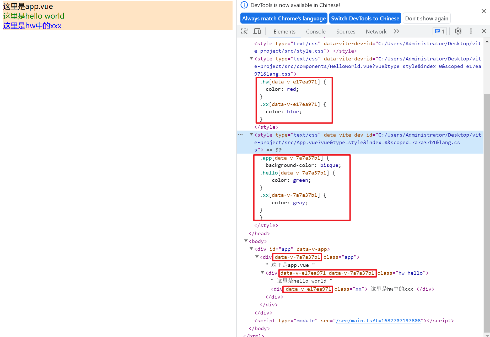
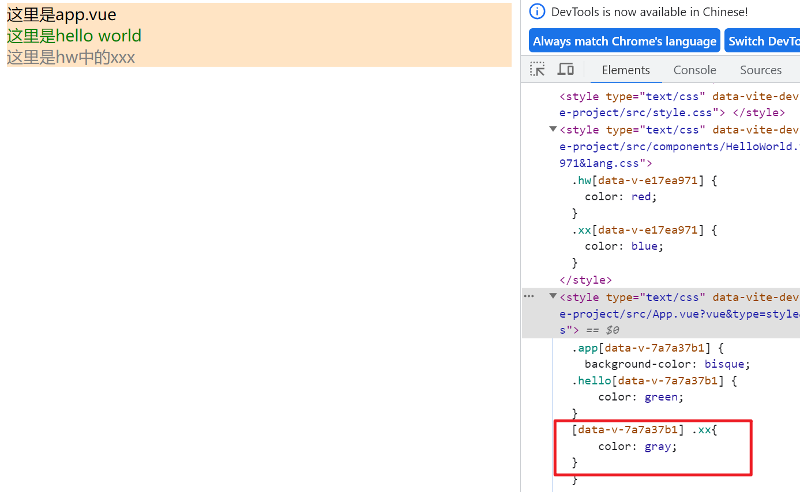

#### 深度选择器与scoped

先说说scoped, 该属性的作用是保证在style中定义的css只在当前组件中起效

原理是:  

1. 对于当前组件中的所有标签, 都添加上一个data-v-xxx的属性
2. 在\

// HelloWorld.vue
<template>

  这里是hello world
  

    这里是hw中的xxx
  

</template>

~~~

可以看到app.vue中的所有组件都被赋予了一个data-v-7a7a37b1这个属性, 同时在app.vue中\
~~~

#### 在js中使用scss中定义的全局变量

https://juejin.cn/post/7155377433951240229

https://blog.csdn.net/hp9999/article/details/126338799