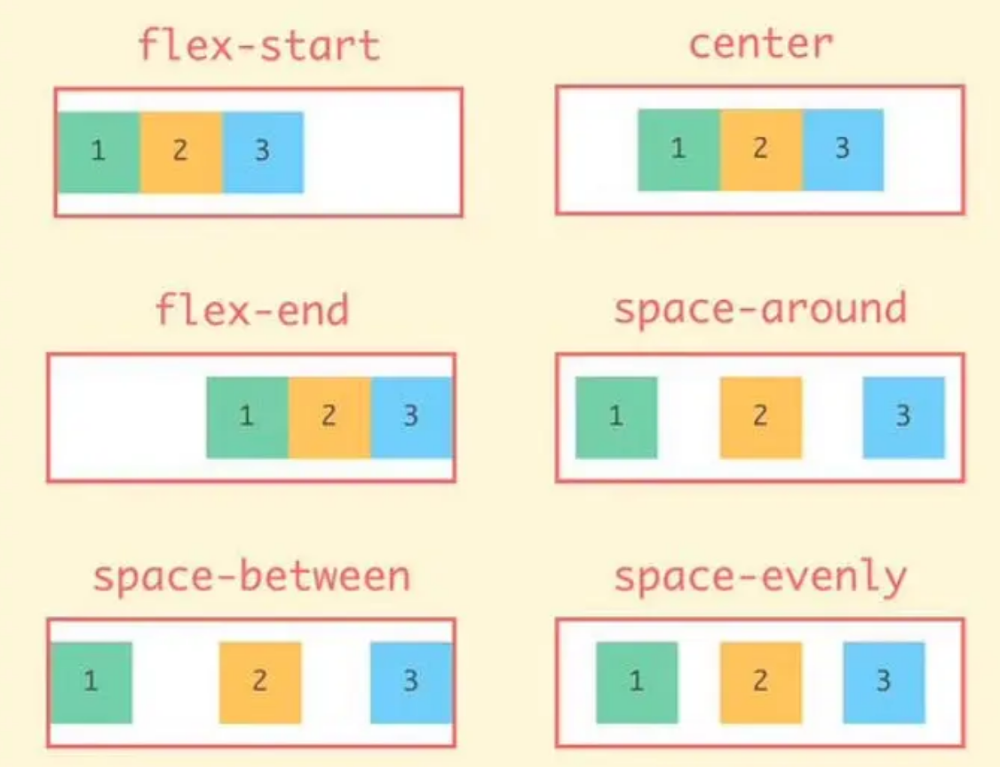
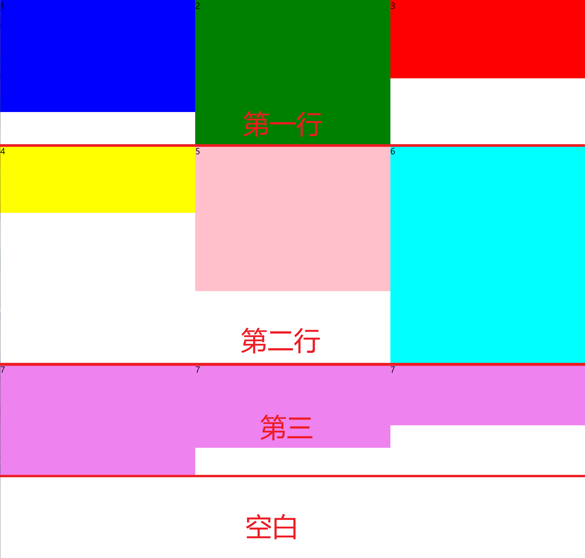
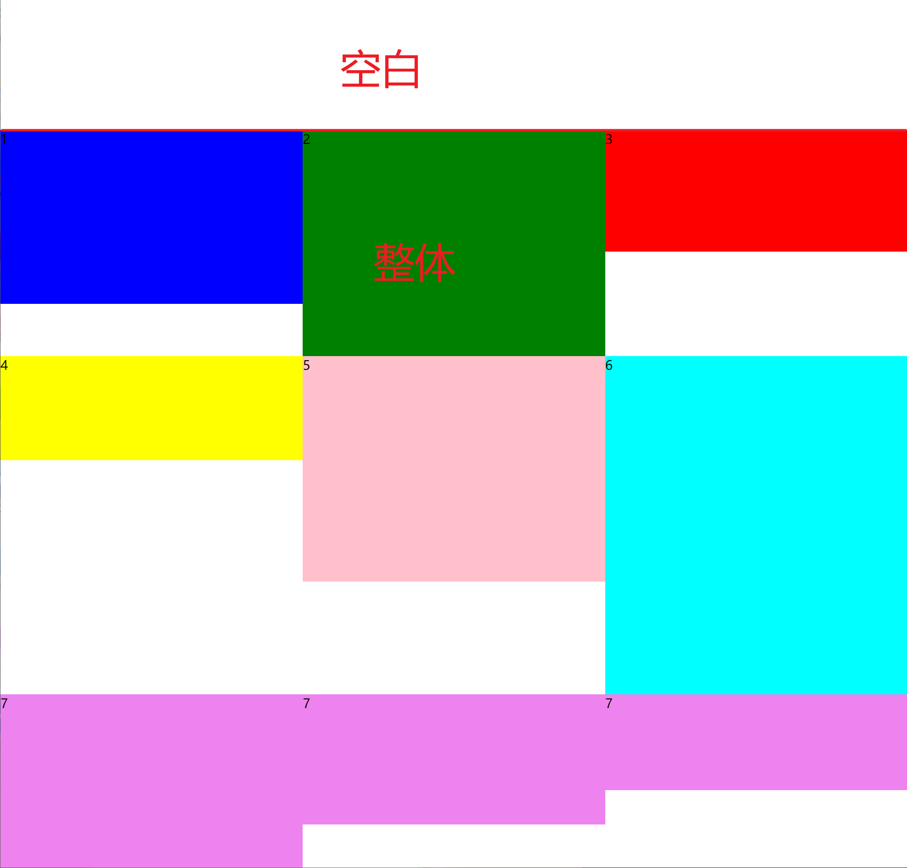
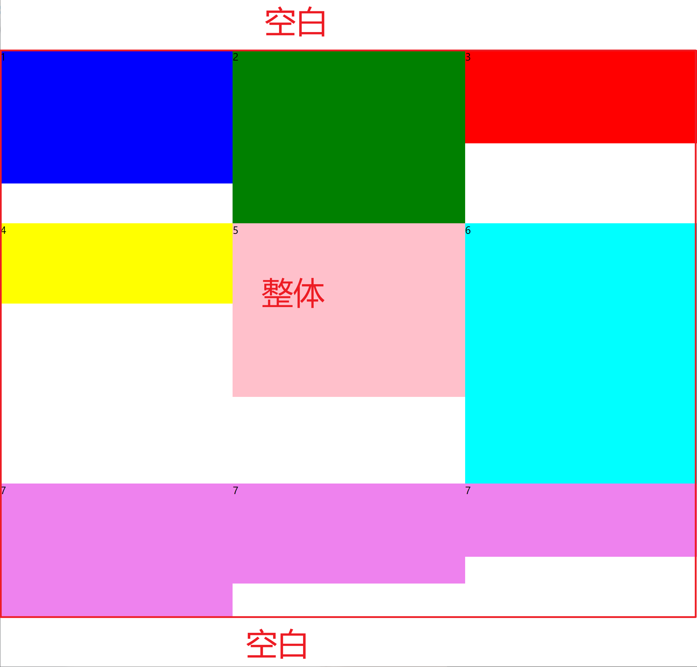
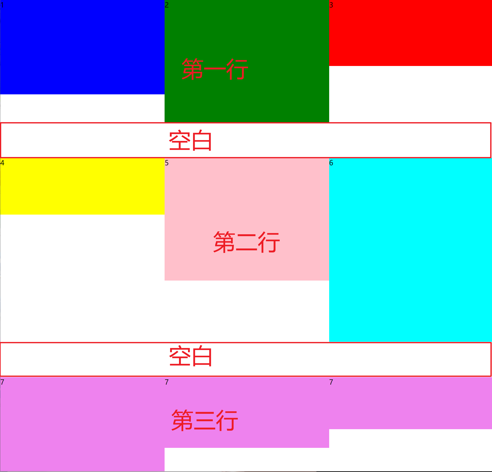
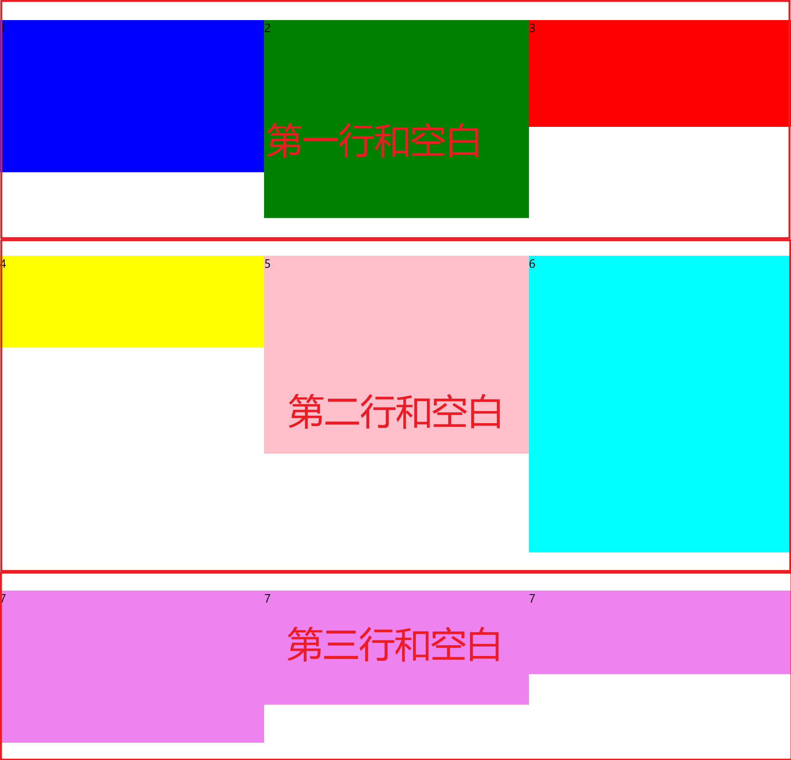

#### 关于flex的理解
当父元素设置为flex时, 子元素被从左到右排列
当设置了flex-wrap: wrap的时候, 并且子元素宽度大于父元素, 那么进行换行
形成多行, 每一行都有一个主轴, 当前行的高度是当前行最高的元素的高度

当设置flex-wrap: nowrap的时候, 子元素被压缩, 因为flex-grow默认为0, flex-shrink默认为1

当元素只有一行的时候, 可以通过align-items来控制元素在垂直方向上的对齐方式

当元素有多行的时候, 可以通过align-content来控制多行在垂直方向上的对齐方式

下面代码分别样式align-content去不同值的时候的样式

~~~html
<body>
    

      
1

      
2

      
3

      
4

      
5

      
6

      
7

      
7

      
7

    

  </body>
~~~

flex-start: 多行作为一个整体, 向上对齐

flex-start: 多行作为一个整体, 向下对齐

center: 多行作为一个整体居中

space-between: 空白平均分布在行之间

space-around: 空白平均分布在每一行的上下两边

