# 一、概述
网格布局（Grid）是最强大的 CSS 布局方案。

它将网页划分成一个个网格，可以任意组合不同的网格，做出各种各样的布局。以前，只能通过复杂的 CSS 框架达到的效果，现在浏览器内置了。


上图这样的布局，就是 Grid 布局的拿手好戏。

Grid 布局与 Flex 布局有一定的相似性，都可以指定容器内部多个项目的位置。但是，它们也存在重大区别。

Flex 布局是轴线布局，只能指定"项目"针对轴线的位置，可以看作是一维布局。Grid 布局则是将容器划分成"行"和"列"，产生单元格，然后指定"项目所在"的单元格，可以看作是二维布局。Grid 布局远比 Flex 布局强大。

# 二、基本概念
学习 Grid 布局之前，需要了解一些基本概念。

## 2.1 容器和项目

1. 采用grid布局的元素被称为"容器"(container). 容器的子元素被称为 项目(item)

   > 只有直接子元素才是item, Grid布局不对后代元素生效

2. 容器被网格线划分, 水平网格线划分出行，垂直网格线划分出列。正常情况下，n行有n + 1根水平网格线，m列有m + 1根垂直网格线，比如三行就有四根水平网格线。
3. 每个单元格被称为cell

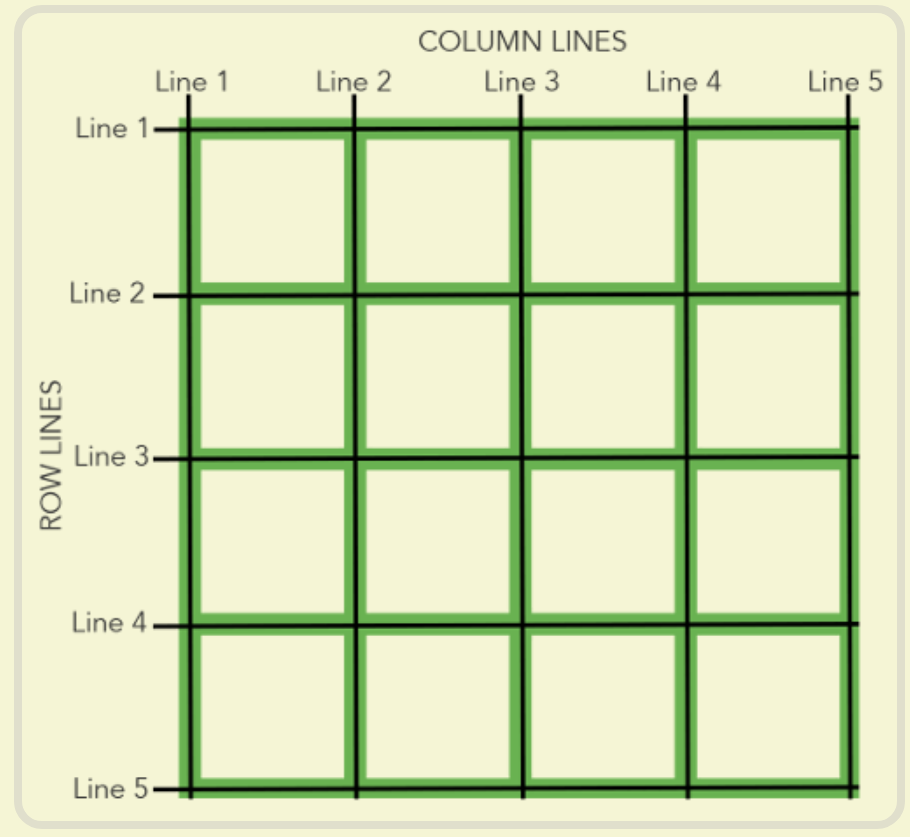


# 三、容器属性
Grid 布局的属性分成两类。一类定义在容器上面，称为容器属性；另一类定义在项目上面，称为项目属性。这部分先介绍容器属性。

## 3.1 display 属性

~~~css
div {
    /** 让div使用网格布局 */
    display: grid 
}
~~~

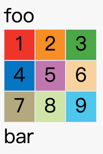

在默认情况下container是块级元素, 但是也可以设置为行内元素

~~~css
div {
    display: inline-grid
}
~~~

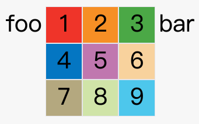

> 设为网格布局以后，容器子元素（项目）的`float`、`display: inline-block`、`display: table-cell`、`vertical-align`和`column-*`等设置都将失效。


## 3.2 grid-template-columns 属性，grid-template-rows 属性
`grid-template-columns`定义列和列的宽度，`grid-template-rows`属性定义行和行的高度

1. 下面代码指定了一个三行三列的网格，列宽和行高都是100px。

   ~~~css
   .container {
   	display: grid;
   	grid-template-columns: 100px 100px 100px;
   	grid-template-rows: 100px 100px 100px;
   }
   ~~~

2. 也可以使用百分比

   ~~~css
   .container {
     display: grid;
     grid-template-columns: 33.33% 33.33% 33.33%;
     grid-template-rows: 33.33% 33.33% 33.33%;
   }
   ~~~
   
3. 重复写同样的值非常麻烦，尤其网格很多时。这时，可以使用`repeat()`函数，简化重复的值。上面的代码用`repeat()`改写如下。
   
   ~~~css
      .container {
         	display: grid;
        	/* 重复3次, 每个网格高度为33.33% */
        	grid-template-columns: repeat(3, 33.33%);
        	grid-template-rows: repeat(3, 33.33%);
      }
   ~~~
   
   `repeat`也可以接受某种模式
   
   ~~~css
   /* 第123列分别为100, 20, 80px, 第456列也是100, 20, 80px */
   grid-template-columns: repeat(2, 100px 20px 80px);
   
   
   grid-template-columns: 30px repeat(auto-fill, 100px) 30px
   ~~~
   
4. `auto-fill` 关键字

   有时候父元素的大小是不确定的, 如果我们明确指出要`repeat(12, 100px)`, 父元素可能会不够大, 导致行溢出

   所以我们可以使用`auto-fill`关键字, 他表示尽可能多的重复, 但是不要溢出

   ~~~css
   .container {
   	display: grid;
       /* 每列宽度为100px, 列数尽可能多的占据父元素的宽度 */
   	grid-template-columns: repeat(auto-fill, 100px);
   }
   ~~~

   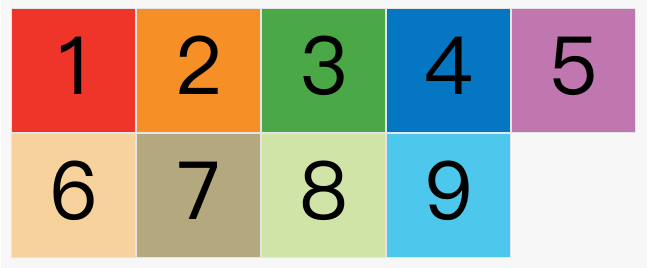

5. `auto-fit`关键字

   `auto-fit`与`auto-fill`类似, 都是尽可能多的行和列

   他们的差别在于, 如果你没有写死单元格的大小, 并且子元素不能填满一整行格子, 那么

   - `auto-fill`不会拉伸格子的大小, 而是尽可能复制多的列, 尽管这些列不会被使用
   - `auto-fit`会拉伸格子的大小, 使得这些格子填满父元素

   你可以通过如下代码,  然后缩放浏览器大小来查看他们的区别

   ~~~html
   <!DOCTYPE html>
   <html>
   <head>
       <style>
           .grid-container {
               display: grid;
           }
           .grid-container--fill {
               /* 单元格大小必须不固定, 才能提现auto-fill和auto-fit的区别 */
               grid-template-columns: repeat(auto-fill, minmax(100px, 1fr));
               background: #2b542c;
           }
           .grid-container--fit {
               grid-template-columns: repeat(auto-fit, minmax(100px, 1fr));
               background: #2b542c;
           }
           .grid-element {
               background-color: deepPink;
               padding: 20px;
               color: #fff;
               border: 1px solid #fff;
           }
           body {
               padding: 2em;
           }
           hr {
               margin: 80px;
           }
       </style>
   </head>
   <body>
   auto-fill
   <div class="grid-container grid-container--fill">
       <div class="grid-element"> 1 </div>
       <div class="grid-element"> 2 </div>
       <div class="grid-element"> 3 </div>
       <div class="grid-element"> 4 </div>
       <div class="grid-element"> 5 </div>
       <div class="grid-element"> 6 </div>
       <div class="grid-element"> 7 </div>
   </div>
   
   <hr>
   
   auto-fit
   <div class="grid-container grid-container--fit">
       <div class="grid-element"> 1 </div>
       <div class="grid-element"> 2 </div>
       <div class="grid-element"> 3 </div>
       <div class="grid-element"> 4 </div>
       <div class="grid-element"> 5 </div>
       <div class="grid-element"> 6 </div>
       <div class="grid-element"> 7 </div>
   </div>
   </body>
   </html>
   ~~~

   当浏览器界面太小的时候, 他们的显示效果都一样

   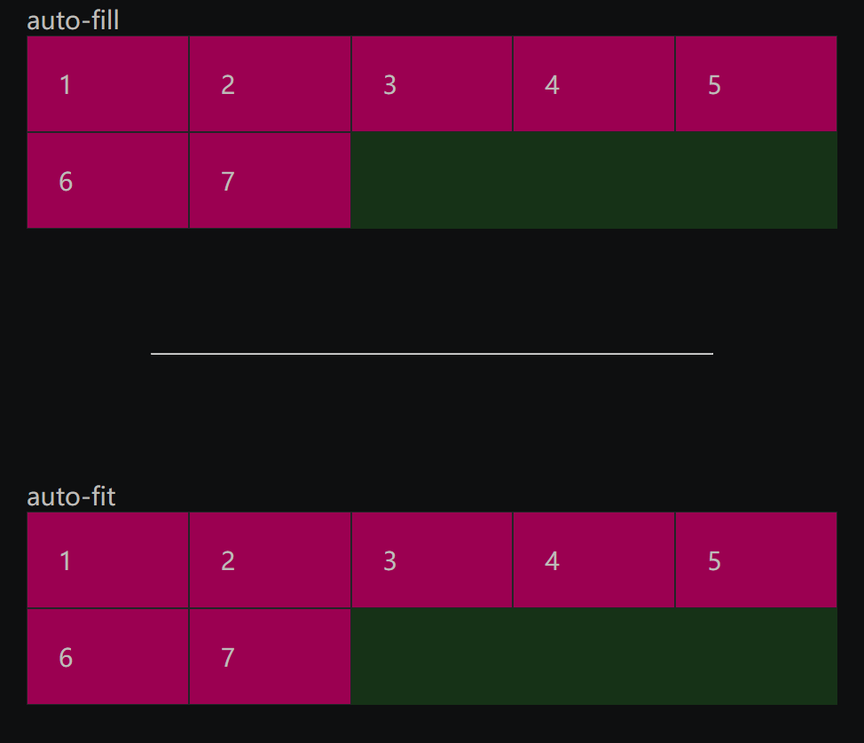

   当浏览器界面太大, 导致7个元素都不能填满容器的时候, auto-fill还是会创建列, 即使他们不会使用

   但是auto-fit会拉伸单元格的大小, 使这一行填满父元素

   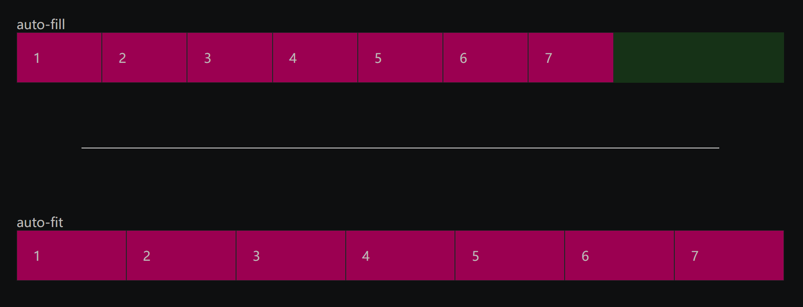

6. `fr `关键字

   ~~~css
   .container {
   	display: grid;
       /*定义两列, 两列均分父元素 */
   	grid-template-columns: 1fr 1fr;
   }
   
   .container {
   	display: grid;
       /* 定义3列, 第一列150px, 第二列和第一列相等, 第三列是第一列的两倍*/
   	grid-template-columns: 150px 1fr 2fr;
   }
   ~~~

7. `minmax()`

   minmax()表示一个长度范围, 左闭右闭, 根据父元素的宽度尽可能取最大值

   ~~~css
   .container {
   	display: grid;
       /* 定义3列, 第三列最小100px, 最大1fr */
       /* 在宽度大于300px的时候, 三列等框 */
       /* 如果宽度小于300px, 第三列100px, 第一二列平分剩余宽度 */
   	grid-template-columns: 1fr 1fr minmax(100px, 1fr);
   }
   ~~~

   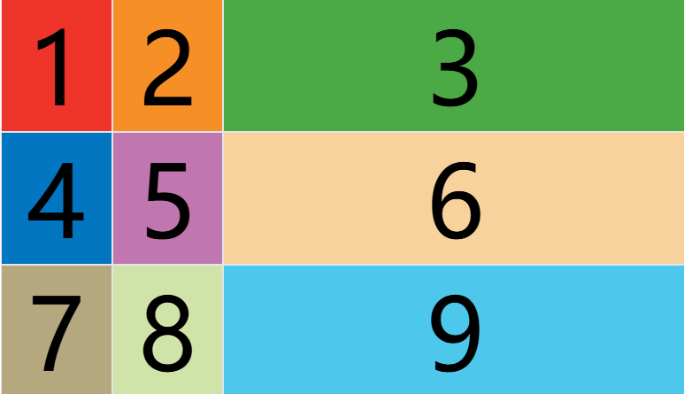

8. `min()`和`max()`

   min取两个值的最小值,  max取两个值的最大值

   ~~~css
   article {
     grid-template-columns: repeat(5, minmax(min(60px, 8vw), 1fr));
   }
   ~~~

9. `auto` 关键字

   auto关键字表示由浏览器自己决定长度。尽可能的大.

   ~~~css
   grid-template-columns: 100px auto 100px;
   
   grid-template-rows: auto 1fr; /* 第一行自动高度，第二行占据剩余空间 */  
   ~~~

   第二列的宽度，基本上等于父元素的宽度-200px，除非单元格内容设置了min-width。

10. 网格线的名称

   `grid-template-columns`属性和`grid-template-rows`属性里面，还可以使用方括号，指定每一根网格线的名字，方便以后的引用。

   ~~~css
   .container {
   	display: grid;
   	grid-template-columns: [c1] 100px [c2] 100px [c3] auto [c4];
   	grid-template-rows: [r1] 100px [r2] 100px [r3] auto [r4];
   }
   ~~~

   上面代码指定网格布局为3行 x 3列，因此有4根垂直网格线和4根水平网格线。方括号里面依次是这八根线的名字。

   **网格布局允许同一根线有多个名字**，比如[fifth-line row-5]。


## 3.3 grid-row-gap 属性，grid-column-gap 属性，grid-gap 属性
`grid-row-gap`，`grid-column-gap`分别用于设置行列间距

~~~css
.container {
  grid-row-gap: 20px;
  grid-column-gap: 20px;
}
~~~

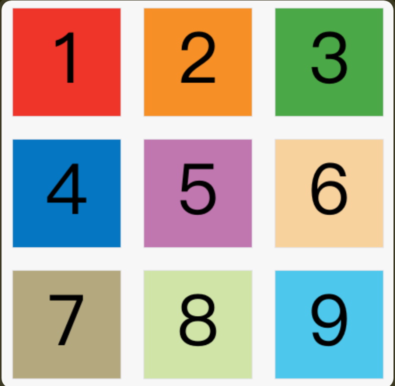

`grid-gap`和`gap`是`grid-column-gap`和`grid-row-gap`的合并简写形式，语法如下。

~~~css
grid-gap: 100px 200px; /*行高100, 列宽200 */

grid-gap: 200px; /*行高列宽都是200 */

gap: 100px 200px; /*行高100, 列宽200 */
~~~


## 3.4 grid-template-areas 属性
网格布局允许指定"区域"（area），一个区域由单个或多个单元格组成。`grid-template-areas`属性用于定义区域。

~~~css
.container {
	display: grid;
	grid-template-columns: 100px 100px 100px;
	grid-template-rows: 100px 100px 100px;
    /* 九个格子分别名为abcd... */
	grid-template-areas:  'a b c'
						'd e f'
						'g h i';
}
~~~

当然你也可以将多个格子合并为一个区域

~~~css
/* 九个格子分为header main sidebar footer */
grid-template-areas: "header header header"
                     "main main sidebar"
                     "footer footer footer";
~~~

如果某些区域你不想命名，则使用"点"（.）表示。

~~~css
grid-template-areas:  'a . c'
					'd . f'
					'g . i';
~~~

> 注意，区域的命名会影响到网格线。每个区域的起始网格线，会自动命名为区域名-start，终止网格线自动命名为区域名-end。
>
> 比如，区域名为header，则起始位置的水平网格线和垂直网格线叫做header-start，终止位置的水平网格线和垂直网格线叫做header-end。


## 3.5 grid-auto-flow 属性

默认情况下, 子元素从左到右, 从上到下被放到格子中, 你也可以通过`grid-auto-flow`来控制这个放置的顺序

- row:  默认值, 从左到右, 从上到下
- row dense: 与row类似, 但是如果有空白的时候会尽量填满
- column: 从上到下, 从左到右
- column dense: 与colomn类似, 但是有空白的格子的时候会尽量的填满


下面的例子让1号项目和2号项目各占据两个单元格，然后在默认的`grid-auto-flow: row`情况下，会产生下面这样的布局。

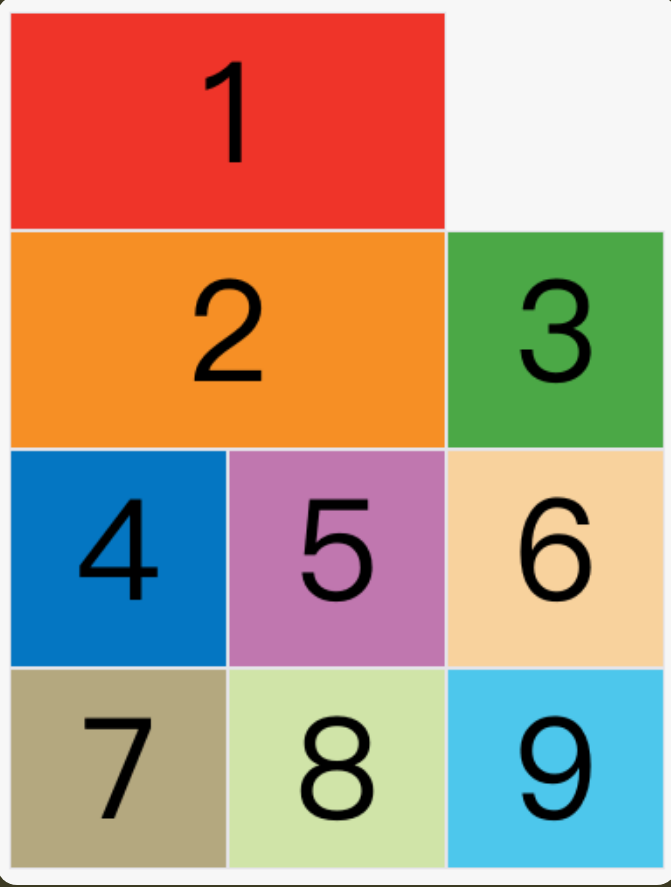

上图中，1号项目后面的位置是空的，这是因为3号项目默认跟着2号项目，所以会排在2号项目后面。

现在修改设置，设为`row dense`，表示"先行后列"，并且尽可能紧密填满，尽量不出现空格。

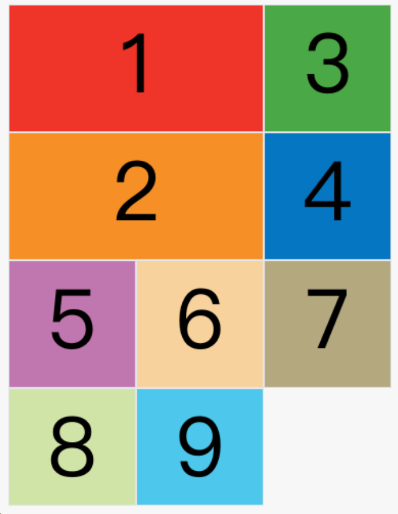

上图会先填满第一行，再填满第二行，所以3号项目就会紧跟在1号项目的后面。8号项目和9号项目就会排到第四行。

如果将设置改为column dense，表示"先列后行"，并且尽量填满空格。

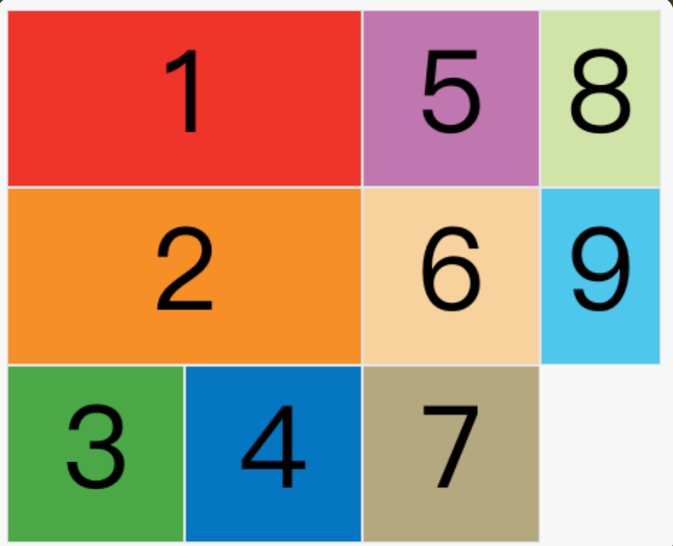

上图会先填满第一列，再填满第2列，所以3号项目在第一列，4号项目在第二列。8号项目和9号项目被挤到了第四列。


## 3.6 justify-items 属性，align-items 属性，place-items 属性

当格子中的元素占不满整个格子的时候, 可以使用`justify-items`和`align-items`来设置内容相较于格子的对齐方式

~~~css
.container {
  justify-items: start(向左) | end(向右) | center(居中) | stretch(拉伸以占满整个格子, 默认);
  align-items: start(向上) | end(向下) | center(居中) | stretch(拉伸以占满整个格子, 默认);
}
~~~

一下代码的效果为
~~~css
.container {
  justify-items: start;
}
~~~

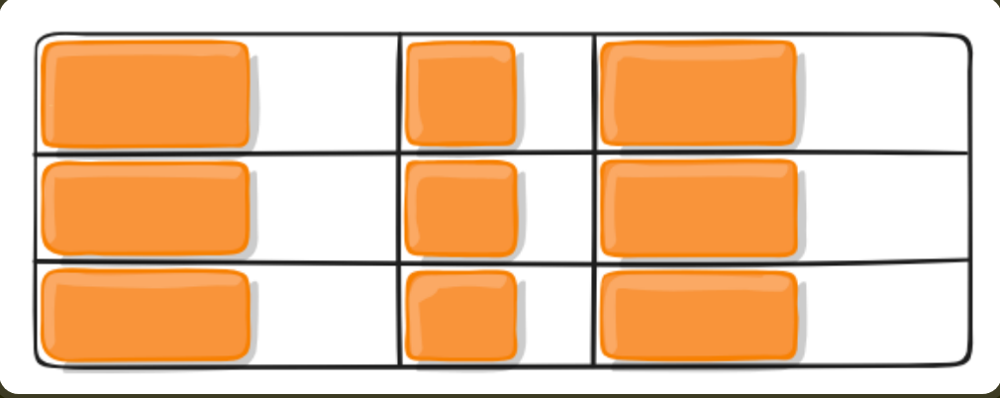

一下代码的效果为

~~~css
.container {
  align-items: start;
}
~~~

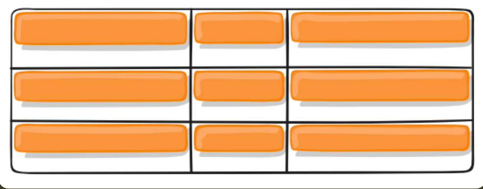

`place-items`属性是`align-items`属性和`justify-items`属性的合并简写形式。

```css
/* 如果省略第二个值，则浏览器认为与第一个值相等。*/
place-items: <align-items> <justify-items>;
```


## 3.7 justify-content 属性， align-content 属性， place-content 属性

当整个网格布局占不满他的父元素的时候, `justify-content`和`align-content`用来控制整个网格布局相对其父元素的对齐方式

他们的取值分别是:

~~~css
.container {
  justify-content:  | end |  |  |  |  | ;
  align-content: start | end | center | stretch | space-around | space-between | space-evenly;  
}
~~~

`jusify-content`的效果如下

| 取值          | 说明                                         | 效果                                                         |
| ------------- | -------------------------------------------- | ------------------------------------------------------------ |
| start         | 向左对齐                                     | 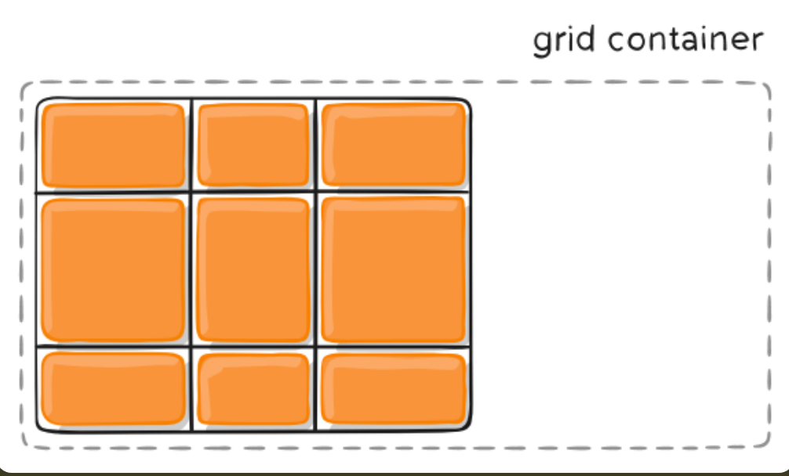 |
| end           | 向右对齐                                     | 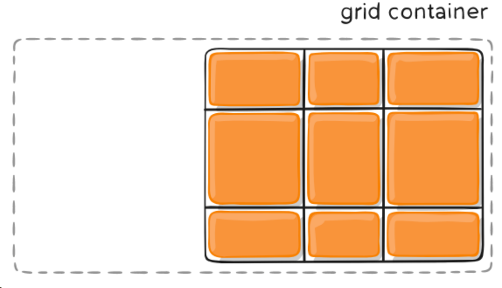 |
| center        | 居中对齐                                     |  |
| stretch       | 默认, 项目没有指定大小时拉伸以占据整个父元素 | 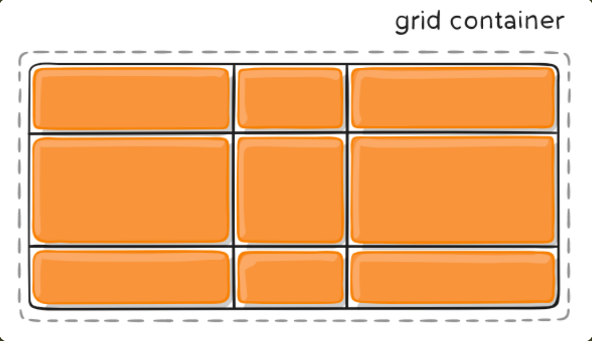 |
| space-around  | 空白环绕在每列周围, 中间的空白为2倍          | 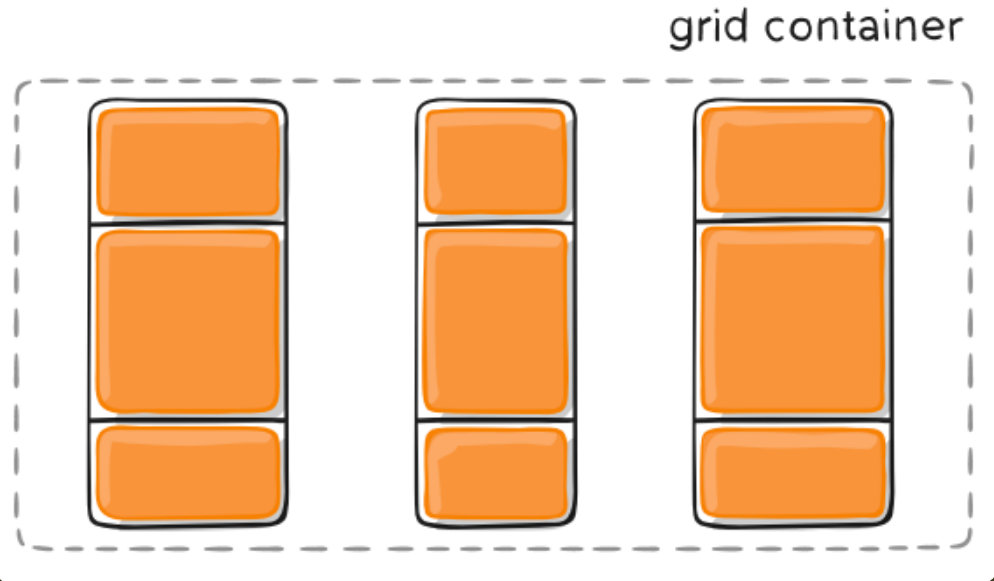 |
| space-between | 空白在每列间                                 | 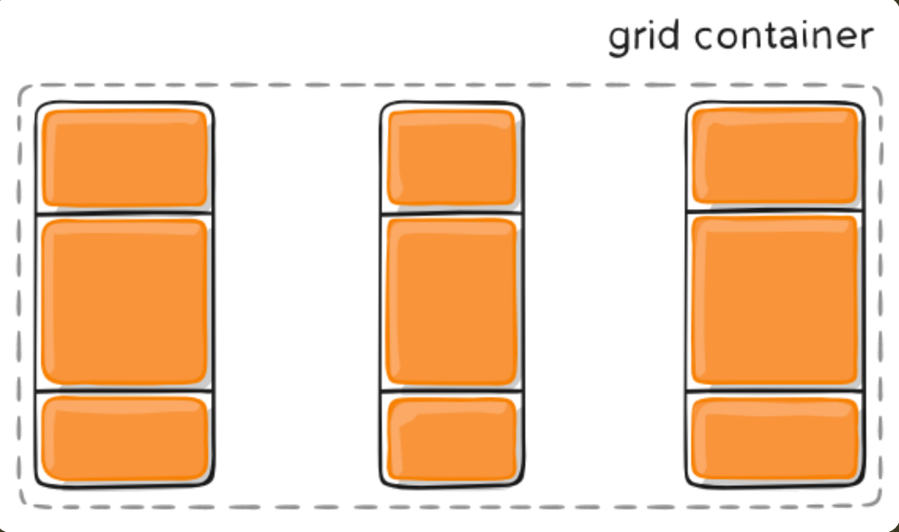 |
| space-evenly  | 空白环绕在每列之间, 并且空白宽度相等         | 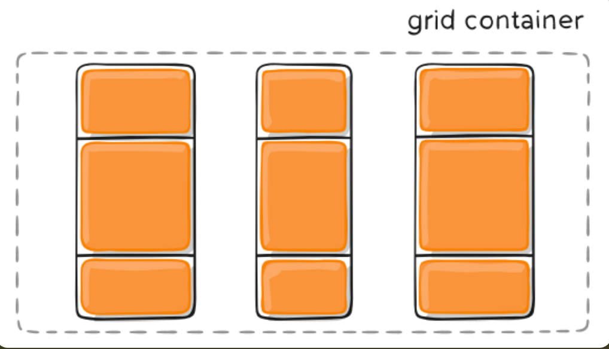 |

`place-content`属性是`align-content`属性和`justify-content`属性的合并简写形式。

~~~css
/*如果省略第二个值，浏览器就会假定第二个值等于第一个值。*/
place-content: <align-content> <justify-content>
~~~


## 3.8 grid-auto-columns 属性，grid-auto-rows 属性
有时候，一些项目的指定位置，在现有网格的外部。比如网格只有3列，但是某一个项目指定在第5行。这时，浏览器会自动生成多余的网格，以便放置项目。

`grid-auto-columns`属性和`grid-auto-rows`属性用来设置，浏览器自动创建的多余网格的列宽和行高。它们的写法与`grid-template-columns`和`grid-template-rows`完全相同。

**如果不指定这两个属性，浏览器完全根据单元格内容的大小，决定新增网格的列宽和行高。**


下面的例子里面，划分好的网格是3行 x 3列，但是，8号项目指定在第4行，9号项目指定在第5行。

~~~css
.container {
  display: grid;
  grid-template-columns: 100px 100px 100px;
  grid-template-rows: 100px 100px 100px;
  grid-auto-rows: 50px; 
}
~~~

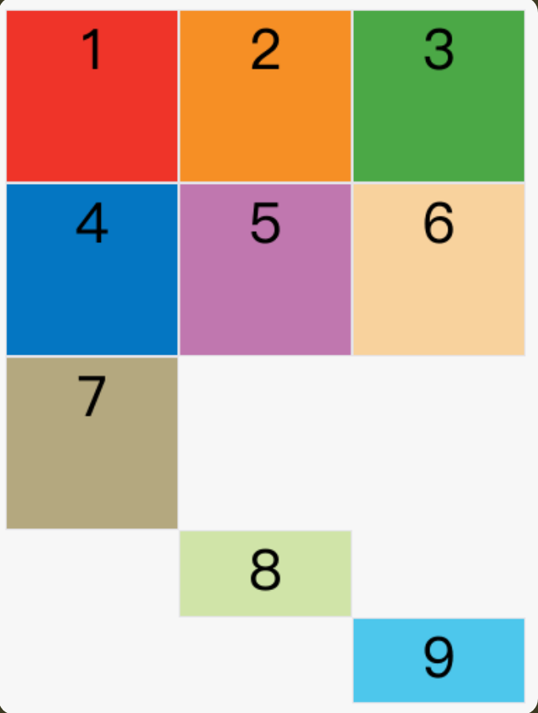


## 3.9 grid-template 属性，grid 属性
`grid-template`属性是`grid-template-columns`、`grid-template-rows`和`grid-template-areas`这三个属性的合并简写形式。

`grid`属性是`grid-template-rows`、`grid-template-columns`、`grid-template-areas`、 `grid-auto-rows`、`grid-auto-columns`、`grid-auto-flow`这六个属性的合并简写形式。

从易读易写的角度考虑，还是建议不要合并属性，所以这里就不详细介绍这两个属性了。


# 四、项目属性
下面这些属性定义在项目上面。

## 4.1 grid-column-start，grid-column-end，grid-row-start，grid-row-end

项目的位置是可以指定的，具体方法就是指定项目的四个边框，分别定位在哪根网格线。

- `grid-column-start`属性：左边框所在的垂直网格线
- `grid-column-end`属性：右边框所在的垂直网格线
- `grid-row-start`属性：上边框所在的水平网格线
- `grid-row-end`属性：下边框所在的水平网格线


1. 下面代码指定，1号项目的左边框是第二根垂直网格线，右边框是第四根垂直网格线。

   ~~~css
   .item-1 {
   	grid-column-start: 2;
   	grid-column-end: 4;
   }
   ~~~

   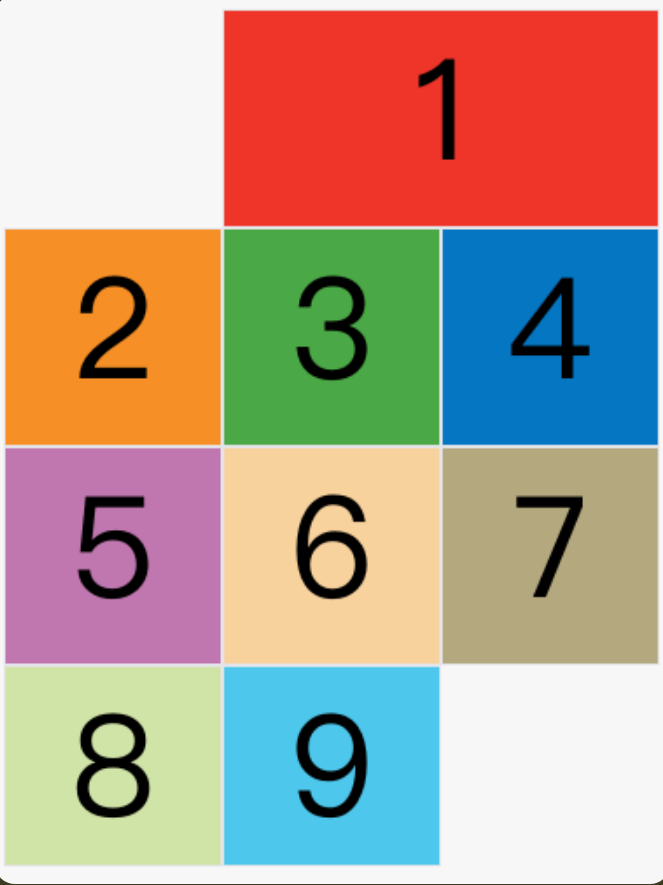

   > 上图中，只指定了1号项目的左右边框，没有指定上下边框，所以会采用默认位置，即上边框是第一根水平网格线，下边框是第二根水平网格线。
   >
   > 除了1号项目以外，其他项目都没有指定位置，由浏览器自动布局，这时它们的位置由容器的grid-auto-flow属性决定，这个属性的默认值是row，因此会"先行后列"进行排列。读者可以把这个属性的值分别改成column、row dense和column dense，看看其他项目的位置发生了怎样的变化。

2. 下面的例子是指定四个边框位置的效果。

   ~~~css
   .item-1 {
   	grid-column-start: 1;
   	grid-column-end: 3;
       grid-row-start: 2;
   	grid-row-end: 4;
   }
   ~~~

   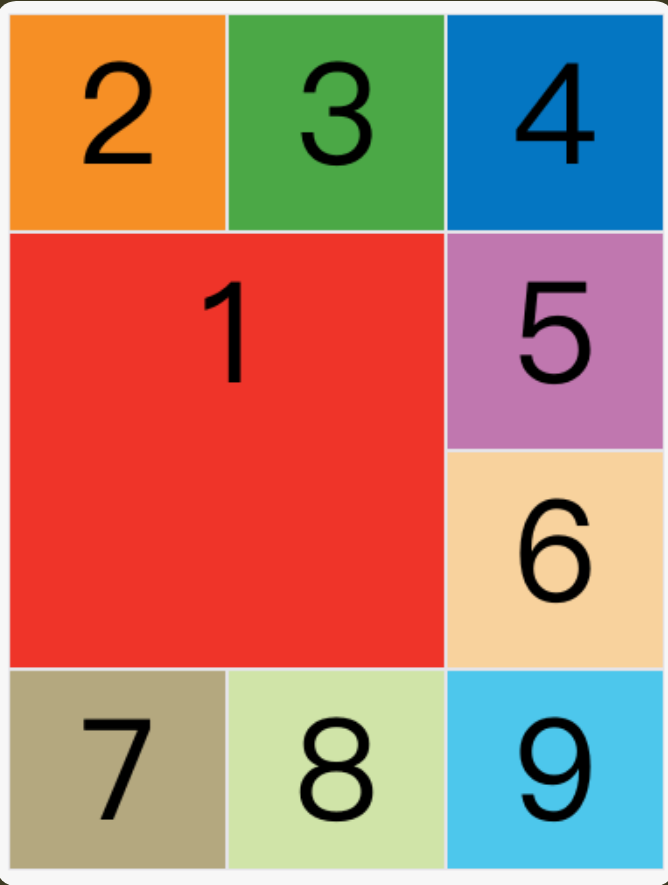

3. 当然也可以指定为负数, 最后一根线为-1

   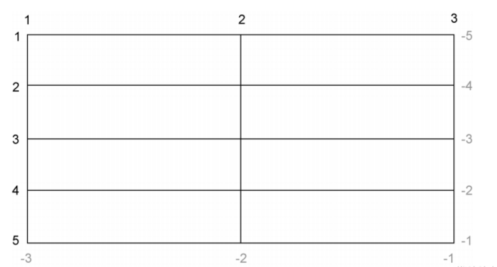

   
   
4. 上面说到, 可以给单元格设置所属的area, 设置之后, 就会对这些单元格进行命名, 格式为`AreasName-start/end`

   这四个属性的值，除了指定为第几个网格线，还可以指定为网格线的名字。

   ~~~css
   .item-1 {
   	grid-column-start: header-start;
   	grid-column-end: header-end;
   }
   ~~~

5. 这四个属性的值还可以使用span关键字，表示"跨越"，即左右边框（上下边框）之间跨越多少个网格。

   `span`这个关键字一般用在结束线上面

   ~~~css
   .item-1 {
       /* 跨越2列 */
   	grid-column-end: span 2;
   }
   ~~~

   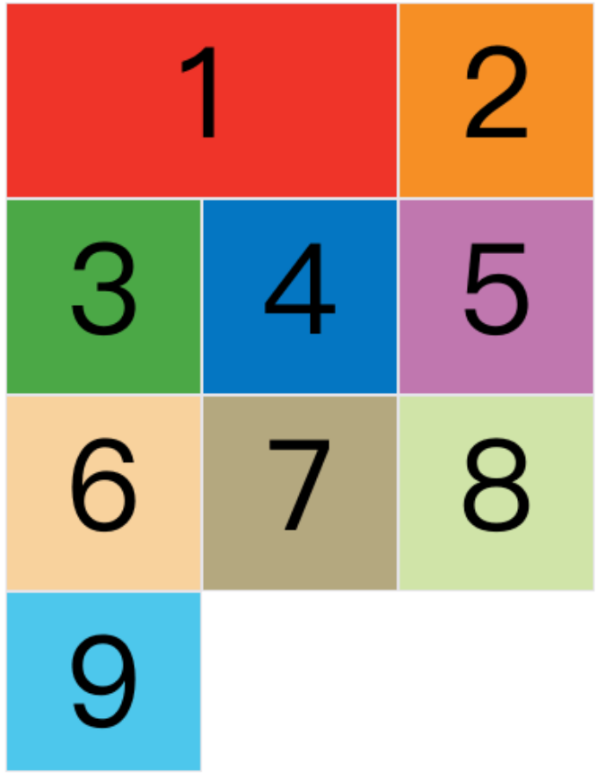

   

6. 使用这四个属性，如果产生了项目的重叠，则使用`z-index`属性指定项目的重叠顺序。


## 4.2 grid-column 属性，grid-row 属性
`grid-column`属性是`grid-column-start`和`grid-column-end`的合并简写形式

`grid-row`属性是`grid-row-start`属性和`grid-row-end`的合并简写形式。

~~~css
.item {
	grid-column: <start-line> / <end-line>;
	grid-row: <start-line> / <end-line>;
}
~~~

下面是一个例子。

~~~css
.item-1 {
	grid-column: 1 / 3;
	grid-row: 1 / 2;
}
/* 等同于 */
.item-1 {
	grid-column-start: 1;
	grid-column-end: 3;
	grid-row-start: 1;
	grid-row-end: 2;
}
/* 等同于 */
.item-1 {
	background: #b03532;
	grid-column: 1 / span 2;
	grid-row: 1 / span 2;
}
~~~


`grid-column`和`grid-row`也可以只给出一个值

~~~css
.item-1 {
    /* 表示元素从开始位置横跨2列 */
	grid-column: span 2;
}

.item-2 {
    /* 表示元素从第二根竖的网格线开始*/
    grid-column: 2
}
~~~

## 4.3 grid-area 属性
`grid-area`指定项目放在哪一个区域。

~~~css
item-1 {
	grid-area: e;
}
~~~

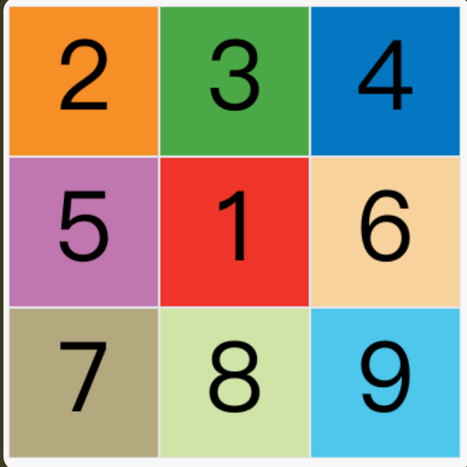

`grid-area`属性还可用作`grid-row-start`、`grid-column-start`、`grid-row-end`、`grid-column-end`的合并简写形式，直接指定项目的位置。

~~~css
.item {
	grid-area: <row-start> / <column-start> / <row-end> / <column-end>;
}
~~~

下面是一个例子。

~~~css
.item-1 {
	grid-area: 1 / 1 / 3 / 3;
}
~~~


## 4.4 justify-self 属性，align-self 属性，place-self 属性
`justify-self`和`align-self`属性做作用与`justify-item`和`align-item`的作用一样, 都是控制单元格中内容在格子内的对齐方式，区别在于他们只能作用域单个单元格。

~~~css
.item {
	justify-self: start | end | center | stretch;
	align-self: start | end | center | stretch;
}
~~~

这两个属性都可以取下面四个值。

- start：对齐单元格的起始边缘。

- end：对齐单元格的结束边缘。

- center：单元格内部居中。

- stretch：如果内容没有设置宽高, 那么就拉伸以占满单元格的整个宽度（默认值）。

  

下面是justify-self: start的例子。

~~~css
.item-1  {
	justify-self: start;
}
~~~

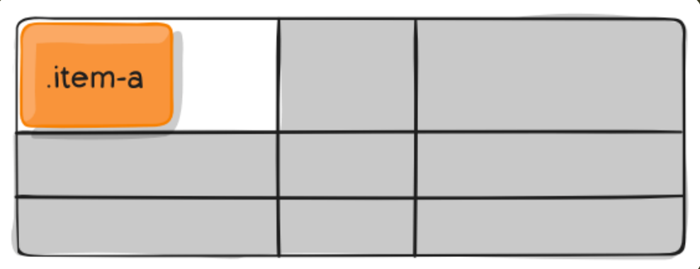

`place-self`属性是`align-self`属性和`justify-self`属性的合并简写形式。

~~~css
/*如果省略第二个值，place-self属性会认为这两个值相等。*/
place-self: <align-self> <justify-self>;
~~~


# 其他

## auto-fill的坑

在默认情况下, 如果使用`grid-template-columns:repeat(auto-fill, 100px)`, 那么grid会根据父元素的大小尽可能的生成出更多的列, 如果父元素的大小发生改变(比如拖动浏览器大小),  那么生成的列的数量也会发生改变


但是在使用`grid-template-rows:repeat(auto-fill, 100px)`的时候,  如果父元素的高度是固定的, 那么他会正常的运转, 即尽可能的生成更多的行, 来填满父元素的高度

但是在父元素的高度不是固定的时候, 他就等效于`grid-template-rows:repeat(1, 100px)`, 即他只会生成一行, 而不是尽可能多的生成行

~~~html
<!DOCTYPE html>
<html lang="zh">
<head>
    <style>

        /* Grid 容器 */
        .grid-container {
            display: grid;
            
            grid-template-columns: repeat(3, 1fr); /* 三列布局 */
            /*height: 1500px;*/
            /* 因为父元素的高度不固定, 退化为 30px repeat(1, 200px) 30px */
            grid-template-rows: 30px repeat(auto-fill, 200px) 30px;
            gap: 10px;
            grid-auto-rows: 100px;
            
            background: red;
        }
        /* 中间内容样式 */
        .item {
            background-color: #4CAF50;
            color: white;
            display: flex;
            font-size: 20px;
            border-radius: 5px;
            height: 100%; /* 确保元素撑满行高 */
        }
    </style>
</head>
<body>
<div class="grid-container">
    <div class="item">1</div>
    <div class="item">2</div>
    <div class="item">3</div>
    <div class="item">4</div>
    <div class="item">5</div>
    <div class="item">6</div>
    <div class="item">7</div>
    <div class="item">8</div>
    <div class="item">9</div>
    <div class="item">10</div>
    <div class="item">11</div>
    <div class="item">12</div>
    <div class="item">13</div>
    <div class="item">14</div>
</div>
</body>
</html>
~~~

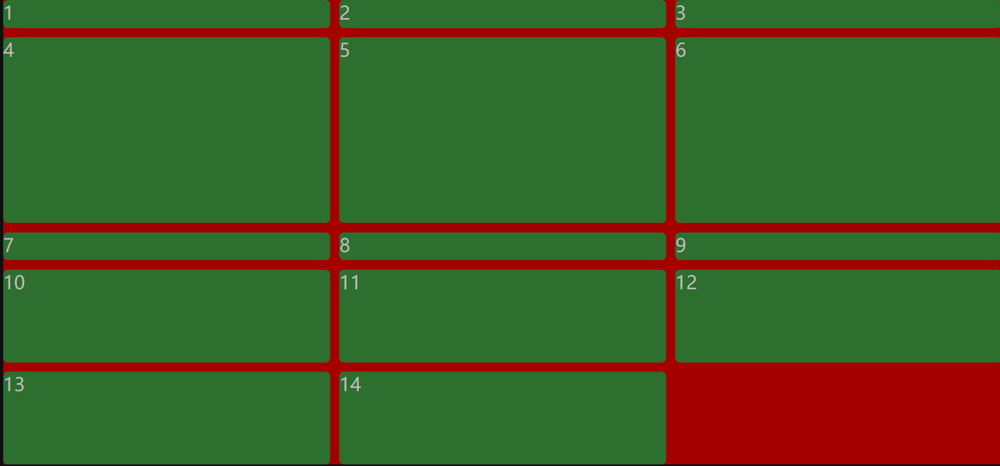

可以看到, 真正由`grid-template-columns`控制的行高是第123行,  `grid-template-rows: 30px repeat(auto-fill, 200px) 30px;`退化为了`grid-template-rows: 30px repeat(1, 200px) 30px;`

第45行的高度其实是由`grid-auto-rows`属性来控制的


**所以如果你想要设置一个行数不固定, 随子元素增加而增加的的网格布局, 那么就不要设置`grid-template-rows`, 而是应该通过`grid-auto-rows`来控制行高**


## 复杂的网格

要想实现复杂的网格, 同时又要控制不同的高度, 那么我们可以嵌套的使用grid布局来实现

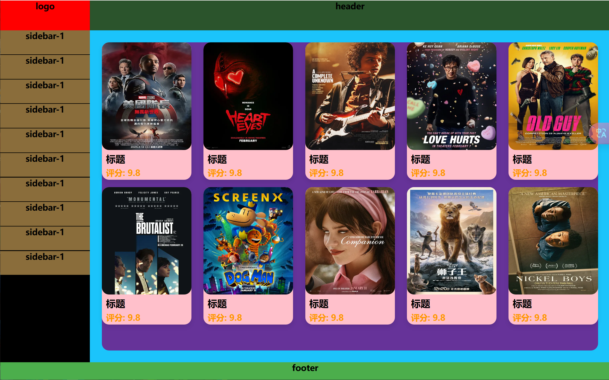

~~~html
<!DOCTYPE html>
<html lang="zh">
<head>
    <meta charset="UTF-8"/>
    <meta http-equiv="X-UA-Compatible" content="IE=edge"/>
    <meta name="viewport" content="width=device-width, initial-scale=1.0"/>
    <style>
        /* 重置所有元素和body的margin, padding */
        *,body {
            margin: 0;
            padding: 0;
        }

        .logo, .header, .sidebar, .footer {
            font-size: 14px;
            text-align: center;
            font-weight: bold;
            color: black;
        }


        .parent {
            display: grid;
            /* 定义两列, 第一列最小150px或者12%窗口大小,  第二轮占用剩余宽度 */
            grid-template-columns: max(150px, 12%) 1fr;
            /* 定义三行, 第一行50px, 第二行最小100p, 或者剩余宽度, 第三行30px */
            grid-template-rows: 50px minmax(200px, 1fr) 30px;
            background: #1bc4fb;

            /* 容器由网格内容撑开, 但是最小也是100vh */
            min-height: 100vh;
        }
        /* logo在第1个格子 */
        .logo {
            grid-area: 1 / 1 / 2 / 2;
            background: red;
        }

        /* header在第一行, 从第二个格子开始到最后 */
        .header {
            grid-area: 1 / 2 / 2 / -1;
            background: #2b542c;
        }
        /* footer在最后一行 */
        .footer {
            grid-area: -2 / 1 / -1 / -1;
            background: #4cae4c;
        }
        /* sidebar在第一列, 从第二个格子开始到倒数第二个格子 */
        .sidebar {
            grid-area: 2 / 1 / -2 / 2;
            background: black;

            display: grid;
            grid-template-columns: 1fr;
            grid-auto-rows: 40px;
            row-gap: 1px;
        }
        .sidebar-item {
            background: #8a6d3b;

        }

        .main {
            /* main从第二行第二列开始, 到倒数第二行最后一列 */
            grid-area: 2 / 2 / -2 / -1;
            background: rebeccapurple;
            margin: 20px;

            display: grid;
            gap: 12px;
            grid-template-columns: repeat(auto-fill, 150px);
            grid-auto-rows: 230px;
            justify-content: space-between;
            align-content: start;
            border-radius: 12px;
        }
        .item {
            background: pink;
            border-radius: 12px;
            box-shadow: 0 4px 8px rgba(0, 0, 0, 0.1);
            transition: transform 0.3s;
        }
        .item:hover {
            /* 鼠标放在item上的时候, 向上浮动5px */
            transform: translateY(-5px);
        }

        .item > img {
            /* 消除图片下面的一点空白 */
            vertical-align: top;
            height: 180px;
            width: 100%;
            /* 图片圆角 */
            border-radius: 12px;
        }
        .info {
            /* 文字向左对齐 */
            text-align: start;
            padding-left: 3px;
        }

        .info h3 {
            font-size: 16px;
            margin: 4px;
        }

        .info p {
            /* 文字大小 */
            font-size: 14px;
            color: #ff9800;
            /* 文字加粗 */
            font-weight: bold;
            margin: 4px ;
        }

    </style>
</head>
<body>

<div class="parent">
    <div class="logo">
        logo
    </div>
    <div class="header">
        header
    </div>
    <div class="sidebar">
        <div class="sidebar-item">sidebar-1</div>
        <div class="sidebar-item">sidebar-1</div>
        <div class="sidebar-item">sidebar-1</div>
        <div class="sidebar-item">sidebar-1</div>
        <div class="sidebar-item">sidebar-1</div>
        <div class="sidebar-item">sidebar-1</div>
        <div class="sidebar-item">sidebar-1</div>
        <div class="sidebar-item">sidebar-1</div>
        <div class="sidebar-item">sidebar-1</div>
        <div class="sidebar-item">sidebar-1</div>

    </div>
    <div class="main">
        <div class="item">
            
            <div class="info">
                <h3>标题</h3>
                <p>评分: <span>9.8</span></p>
            </div>
        </div>
        <div class="item">
            
            <div class="info">
                <h3>标题</h3>
                <p>评分: <span>9.8</span></p>
            </div>
        </div>
        <div class="item">
            
            <div class="info">
                <h3>标题</h3>
                <p>评分: <span>9.8</span></p>
            </div>
        </div>
        <div class="item">
            
            <div class="info">
                <h3>标题</h3>
                <p>评分: <span>9.8</span></p>
            </div>
        </div>
        <div class="item">
            
            <div class="info">
                <h3>标题</h3>
                <p>评分: <span>9.8</span></p>
            </div>
        </div>
        <div class="item">
            
            <div class="info">
                <h3>标题</h3>
                <p>评分: <span>9.8</span></p>
            </div>
        </div>
        <div class="item">
            
            <div class="info">
                <h3>标题</h3>
                <p>评分: <span>9.8</span></p>
            </div>
        </div>
        <div class="item">
            
            <div class="info">
                <h3>标题</h3>
                <p>评分: <span>9.8</span></p>
            </div>
        </div>
        <div class="item">
            
            <div class="info">
                <h3>标题</h3>
                <p>评分: <span>9.8</span></p>
            </div>
        </div>
        <div class="item">
            
            <div class="info">
                <h3>标题</h3>
                <p>评分: <span>9.8</span></p>
            </div>
        </div>
    </div>
    <div class="footer">
        footer
    </div>
</div>
</body>
</html>
~~~


## 一个自适应大小的网格布局


## 自动生成grid布局

https://cssgrid-generator.netlify.app/