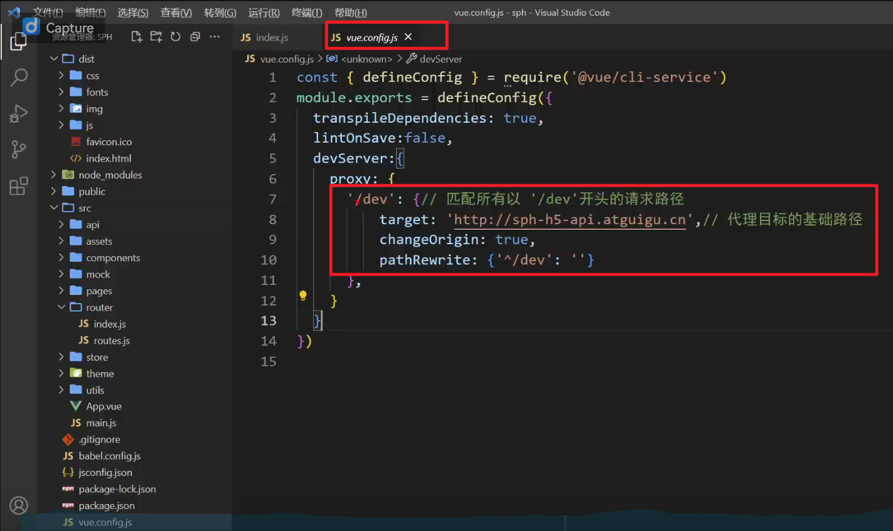
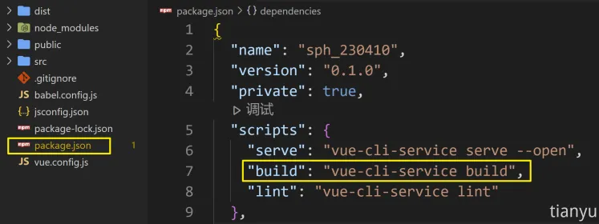

# 前端项目上线

https://www.yuque.com/tianyu-coder/openshare/shka6xog7fbezhad

https://www.bilibili.com/video/BV19n4y1d7Gr/?spm_id_from=333.1387.search.video_card.click&vd_source=f79519d2285c777c4e2b2513f5ef101a

## 1. 项目分析

1. 一般我们在开发的时候, 都会通过脚手架来启动一个服务器, 方便开发的时候查看网页

   同时为了解决跨域问题, 我们也会让脚手架启动的服务器作为一个代理服务器

   我们通过axios请求脚手架`/dev/xxx`, 脚手架检测到对应的请求后, 转发我们的请求到后端服务器, 这样就解决了跨域的问题, 而不需要后端配置

   

   所以在项目上线的时候,  我们也要配置前端的服务器来转发对应的后端的请求, 到后端服务器

   

2. 一般项目上线的时候, 我们对路由通常采用history模式, 而不是hash模式, 因为url美观, 但是这也会产生一个问题, 就是刷新时，**会将前端路由携带给后端，而后端没有对应资源的匹配，就出现了 404 问题。**

   **为了解决这个问题, 我们应该配置我们的前端服务器, 当接受到无法匹配的Get请求之后, 就返回index页面, 浏览器接受到index页面之后, 路由可以根据路径自动路由到对应的页面**

## 2. 本地服务器部署 

### 2.1 部署

1. 准备一个本地的服务器

   服务器可以用：Java、Php、Go、Node.js 等语言编写

   本教程采用是Node.js编写服务器，端口号为：8088，且已经配置了public文件夹为静态资源。

   ~~~js
   // 引入express
   const express = require('express')
   // 配置端口号
   const PORT = 8088
   
   // 创建一个app服务实例
   const app = express()
   
   // 配置public目录存放静态资源
   app.use(express.static(__dirname + '/public'))
   
   // 绑定端口监听
   app.listen(PORT, () => {
   	console.log(`本地服务器启动成功，http://localhost:${PORT}`)
   })
   ~~~

   

2. 进行前端项目打包

   

3. 将打包生成的文件(dist文件夹)内容，放到服务器的静态资源文件夹中（上文中的public文件夹）

4. 启动express服务器, 即可访问前端项目

### 2.2 解决history模式404问题

把 url 中的 path，交给了前端路由去处理，具体配置如下：

~~~js
app.get('*',(req,res)=>{
    res.sendFile(__dirname + '/public/index.html')
})
~~~

也可以借助`connect-history-api-fallback`中间件完成配置

~~~js
const history = require('connect-history-api-fallback');

app.use(history());
// 配置静态资源
app.use(express.static(__dirname + '/public'))
~~~

### 2.3 转发后端请求

问题分析：脱离脚手架后，就没有了代理服务器，无法转发请求到【提供数据】的服务器。

如何解决？—— 在 Node 服务器中借助http-proxy-middleware中间件配置代理，具体配置如下：

~~~js
// 引入createProxyMiddleware
const { createProxyMiddleware } = require('http-proxy-middleware')

// 匹配到/dev的请求之后, 删除/dev前缀, 并转发到后端服务器去
app.use('/dev', createProxyMiddleware({
	target: 'http://sph-h5-api.atguigu.cn',
	changeOrigin: true,
	pathRewrite: {
		'^/dev': ''
	}
}))
~~~

## 3. nginx服务器部署

~~~conf
location / {
  root   D:\dist; # 资源路径放在d盘的dist目录下
  index  index.html index.htm;
  try_files $uri $uri/ /index.html; # 当无法找到对应资源的时候, 返回index, 解决history 404的问题
}

# 匹配到/dev的请求之后, 删除/dev前缀, 并转发到后端服务器去
location /dev/ {
  proxy_pass http://sph-h5-api.atguigu.cn/;
}
~~~

## 4. 云服务器部署

我们可以在云服务器上借助nginx完成部署，大致流程与本地nginx部署一致

1. 关于购买云服务器，可选择：阿里云、腾讯云等。

2. 关于操作系统，看个人习惯，Ubuntu、CentOs、RedHat、都不错。

3. 购买完成后记得重置密码

4. linux 远程操作软件：Xshell、Xftp

5. 具体配置如下：

   - 给服务器安装nginx

     ~~~shell
     yum install nginx
     ~~~

   - 将打包后的前端资源放在`/var/sph`文件夹中。

   - 修改nginc的配置文件 `/etc/nginx/nginx.config`

     ~~~config
     # For more information on configuration, see:
     #   * Official English Documentation: http://nginx.org/en/docs/
     #   * Official Russian Documentation: http://nginx.org/ru/docs/
     
     user nginx;
     worker_processes auto;
     error_log /var/log/nginx/error.log;
     pid /run/nginx.pid;
     
     # Load dynamic modules. See /usr/share/doc/nginx/README.dynamic.
     include /usr/share/nginx/modules/*.conf;
     
     events {
         worker_connections 1024;
     }
     
     http {
         log_format  main  '$remote_addr - $remote_user [$time_local] "$request" '
                           '$status $body_bytes_sent "$http_referer" '
                           '"$http_user_agent" "$http_x_forwarded_for"';
     
         access_log  /var/log/nginx/access.log  main;
     
         sendfile            on;
         tcp_nopush          on;
         tcp_nodelay         on;
         keepalive_timeout   65;
         types_hash_max_size 2048;
     
         include             /etc/nginx/mime.types;
         default_type        application/octet-stream;
     
         # Load modular configuration files from the /etc/nginx/conf.d directory.
         # See http://nginx.org/en/docs/ngx_core_module.html#include
         # for more information.
         include /etc/nginx/conf.d/*.conf;
     
         server {
             listen       80 default_server;
             listen       [::]:80 default_server;
             server_name  _;
             root         /usr/share/nginx/html;
     
             # Load configuration files for the default server block.
             include /etc/nginx/default.d/*.conf;
     
             location / {
               root   /var/sph; # 资源路径放在/var/sph目录下
               index  index.html index.htm;
               try_files $uri $uri/ /index.html; # 当无法找到对应资源的时候, 返回index, 解决history 404的问题
             }
             
             # 匹配到/dev的请求之后, 删除/dev前缀, 并转发到后端服务器去
             location /dev/ {
               proxy_pass http://sph-h5-api.atguigu.cn/;
             }
     
             error_page 404 /404.html;
                 location = /40x.html {
             }
     
             error_page 500 502 503 504 /50x.html;
                 location = /50x.html {
             }
         }
     }
     ~~~

     